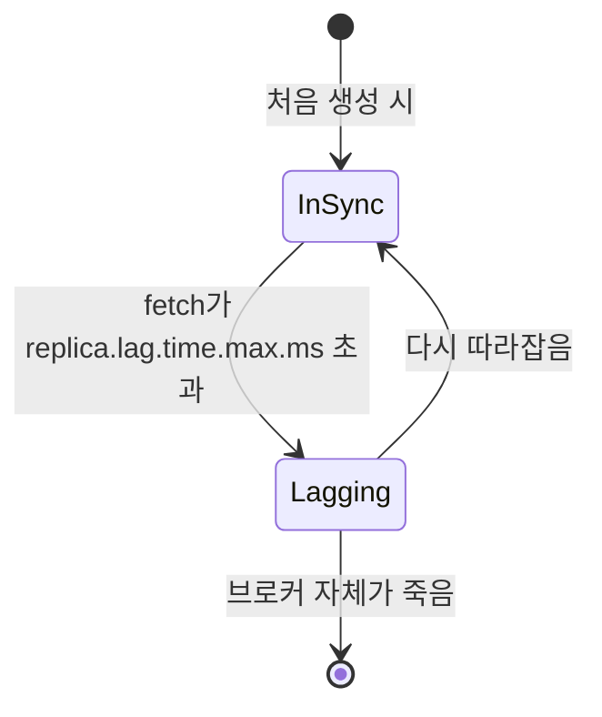
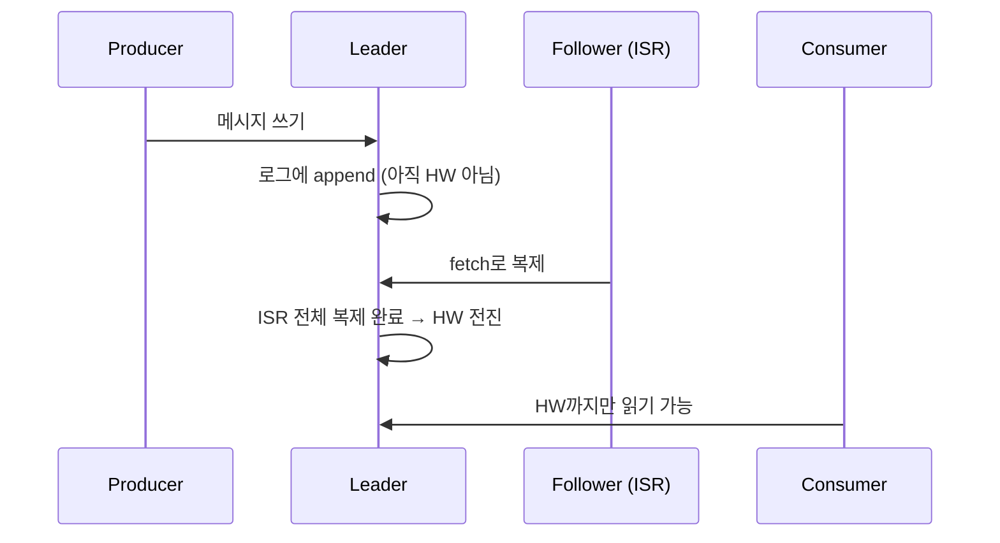

# Kafka ISR (In-Sync Replica)

Leader와 충분히 동기화된 상태를 유지하고 있는 복제본들의 집합이다. Leader 자신도 ISR에 포함된다.

"복제본이 몇 개 있는가"와 "그중 몇 개가 지금 믿을 만한가"는 다른 질문이다. replication factor는 앞의 것을, ISR은 뒤의 것을 답한다.

## ISR에 들어가고 빠지는 기준

Follower는 Leader의 로그를 계속 가져가면서(fetch) 따라잡는다. 이 fetch가 일정 시간 안에 오지 않으면 Kafka는 그 Follower를 "뒤처졌다"고 판단하고 ISR에서 제외한다.

기준이 되는 설정값이 `replica.lag.time.max.ms`다. 이 시간 안에 Leader에게 fetch 요청을 보내지 못한 Follower는 ISR에서 빠진다.

과거 버전에는 offset 차이(`replica.lag.max.messages`)로도 판단했지만, 지금은 시간 기준 하나로 단순화되어 있다.

ISR에서 빠진 Follower도 복제 자체는 계속 시도한다. 따라잡으면 다시 ISR로 복귀한다.

## min.insync.replicas와의 관계

`min.insync.replicas`는 ISR이 최소 몇 개는 유지되어야 쓰기를 받아주겠다는 브로커 측 설정이다.

`acks=all`인 producer가 메시지를 보냈을 때, ISR 크기가 `min.insync.replicas`보다 작으면 브로커는 그 쓰기를 거부한다. `NotEnoughReplicas` 예외가 발생한다.

replication factor가 3이고 `min.insync.replicas=2`라면, ISR이 2개 밑으로 떨어졌을 때(Leader 혼자 남는 등) 쓰기가 막힌다. 데이터 유실보다 가용성 저하를 선택한 것이다.

이 설정이 없으면 `acks=all`이어도 ISR이 Leader 하나만 남은 상태에서 쓰기가 성공해버릴 수 있다. 그 Leader가 죽으면 그 메시지는 그대로 유실된다. 참고: kafka-acks.md

## High Watermark와의 관계

High Watermark(HW)는 ISR 전체가 복제를 마친 지점까지의 offset이다.

consumer는 Leader의 로그 전체가 아니라 HW까지만 읽을 수 있다. Leader에 메시지가 더 있어도 ISR 전체에 복제되지 않았다면 아직 consumer에게 보이지 않는다.

이 구조 때문에 Leader가 죽고 다른 ISR 멤버가 새 Leader가 되어도, consumer 입장에서는 이미 읽은 메시지가 사라지는 일이 없다. HW 이후 구간만 새로 확정되지 않은 상태였을 뿐이다.

## 왜 어렵게 느껴지는가

ISR은 "복제본 목록"이 아니라 "지금 신뢰할 수 있는 복제본만 걸러낸 동적인 집합"이다. 브로커 장애, 네트워크 지연, 재시작마다 크기가 바뀐다.

acks, min.insync.replicas, HW, Leader 선출까지 네 가지 설정/개념이 ISR 하나를 중심으로 서로 얽혀 있어서, 하나씩 보면 쉬운데 한 번에 보면 헷갈린다. 순서를 정리하면: ISR이 동기화 여부를 판정하고 → min.insync.replicas가 쓰기 가능 여부를 정하고 → acks가 producer 입장의 성공 기준을 정하고 → HW가 consumer에게 보이는 범위를 정하고 → Leader 선출은 ISR 안에서만 일어난다.

참고: kafka-replication.md
참고: kafka-acks.md
참고: kafka-partition.md
참고: kafka-zookeeper-metadata-problem.md
참고: kafka-controller.md
참고: kafka-leader-follower.md
