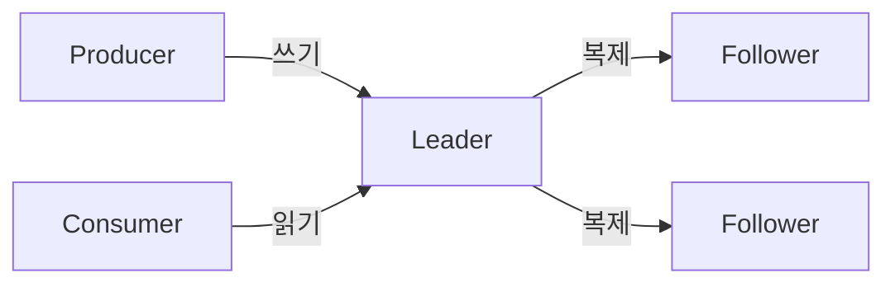

# Kafka Leader/Follower가 필요한 이유

파티션 하나를 여러 브로커에 복제해두는 이유는 브로커 한 대가 죽어도 데이터와 서비스가 계속되게 하기 위해서다. 그런데 복사본이 여러 개면 "누가 쓰기를 받을 것인가"를 정해야 하는 문제가 생긴다.

## 복사본이 모두 쓰기를 받으면 생기는 문제

모든 복사본이 동시에 쓰기를 받아들이면, 복사본끼리 기록 순서가 어긋날 수 있다.

broker-1과 broker-2가 같은 파티션의 복사본을 갖고 있다고 하자. 두 producer가 거의 동시에 서로 다른 메시지를 broker-1과 broker-2에 각각 보내면, 어느 메시지가 먼저인지는 브로커마다 다르게 기록된다. 나중에 두 복사본을 맞춰보면 순서가 다른 두 개의 로그가 존재하게 된다.

파티션 안에서 메시지 순서가 보장된다는 것이 Kafka의 핵심 특성인데, 복사본마다 순서가 다르면 이 보장이 깨진다. 참고: kafka-partition.md

## Leader/Follower 구조로 푸는 방식

Kafka는 복사본 중 하나만 쓰기를 받도록 정한다. 이 복사본이 Leader다. 나머지 복사본(Follower)은 Leader의 로그를 그대로 따라가기만 한다.

producer와 consumer는 항상 Leader하고만 통신한다. 순서는 Leader가 정한 순서 하나로 고정되고, Follower는 그 순서를 그대로 복제만 하면 되므로 복사본 간 순서 불일치가 애초에 생기지 않는다.

## 대가: Leader 장애 시 순간적인 쓰기 중단

쓰기 창구를 하나로 좁힌 대가는, Leader가 죽으면 그 파티션은 새 Leader가 정해질 때까지 잠깐 쓰기/읽기가 안 된다는 점이다.

이 공백을 최소화하기 위해 Kafka는 Leader를 잘 따라잡고 있던 Follower들(ISR)만 새 Leader 후보로 둔다. ISR 중 하나가 새 Leader가 되면 서비스가 다시 이어진다. 참고: kafka-isr.md

## 정리

Leader/Follower 구조는 "순서 보장"과 "장애 복구"라는 두 목적을 동시에 만족시키기 위한 절충이다.

복사본을 하나만 두면 순서는 자연히 보장되지만 그 복사본이 죽으면 데이터를 잃는다. 복사본 여럿이 모두 쓰기를 받으면 장애에는 강해지지만 순서가 깨진다. Leader/Follower는 쓰기는 하나(Leader)로 좁혀 순서를 지키고, 복사본은 여럿(Follower 포함) 유지해서 장애에 대비하는 절충안이다.

참고: kafka-replication.md
참고: kafka-partition.md
참고: kafka-isr.md
