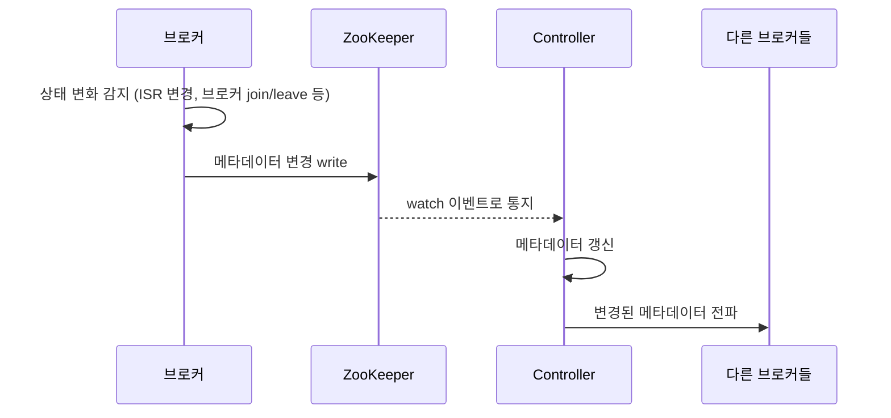

# Kafka ZooKeeper 시절 메타데이터 관리 문제

Kafka는 원래 클러스터 메타데이터를 ZooKeeper에 저장했다. 여기서 메타데이터란 어느 브로커가 어느 파티션의 Leader인지, ISR은 어떻게 구성되어 있는지, 어떤 토픽·파티션이 존재하는지 같은 클러스터 전체의 상태 정보다.

이 구조가 클러스터 규모가 커질수록 메타데이터 갱신을 느리고 불안정하게 만들었다. ISR 변경도 이 메타데이터의 일부라서 같은 문제를 겪었지만, 토픽 생성·삭제나 파티션 재배치, 브로커 join/leave 같은 다른 메타데이터 변경도 똑같은 구조적 문제를 겪었다.

이 문제 때문에 Kafka는 결국 ZooKeeper를 걷어내고 KRaft(Kafka Raft)로 옮겨갔다. KRaft가 왜 나왔는지 이해하려면 먼저 ZooKeeper 시절 구조가 어디서 막혔는지 알아야 한다.

## ZooKeeper 시절 구조

브로커가 메타데이터 변경을 직접 감지하고, 그 결과를 ZooKeeper에 write했다. Controller(브로커 중 하나가 맡는 역할)는 ZooKeeper의 변경을 watch로 통지받아 인지했다. 참고: kafka-controller.md

브로커가 ZooKeeper에 직접 쓰고, Controller는 그걸 뒤늦게 통지받는 구조라는 점이 핵심이다. Controller가 변경의 최초 발생 지점이 아니었다.

## 전파 지연 문제

브로커 수와 파티션 수가 늘어날수록 ZooKeeper에 발생하는 write와 watch 이벤트가 함께 늘어난다. ZooKeeper 하나가 전체 클러스터의 메타데이터 변경을 다 처리해야 하니, 특정 지점 이후로는 ZooKeeper 자체가 병목이 됐다.

변경이 실제로 일어난 시점과, Controller가 그 변경을 인지하고 다른 브로커에 전파하는 시점 사이에 지연이 생겼다. 이 지연은 특정 종류의 변경에만 국한되지 않고 메타데이터 갱신 전반에 걸쳐 나타났다.

- ISR 변경 — 파티션 수가 많은 클러스터에서는 초당 수백~수천 건씩 발생할 수 있어 이 지연이 가장 자주 드러나는 사례였다. 참고: kafka-isr.md
- 토픽 생성/삭제 — watch 큐가 밀려 있으면 새 토픽이 즉시 클러스터 전체에 보이지 않는 경우가 있었다
- 파티션 재배치(reassignment) — 재배치 진행 상황을 ZooKeeper 경유로 추적하다 보니 대규모 재배치일수록 진행이 느렸다
- 브로커 join/leave — 브로커 하나가 재시작할 때마다 관련 파티션 전체의 메타데이터가 다시 전파돼야 했다

## Controller Failover가 느렸던 이유

Controller 역할을 하던 브로커가 죽으면 새 Controller가 선출된다. 문제는 그다음이다.

새 Controller는 자기 메모리에 아무 상태도 없는 채로 시작한다. 그래서 ZooKeeper에 저장된 전체 메타데이터(모든 토픽, 모든 파티션, 모든 ISR 상태)를 처음부터 다시 읽어와야 했다.

파티션 수가 많을수록 이 초기 로딩(bootstrap)에 걸리는 시간이 길어졌다. 이 로딩이 끝나기 전까지는 새 Leader 선출을 포함한 클러스터 운영 전반이 지연됐다. Controller가 바뀌는 순간 클러스터 전체가 잠깐 멈춘 것처럼 느껴지는 이유가 여기 있었다.

## 이중 관리 구조의 근본 문제

ZooKeeper 시절 구조는 "진실의 원천(source of truth)은 ZooKeeper인데, 그걸 실제로 쓰는 건 Controller"라는 이중 구조였다. Controller가 자기 메모리에 캐시해둔 메타데이터와 ZooKeeper의 실제 데이터가 항상 정확히 일치한다는 보장이 없었다.

이 어긋남이 ISR 판단에서 나타나면, Controller가 오래된 메타데이터를 기준으로 실제로는 ISR에서 빠진 Follower를 아직 ISR에 있다고 착각하거나 그 반대로 판단할 수 있었다. ISR 판단이 틀리면 Leader 선출 시 데이터 유실로 이어질 수 있다. 같은 어긋남이 파티션 배치나 토픽 존재 여부 판단에서 나타나면 다른 종류의 불일치로 이어졌다.

## KRaft로의 전환 (KIP-500)

KRaft는 ZooKeeper를 없애고, Kafka 브로커 자체가 Raft 합의 프로토콜로 메타데이터를 직접 복제하는 구조다.

메타데이터가 별도 시스템(ZooKeeper)이 아니라 Kafka 내부의 로그로 관리되기 때문에, Controller는 더 이상 외부 시스템을 watch할 필요가 없다. 메타데이터 변경 자체가 Kafka의 복제 로그를 따라 전파되므로, 변경 종류와 관계없이 Controller에 반영되는 경로가 짧아졌다.

Controller failover 시에도 ZooKeeper 전체를 다시 읽어올 필요 없이, Raft 로그를 따라잡기만 하면 되므로 복구가 빨라졌다.

참고: kafka-isr.md
참고: kafka-replication.md
참고: kafka-controller.md
