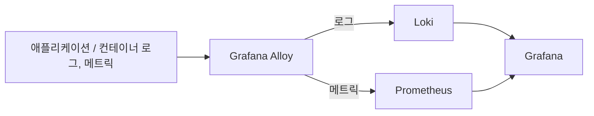

# Grafana Alloy

Grafana Alloy는 Grafana Labs가 만든 통합 수집 에이전트다. loki.md에서 다루는 Loki로 로그를 보내는 역할(기존 promtail.md의 Promtail이 하던 일)과, Prometheus로 메트릭을 보내는 역할을 하나의 에이전트로 합쳤다. Grafana Agent의 후속 프로젝트로, Grafana Agent 자체가 2025년에 단계적으로 폐지(deprecated)되면서 Alloy가 표준 수집 에이전트 자리를 대체했다.

## Promtail과의 관계

Promtail은 로그 전용, Alloy는 로그+메트릭+트레이스를 하나의 파이프라인으로 처리한다. 새로 스택을 구성한다면 Promtail 대신 Alloy로 로그 수집을 하는 게 현재 권장되는 방향이다. 기존에 Promtail로 돌리던 걸 굳이 지금 당장 바꿀 필요는 없지만, Promtail은 유지보수 모드로 들어갔기 때문에 신규 구성에서는 Alloy를 쓴다.

## 왜 Loki와 같이 쓰는가

Loki는 저장·쿼리만 담당하고 로그를 직접 수집하지 않는다. 어딘가에서 로그 파일을 읽어 레이블을 붙여 push해주는 에이전트가 필요한데, 그 역할을 Alloy가 한다. 즉 Alloy 단독으로는 로그를 보여줄 곳이 없고, Loki 단독으로는 로그가 들어올 입구가 없어서 둘은 항상 짝으로 쓰인다 — Promtail이 Loki와 짝이었던 것과 같은 구조다.

참고: loki.md, promtail.md
