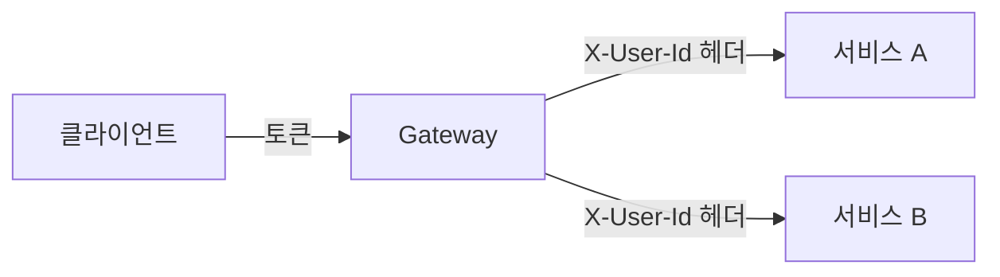

# API Gateway

마이크로서비스 앞단에서 외부 요청을 먼저 받아, 인증·라우팅 같은 공통 처리를 한 번에 하고 내부 서비스로 넘겨주는 관문.

---

## 왜 필요한가

서비스가 여러 개일 때 서비스마다 토큰 검증을 구현하면 중복이 생기고, 구현이 서로 어긋날 수 있다. 공통 관심사를 서비스 앞의 한 지점으로 모으면 내부 서비스는 비즈니스 로직에만 집중한다.

## 토큰으로 하는 일

**1. 토큰 추출.** `Authorization: Bearer <토큰>` 헤더에서 토큰을 꺼낸다.

**2. 토큰 검증.** 토큰 종류에 따라 방식이 다르다.
- JWT는 Gateway가 직접 검증한다. 서명(공개키), 만료 시각 `exp`, 발급자 `iss`, 대상 `aud`를 확인한다. 인증 서버를 호출하지 않아서 빠르다
- 불투명 토큰(랜덤 문자열)은 토큰 안에 정보가 없다. 인증 서버나 Redis에 유효한지 물어봐야 한다(introspection)

**3. 실패 처리.** 검증에 실패하면 내부 서비스로 보내지 않고 Gateway에서 바로 `401`을 응답한다.

**4. 정보 추출과 전달.** 검증에 성공하면 payload에서 userId를 꺼내 `X-User-Id` 같은 헤더에 담아 내부로 넘긴다. 이때 클라이언트가 보낸 같은 이름의 헤더는 반드시 제거하거나 덮어써야 한다. 그렇지 않으면 클라이언트가 `X-User-Id: 1`을 직접 보내 다른 사람 행세를 할 수 있다.

## 인증과 인가의 경계

Gateway가 하는 건 보통 인증(Authentication), 즉 "이 사람이 누구인가"까지다. 인가(Authorization)는 둘로 나뉜다.
- 거친 수준(로그인 필수 경로, 관리자 전용 경로)은 Gateway에서 처리하기도 한다
- 세밀한 수준(이 쿠폰이 이 사용자의 것인가)은 도메인 지식이 필요해서 내부 서비스가 처리한다

토큰을 발급하는 건 Gateway가 아니라 로그인을 처리하는 인증 서버다. Gateway는 발급된 토큰을 검증하는 쪽이다.

## 헤더를 신뢰하는 구조의 전제

내부 서비스가 토큰을 다시 검증하지 않고 Gateway가 넣어 준 헤더를 믿는 구조에서는, Gateway를 거치지 않고 내부 서비스에 직접 접근하는 경로를 막아야 한다. 헤더는 누구나 위조해서 보낼 수 있기 때문이다. 네트워크 수준 격리(내부 서비스는 Gateway에서 오는 트래픽만 허용)가 같이 따라와야 한다.

## 구현체

Gateway 역할을 하는 도구는 만드는 방식이 다르다.
- Spring Cloud Gateway는 Spring Boot 애플리케이션으로 직접 만든다. 라우팅과 필터를 자바 코드와 설정으로 작성한다
- Kong은 Nginx 기반의 독립 제품이다. JWT 검증, rate limit 같은 기능을 플러그인 설정으로 붙인다. 언어와 무관해서 서비스 언어가 섞여 있을 때 쓴다

Istio는 Gateway가 아니라 서비스 메시다. 외부 진입점(ingress gateway)뿐 아니라 내부 서비스끼리의 호출까지 다룬다는 점이 다르다. 참고: istio.md

## Recap

API Gateway는 마이크로서비스 앞에서 요청을 먼저 받아 토큰 검증 같은 공통 처리를 한 번에 하는 관문이다. JWT는 서명과 만료, 발급자를 직접 확인하고 불투명 토큰은 인증 서버에 물어본다. 검증이 실패하면 Gateway에서 401로 끊고, 성공하면 userId를 헤더로 풀어 내부 서비스에 넘기되 클라이언트가 보낸 같은 이름의 헤더는 제거한다. Gateway는 인증까지 맡고 소유자 확인 같은 세밀한 인가는 내부 서비스가 한다. 헤더를 신뢰하는 구조이므로 내부 서비스로 Gateway를 우회하는 접근을 네트워크에서 막아야 한다.
