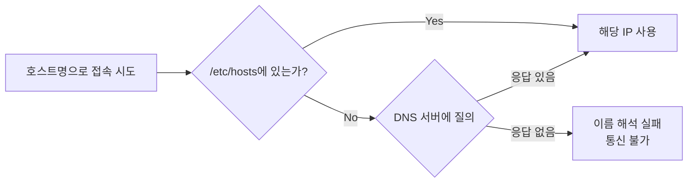

# /etc/hosts

호스트명을 IP 주소로 직접 매핑해두는 로컬 파일. DNS 서버에 물어보지 않고 이 파일에 등록된 매핑을 먼저 사용한다.

---

## 왜 /etc/hosts에 없으면 통신이 안 되는가

애플리케이션이 `https://api.internal.example.com` 같은 URL로 통신할 때, 먼저 그 호스트명을 IP로 바꾸는 이름 해석(name resolution) 과정을 거친다. 이 과정에서 OS는 DNS 서버에 묻기 전에 로컬 파일부터 확인하는데, 그 파일이 `/etc/hosts`다. DNS에 등록되지 않은 내부 전용 도메인(사내 서비스, 폐쇄망 서버, 로컬 개발 환경)은 `/etc/hosts`에 IP와 호스트명을 직접 적어주지 않으면 이름 해석 자체가 실패한다. 이름 해석이 실패하면 커넥션을 시도할 IP가 없으니 통신도 시작되지 않는다.

## 이름 해석 순서

리눅스/macOS는 기본적으로 `/etc/nsswitch.conf`의 `hosts` 라인에 정의된 순서를 따른다. 보통은 `files dns` 순서라서 `/etc/hosts`를 먼저 보고, 거기 없으면 DNS 서버에 질의한다.

`/etc/hosts`에 매핑이 있으면 DNS 질의 자체를 건너뛴다. 그래서 이 파일에 잘못된 IP가 적혀 있으면 DNS가 정상이어도 엉뚱한 곳으로 연결되거나 아예 실패한다.

## 자주 겪는 상황

사내망이나 폐쇄망에서 별도 DNS 서버 없이 운영되는 환경이 흔한 원인이다. 이런 환경의 서비스는 공인 DNS에 등록되어 있지 않으니, 해당 서비스와 통신하려는 모든 클라이언트(로컬 개발 머신, VM, 컨테이너 호스트)에 IP-호스트명 매핑을 각각 등록해줘야 한다. 등록을 빠뜨리면 curl이나 애플리케이션 호출이 타임아웃이나 "could not resolve host" 에러로 실패한다.

컨테이너 환경에서도 같은 문제가 발생한다. 컨테이너 내부의 `/etc/hosts`는 호스트 OS와 별개이기 때문에, 호스트에서는 통신되던 도메인이 컨테이너 안에서는 안 될 수 있다.

## 확인 방법

`cat /etc/hosts`로 현재 등록된 매핑을 확인하고, `ping 호스트명`이나 `nslookup 호스트명`으로 실제로 어떤 IP가 해석되는지 확인한다. `nslookup`은 `/etc/hosts`를 건너뛰고 DNS 서버에만 직접 질의하기 때문에, `/etc/hosts` 문제인지 DNS 문제인지 구분하는 데 쓸 수 있다.

---

참고: ntp.md
