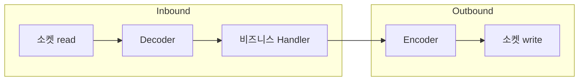

# Netty (네티)

JVM 위에서 동작하는 비동기 이벤트 기반 네트워크 애플리케이션 프레임워크. NIO를 직접 다루기 어렵다는 문제를 해결하기 위해 만들어졌다.

## 왜 만들어졌나

자바 NIO는 epoll/kqueue 기반의 non-blocking I/O를 제공하지만 API가 저수준이라 다루기 어렵다. Selector 등록, 버퍼 관리, 부분 읽기/쓰기 처리를 직접 구현해야 하고 실수하기도 쉽다.

Netty는 이 NIO API를 감싸서 이벤트 기반 네트워크 프로그래밍을 다루기 쉬운 형태로 제공한다. Spring WebFlux, gRPC, Elasticsearch 등 JVM 생태계의 비동기 네트워크 스택 상당수가 내부적으로 Netty를 쓴다.

## nginx와의 공통점

nginx와 마찬가지로 이벤트 루프 기반이다. 스레드 하나가 다수의 연결을 non-blocking I/O로 처리하고, OS의 I/O 멀티플렉싱(epoll/kqueue)을 통해 준비된 이벤트만 처리한다. 그래서 연결 수가 늘어도 스레드 수는 거의 늘지 않는다.

차이는 실행 위치다. nginx는 독립된 웹 서버/프록시 프로세스이고, Netty는 JVM 애플리케이션 안에 라이브러리로 들어가 애플리케이션 코드와 같은 프로세스에서 동작한다.

## EventLoop과 EventLoopGroup

Netty의 이벤트 루프 단위는 EventLoop이다. EventLoop 하나가 스레드 하나에 대응하고, 자신에게 할당된 여러 Channel(연결)의 I/O 이벤트와 등록된 작업을 순차 처리한다.

EventLoopGroup은 EventLoop들을 묶은 그룹이다. Netty 서버는 보통 두 개의 EventLoopGroup을 쓴다.

1. boss group — 클라이언트의 연결 요청(accept)만 처리한다
2. worker group — accept된 연결의 실제 데이터 읽기/쓰기를 처리한다

연결이 accept되면 boss가 해당 Channel을 worker group의 EventLoop 하나에 등록한다. 이후 그 Channel의 모든 이벤트는 같은 EventLoop(같은 스레드)에서만 처리되므로 별도 동기화 없이 안전하다.

## Channel과 Pipeline

Channel은 소켓 연결 하나를 추상화한 객체다. 연결의 상태(열림/닫힘)와 읽기/쓰기 동작을 이 객체를 통해 다룬다.

ChannelPipeline은 Channel에 들어오고 나가는 데이터를 처리하는 ChannelHandler들의 체인이다. 데이터가 들어오면(inbound) 파이프라인을 따라 handler를 순서대로 통과하며 디코딩·비즈니스 로직 처리가 이루어지고, 나갈 때(outbound)는 반대 방향으로 인코딩된다.

## 논블로킹과 콜백

Netty API 호출은 즉시 반환되고 실제 I/O 완료는 콜백(ChannelFuture, Listener)으로 통지된다. 호출 스레드가 결과를 기다리며 블로킹하지 않기 때문에, 같은 EventLoop 스레드가 그 사이 다른 Channel의 이벤트를 처리할 수 있다.

이 모델 때문에 Netty 위에서 애플리케이션 코드를 짤 때도 블로킹 호출(JDBC 등)을 EventLoop 스레드에서 직접 실행하면 안 된다. 블로킹 호출 하나가 그 스레드에 걸린 다른 모든 연결의 처리를 지연시키기 때문이다.

## Tomcat과의 대비

Tomcat은 기본적으로 스레드풀 기반이다. 요청 하나에 스레드 하나가 붙어서 처리가 끝날 때까지 점유한다. 블로킹 호출이 있어도 그 스레드만 블로킹되고 다른 요청은 다른 스레드가 처리한다.

Netty(및 그 위의 WebFlux)는 적은 수의 이벤트 루프 스레드가 다수 요청을 나눠 처리한다. 스레드 자원은 절약되지만, 블로킹 호출을 잘못 넣으면 그 스레드에 걸린 모든 요청이 함께 지연된다는 트레이드오프가 있다.

참고: event-loop.md, nonblocking-io.md, io-multiplexing.md, nginx.md
