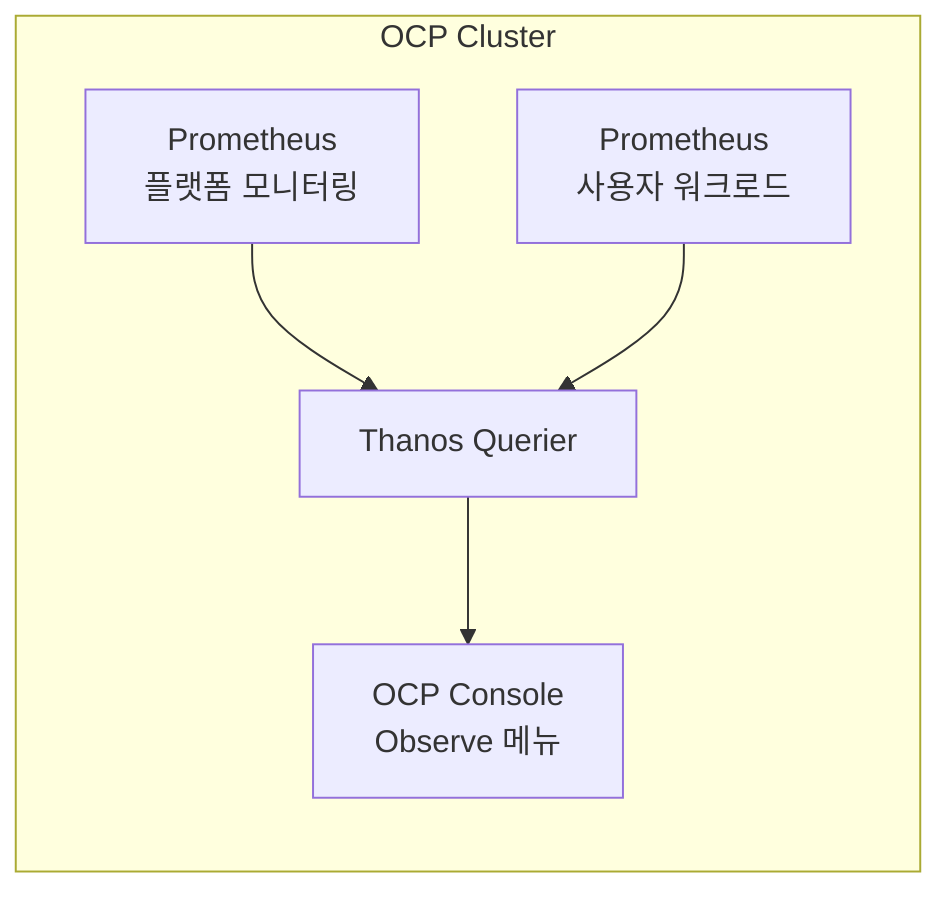

# Thanos

Thanos는 Prometheus 위에 얹어서 여러 Prometheus 인스턴스를 하나의 쿼리 인터페이스로 묶어주고, 장기 보관을 가능하게 해주는 레이어다.

## 왜 필요한가

Prometheus는 원래 단일 노드로 동작하도록 설계됐다. 그래서 두 가지 한계가 있다.

첫째, 로컬 디스크에만 데이터를 저장하기 때문에 보관 기간이 길어지면 디스크 용량 문제가 생긴다.

둘째, Prometheus 인스턴스가 여러 개로 나뉘면 메트릭 하나를 조회할 때 각 인스턴스를 따로따로 조회해야 한다.

Thanos는 이 두 문제를 풀기 위해 Prometheus 위에 얹는 레이어다. 오브젝트 스토리지(S3 등)로 오래된 데이터를 내보내 장기 보관을 가능하게 하고, 여러 Prometheus 인스턴스의 데이터를 쿼리 시점에 하나로 합쳐준다.

## 커뮤니케이션에서 헷갈리는 지점

"Thanos가 메트릭을 수집한다"고 오해하기 쉽지만, 실제로 타겟을 스크래핑(scrape)하는 것은 여전히 각 Prometheus 인스턴스다. Thanos는 수집을 대체하지 않고, 수집된 결과를 나중에 조회 시점에 통합해주는 역할만 한다.

OCP(OpenShift Container Platform)에서는 Cluster Monitoring Operator가 Prometheus, Alertmanager와 함께 Thanos Querier(사용자 워크로드 모니터링을 켜면 Thanos Ruler까지)를 배포하고 관리한다. OCP는 플랫폼 모니터링용 Prometheus와 사용자 워크로드 모니터링용 Prometheus를 분리 운영하는데, 콘솔의 Observe 메뉴에서 메트릭을 조회하면 실제로는 이 두 Prometheus를 묶어주는 Thanos Querier를 거친다. 그래서 사용자 입장에서는 "Thanos로 메트릭을 받는다"고 느끼기 쉽지만, 스크래핑 자체는 여전히 Prometheus 몫이다.

참고: ocp.md, prometheus.md
