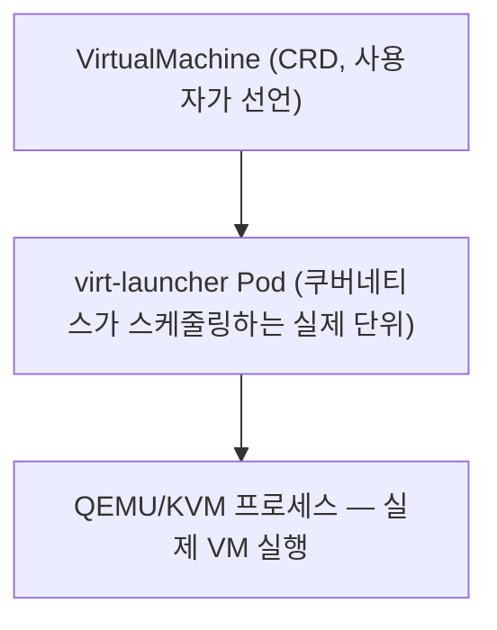
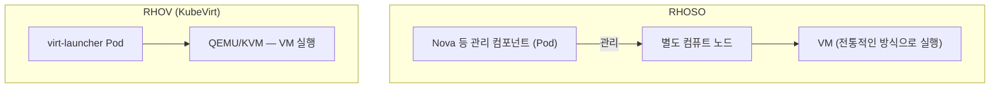

# KubeVirt

KubeVirt는 VM을 쿠버네티스 오브젝트로 다룰 수 있게 해주는 오픈소스 프로젝트다. RHOV는 이 KubeVirt를 가져다 레드햇이 제품으로 패키징한 것이다 — RHOSP가 OpenStack이라는 오픈소스 프로젝트를 레드햇이 패키징한 것과 같은 관계다.

## 어떻게 VM을 쿠버네티스 오브젝트로 만드나

핵심은 VM을 실행하는 QEMU/KVM 프로세스를 Pod 안에 넣어버리는 것이다. 참고: kvm.md

KubeVirt가 `VirtualMachine`이라는 커스텀 리소스(CRD)를 만들면, 그 뒤에서 실제로는 `virt-launcher`라는 특수한 Pod가 뜬다. 이 Pod 안에서 QEMU/KVM 프로세스가 돌면서 실제 VM을 실행한다. 즉 VM 자체가 컨테이너로 바뀌는 게 아니라, "QEMU/KVM이라는 VM 실행 프로세스를 담은 Pod"를 쿠버네티스가 스케줄링·재시작·감시하는 방식이다. 참고: pod.md

이 구조 덕분에 `kubectl get pods`로 보면 VM도 Pod 하나로 보인다. VM이 죽으면 쿠버네티스가 Pod를 재스케줄링하듯 다시 띄우고, VM 간 통신도 쿠버네티스 Service/네트워킹을 그대로 쓴다. 참고: ovn-kubernetes.md

virt-launcher Pod와 일반 컨테이너 Pod는 오브젝트 모델(스케줄링, 재시작, 네트워킹)이라는 틀은 완전히 같고, 그 안에서 도는 내용물(가벼운 프로세스냐 완전한 커널을 가진 VM이냐)만 다르다. 이 차이는 container-vs-vm.md 참고.

## OCP와 KVM은 상하 관계가 아니라 같은 노드 위의 나란한 관계

"OCP 위에서 VM이 돈다"는 말 때문에 하이퍼바이저 위에 OCP를 얹은 구조로 오해하기 쉬운데, 그렇지 않다. OCP 워커 노드는 그냥 리눅스 서버이고, 그 노드의 리눅스 커널에는 KVM이 이미 내장되어 있다. 이 노드 위에서 kubelet(쿠버네티스가 이 노드를 관리하는 에이전트)과 KVM(이 노드 커널의 하이퍼바이저 기능)이 같은 레벨로 나란히 돈다. 참고: kvm.md

KubeVirt는 VM을 띄워야 할 때 kubelet에게 "virt-launcher Pod를 이 노드에 띄워라"고 지시하고, 그 Pod 안에서 뜬 QEMU가 같은 노드 커널의 `/dev/kvm`에 접근해서 VM을 실행한다. 즉 OCP(쿠버네티스)는 무엇을 어느 노드에 배치할지 결정하는 오케스트레이션 레이어이고, KVM은 그 노드가 원래 갖고 있던 하이퍼바이저 기능이다. 둘은 상하 관계가 아니라, 같은 노드 위에서 각자 다른 역할(하나는 배치·관리, 하나는 실행)을 맡는 관계다.

## virt-launcher란 무엇인가

virt-launcher는 VM 하나당 KubeVirt가 만드는 특수한 Pod로, VM의 생명주기와 1:1로 생성·종료된다. 자세한 내용은 virt-launcher.md 참고.

## 왜 이 방식을 택했나 — 성능이 아니라 운영 비용

"컨테이너로 VM을 만든다"는 표현 때문에 하이퍼바이저를 안 쓰는 것처럼 들리기 쉬운데, 그렇지 않다. virt-launcher Pod 안에서도 결국 QEMU/KVM이 그대로 돈다 — 하이퍼바이저(KVM)는 RHV든 RHOV든 똑같이 쓰인다. 그래서 KubeVirt가 바꾼 것은 VM 실행 방식(하이퍼바이저 가상화)이 아니라, 그 QEMU 프로세스를 감싸는 틀이 전용 관리 서버(RHV)냐 쿠버네티스 Pod(RHOV)냐라는 부분이다.

성능만 보면 순수 RHV(전용 관리 스택)와 RHOV(KubeVirt) 사이에 이론적 차이는 크지 않다. VM을 실행하는 건 둘 다 같은 QEMU/KVM이고, Pod라는 틀 자체는 리눅스 cgroup/namespace로 감싸는 정도라 오버헤드가 크지 않다. VM 하나마다 virt-launcher Pod가 추가로 붙는 관리 오버헤드는 있지만, 근본적인 성능 저하는 아니다.

진짜 차이는 운영 비용에서 난다. RHV 같은 전용 VM 관리 스택은 스케줄러, 헬스체크, 마이그레이션, 모니터링, 인증, API를 처음부터 다 자체 구현해야 한다. 조직이 이미 컨테이너 워크로드를 위해 OCP 클러스터를 운영 중이라면, 그 클러스터에는 이미 스케줄러, 헬스체크, 롤링 업데이트, 모니터링, 인증/RBAC, 스토리지 연동(ODF), 네트워킹(OVN-Kubernetes)이 갖춰져 있다. RHOV는 이 기존 인프라를 그대로 재사용해서, VM과 컨테이너를 별개 플랫폼 두 개로 운영하며 모니터링·인증·네트워크 정책을 각각 구축·유지하는 비용을 없앤다. 참고: ocp.md, odf.md, ovn-kubernetes.md

다만 레이턴시에 극도로 민감한 워크로드처럼 성능이 최우선인 경우에는, 플랫폼을 통합하는 이점보다 전용 스택의 이점이 더 클 수 있다. RHOSP/RHOSO 같은 대규모 IaaS 전용 플랫폼이 계속 존재하는 이유도 이 지점과 맞닿아 있다.

## RHOSO와 비교했을 때 무엇이 다른가

RHOSO는 OpenStack의 관리 컴포넌트(Nova 등)만 컨테이너화해서 Pod로 올리고, 그 컴포넌트가 관리하는 실제 VM은 별도 컴퓨트 노드에서 전통적인 방식으로 돈다. 참고: rhoso.md

KubeVirt는 다르다. VM을 실행하는 QEMU/KVM 프로세스 자체가 처음부터 Pod 안에서 돈다. 그래서 RHOV는 VM 자체가 OCP 클러스터의 스케줄링 대상이 되지만, RHOSO는 VM을 다루는 도구만 그렇게 된다는 차이가 앞서 나온 설명 그대로 여기서 확인된다.

참고: rhov.md, kvm.md, pod.md, rhoso.md, ocp.md, container-vs-vm.md
