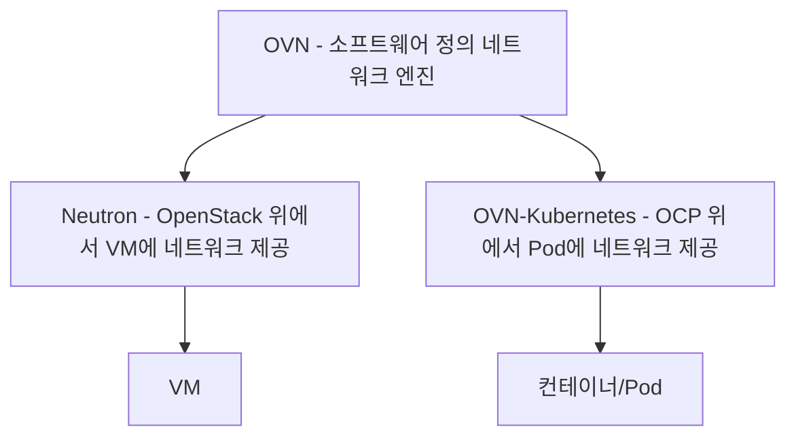

# OCP/OpenStack 네트워킹 용어 개요 — Neutron, OVN-Kubernetes

네트워킹도 앞서 정리한 스토리지와 똑같은 패턴이다. OVN이라는 네트워크 가상화 기술 자체는 하나이고, 그걸 컨테이너 쪽에 쓰면 OVN-Kubernetes, VM 쪽에 쓰면 Neutron(OVN 드라이버)이라는 이름이 된다. 참고: storage-overview.md, rhv-ocp-osp-overview.md

## 핵심 구도: 하는 일은 같고, 플랫폼이 다르다

- Neutron — OpenStack(VM) 안에서 네트워크, 서브넷, 라우터, 보안 그룹을 관리하는 서비스. VM에 가상 네트워크를 붙여준다
- OVN-Kubernetes — OCP(컨테이너) 안에서 Pod 간 네트워크와 정책(NetworkPolicy)을 관리하는 CNI(Container Network Interface) 플러그인. Pod에 가상 네트워크를 붙여준다
- OVN(Open Virtual Network) — 두 시스템이 공통으로 쓰는 기반 기술. 브리지, 라우터, 보안 규칙 같은 네트워크 요소를 소프트웨어로 정의하는 오버레이 네트워크 엔진이다. 참고: bridge.md, network-cidr.md

즉 "이 클러스터 네트워크가 어떻게 도냐"고 물으면, VM 환경이면 Neutron이 관리하는 것이고 컨테이너 환경이면 OVN-Kubernetes가 관리하는 것이다. 둘 다 내부적으로 OVN을 쓰는 경우가 많아서 로그나 트러블슈팅 명령어(`ovn-nbctl` 등)가 비슷하게 보일 수 있다.

## 한 줄 구분법

VM 얘기면 Neutron, 컨테이너/Pod 얘기면 OVN-Kubernetes다. 스토리지의 Cinder/ODF 구도와 정확히 같은 축이므로, storage-overview.md의 구분법을 그대로 적용해서 들으면 된다.

참고: neutron.md, ovn-kubernetes.md, ocp.md, rhosp-osp.md
