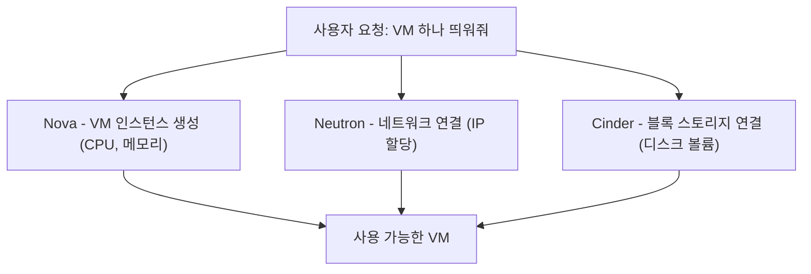

# OpenStack

OpenStack은 VM, 네트워크, 스토리지를 API와 코드로 프로비저닝하는 오픈소스 IaaS(Infrastructure as a Service) 프로젝트다. RHOSP는 이 OpenStack을 레드햇이 가져다 엔터프라이즈용으로 패키징하고 지원하는 배포판이다 — KubeVirt를 RHOV가 패키징한 것과 같은 관계다. 참고: rhosp-osp.md, kubevirt.md

## 여러 컴포넌트로 이루어진 프로젝트

OpenStack은 하나의 프로그램이 아니라 여러 독립 서비스가 모인 집합이다. Nova(컴퓨트/VM 생성), Neutron(네트워킹), Cinder(블록 스토리지), Keystone(인증) 같은 컴포넌트들이 각자 API를 갖고 메시지 큐와 DB를 통해 서로 통신한다. 참고: neutron.md, cinder.md

VM 하나를 프로비저닝해달라고 요청하면, 이 컴포넌트들이 함께 동작해서 "쓸 수 있는 VM"을 만들어낸다. 참고: provisioning.md

즉 VM만 딱 만들어주는 게 아니라, 그 VM이 실제로 접속되고 데이터를 저장할 수 있는 상태까지 갖춰서 내준다. 이 구조 자체가 OpenStack의 목표를 보여준다 — 단일 VM 관리가 아니라, 여러 팀/고객에게 독립된 네트워크·스토리지·컴퓨트를 셀프서비스로 제공하는 대규모 멀티테넌트 클라우드를 만드는 것이다. 참고: tenant.md

컴포넌트가 나뉘어 있는 이유도 각 영역(컴퓨트, 네트워크, 스토리지)을 독립적으로 확장하고 교체할 수 있게 하기 위해서다.

## 왜 여러 회사가 각자 배포판을 만드나

OpenStack은 커뮤니티가 만드는 오픈소스 프로젝트일 뿐이라, 실제로 설치·운영·지원까지 받으려면 누군가 패키징한 배포판이 필요하다. 레드햇의 RHOSP가 그 중 하나이고, 그 외에도 여러 벤더가 각자의 OpenStack 배포판을 낸다. 리눅스 커널이 하나의 오픈소스 프로젝트인데 그 위에 우분투, RHEL 같은 여러 배포판이 있는 것과 같은 구조다. 참고: kernel.md

## 레드햇의 OpenStack 배포판 두 가지

- RHOSP — 레드햇이 패키징한 OpenStack 배포판. 컴포넌트가 별도 VM/베어메탈 위에서 직접 도는 전통적 방식
- RHOSO — 같은 OpenStack을 OCP(쿠버네티스) 위에 컨테이너화해서 배포하는 최신 아키텍처. 참고: rhoso.md

즉 OpenStack이라는 프로젝트 자체는 하나이고, RHOSP/RHOSO는 그걸 "어떻게 배포하고 어디서 돌리느냐"만 다른 두 가지 방식이다.

참고: rhosp-osp.md, rhoso.md, neutron.md, cinder.md, kubevirt.md, vsphere-vcenter.md, tenant.md
