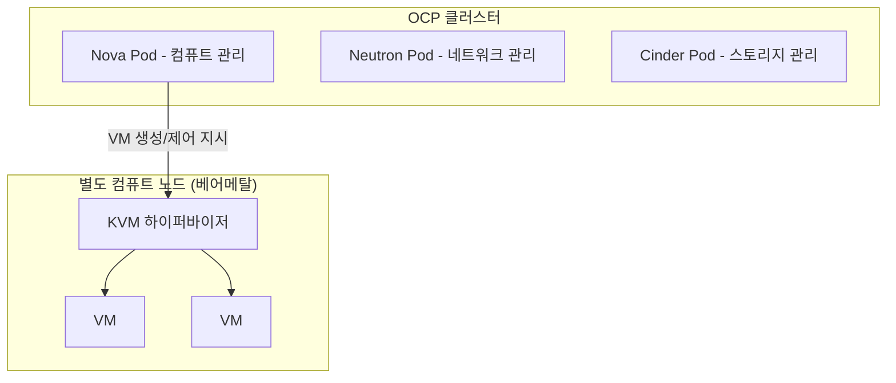

# RHOSO (Red Hat OpenStack Services on OpenShift)

RHOSO는 OpenStack을 OCP(쿠버네티스) 클러스터 위에서 서비스 형태로 돌리는 레드햇의 최신 아키텍처다.

## RHOSP와의 차이

RHOSP(전통 방식)는 OpenStack 컴포넌트(Nova, Neutron 등)가 VM이나 베어메탈 위에서 직접 프로세스로 돈다. RHOSO는 그 컴포넌트들을 컨테이너화해서 OCP 클러스터 위에 Operator로 배포한다. 즉 관리 대상(OpenStack이 제공하는 VM 인프라)은 같지만, 그 관리 도구 자체가 돌아가는 기반이 베어메탈/VM에서 컨테이너 플랫폼으로 바뀐 것이다.

## 왜 이 조합이 헷갈리는가

"컨테이너 플랫폼(OCP) 위에서 가상화 플랫폼(OpenStack)을 관리한다"는 계층 구조라서, 회사 축(레드햇)과 인프라 축(VM vs 컨테이너)이 한 제품 안에서 겹친다. RHOSO 얘기가 나오면 최종적으로 관리되는 것은 VM이고, 그 관리자를 실행하는 기반이 OCP라는 두 층을 분리해서 들으면 헷갈리지 않는다.

## 컨테이너화되는 것은 관리 도구뿐, VM 자체는 아니다

"OSP가 컨테이너로 올라간다"는 말은 OpenStack의 제어 컴포넌트(Nova, Neutron, Cinder 같은 관리 서비스)에만 해당한다. 이 컴포넌트들은 Pod로 OCP 클러스터 위에 뜬다. 하지만 이 컴포넌트들이 최종적으로 관리하는 VM 자체는 컨테이너가 아니다 — Nova가 실제로 VM을 띄울 때는 여전히 KVM 하이퍼바이저를 통해서고, 보통 OCP 노드와는 별도인 컴퓨트 노드(베어메탈)에서 돈다.

이 점이 RHOV와 근본적으로 다른 지점이다. RHOV는 VM 자체를 KubeVirt로 쿠버네티스 오브젝트화해서 OCP 노드 위에서 직접 돌리지만, RHOSO는 VM을 다루는 도구(Nova 등)만 쿠버네티스 오브젝트로 바뀐 것이고 VM 자체는 그대로 별도 하이퍼바이저 위에서 돈다. 참고: rhov.md, kubevirt.md

참고: rhv-ocp-osp-overview.md, rhosp-osp.md, ocp.md, rhov.md
