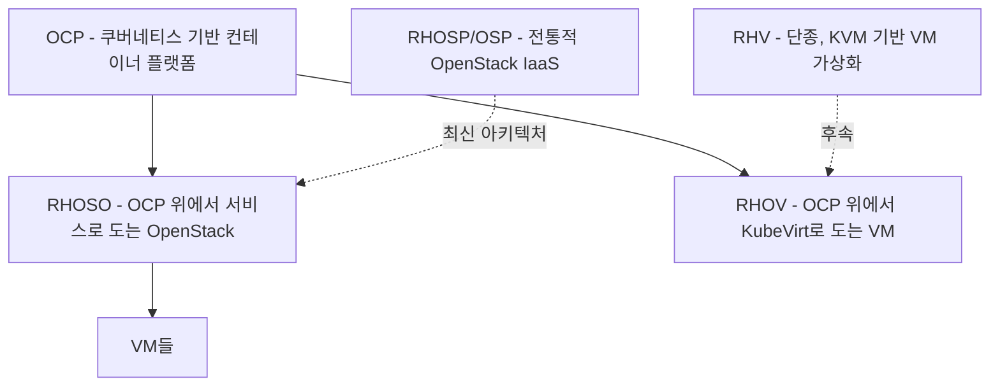

# RHV / OCP / OSP 개요 — 이름이 헷갈리는 이유

RHV, RHOV, OCP, OSP, RHOSO 같은 이름들은 두 가지 축을 같이 보면 헷갈리지 않는다. 하나는 "누가 만들었나(회사)"고, 다른 하나는 "무엇을 가상화하나(인프라 종류)"다.

## 축 1: 회사 — 레드햇 vs VMware

이 용어들 대부분은 레드햇(RH) 제품이다. VMware의 vSphere/vCenter와 경쟁 관계에 있는 레드햇 진영의 이름들이라고 보면 된다. 이름 앞에 RH가 붙어 있으면 레드햇 제품이라는 뜻이고(RHV, RHOV, RHOSO), 붙지 않은 OCP나 OSP도 실제로는 레드햇 제품이다. RH 표기 유무는 마케팅상의 브랜딩 차이일 뿐, 회사 축을 나누는 기준은 아니다.

VMware 쪽 대응은 vCenter(≈RHV/RHOSP)다. 자세한 내용은 vsphere-vcenter.md 참고.

## 축 2: 인프라 종류 — VM 가상화 vs 컨테이너

이게 실제로 용어를 구분하는 핵심 축이다.

- VM(가상머신)을 관리하는 제품 — RHV, RHOSP/RHOSO
- 컨테이너를 관리하는 제품 — OCP
- 둘 다 걸치는 제품 — RHOV(OCP 위에서 VM을 직접 관리)

즉 "가상화"라는 한 단어로 뭉뚱그려 부르지만, VM을 다루는지 컨테이너를 다루는지에 따라 완전히 다른 제품이다. 참고: pod.md, unix.md(컨테이너는 namespace로 격리된 프로세스)

## 각 이름이 가리키는 것

- RHV(Red Hat Virtualization) — KVM 기반 서버 가상화 플랫폼. VMware vSphere와 직접 경쟁하던 제품. 하이퍼바이저 위에 VM을 올려서 관리한다. 단종되었고 후속은 RHOV다
- RHOV(Red Hat OpenShift Virtualization) — RHV의 후속. 별도 하이퍼바이저 플랫폼이 아니라 OCP(쿠버네티스) 클러스터 위에서 KubeVirt로 VM을 쿠버네티스 오브젝트처럼 직접 관리하는 기능
- RHOSP(Red Hat OpenStack Platform) — OpenStack 기반의 IaaS(Infrastructure as a Service) 플랫폼. VM, 네트워크, 스토리지를 코드로 프로비저닝하는 클라우드 인프라 계층. 흔히 OSP로 줄여 부른다
- RHOSO(Red Hat OpenStack Services on OpenShift) — RHOSP를 OCP(쿠버네티스) 위에서 서비스 형태로 돌리는 최신 아키텍처. 즉 OpenStack의 제어 컴포넌트 자체가 컨테이너화되어 OCP 클러스터 위에서 관리된다
- OCP(OpenShift Container Platform) — 레드햇의 쿠버네티스 배포판. 컨테이너 오케스트레이션 플랫폼이다

## 왜 최근에 더 헷갈리는가

원래는 "VM은 RHV/RHOSP, 컨테이너는 OCP"로 축이 깔끔했다. 그런데 RHOV와 RHOSO부터는 VM 관리 기능/도구 자체가 OCP(컨테이너 플랫폼) 위에서 돌아가는 구조로 바뀌었다. RHOV는 VM을 쿠버네티스 오브젝트로 직접 얹은 것이고, RHOSO는 OpenStack이라는 IaaS 도구 전체를 OCP 위에 컨테이너로 얹은 것이다. 그래서 지금은 "OCP가 기반이고, 그 위에서 VM(RHOV) 또는 OpenStack(RHOSO)이 돈다"는 계층 구조가 됐다 — 컨테이너 플랫폼이 가상화 플랫폼의 기반이 되는 역전이 생긴 것이다.

## 한 줄 구분법

컨테이너 얘기면 OCP, 전통적 VM/IaaS 얘기면 RHV(레거시) 또는 RHOSP(현재도 쓰임)다. "OCP 위에서 도는 VM"이라는 말이 나오면 RHOV(VM을 직접) 또는 RHOSO(OpenStack을 통해)인지 구분해서 들으면 된다. 나머지는 각 이름의 개별 파일에서 확인하면 된다.

참고: rhv.md, rhov.md, rhosp-osp.md, ocp.md, rhoso.md, vsphere-vcenter.md, kvm.md
