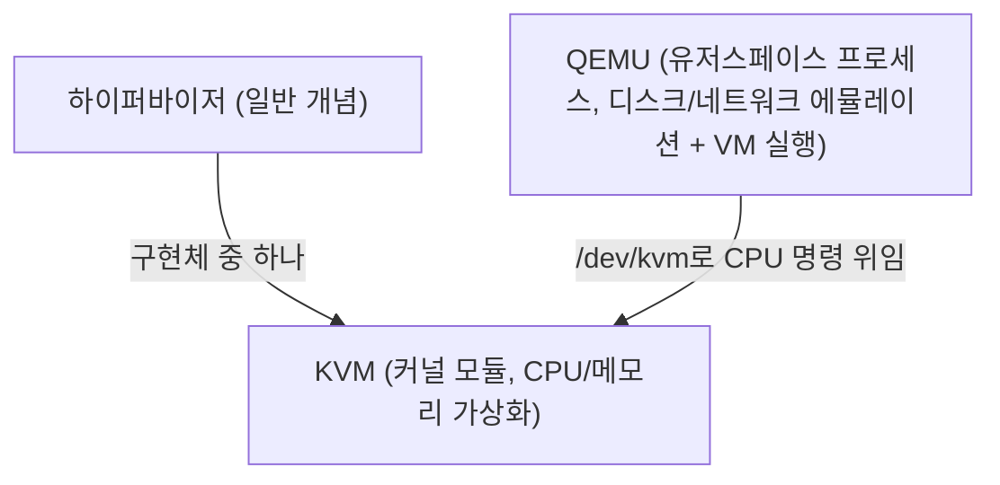
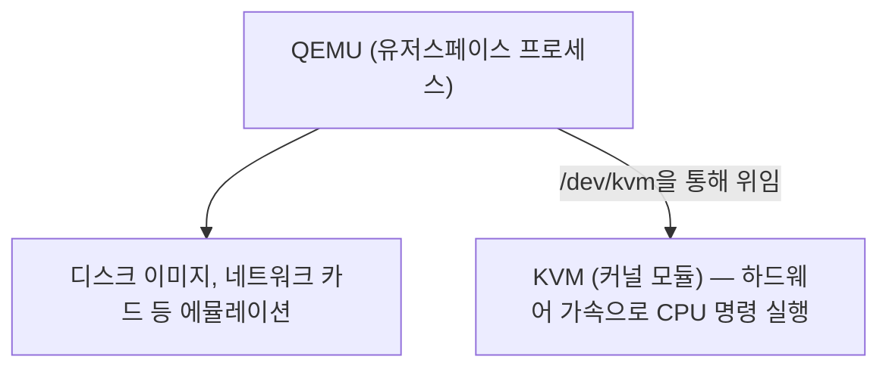

# QEMU

QEMU는 VM을 실행하는 유저스페이스 프로그램이다. KVM이 CPU/메모리 가상화만 담당하는 커널 모듈이라, 디스크 이미지 처리·네트워크 카드 에뮬레이션·VM 프로세스 실행 같은 나머지 작업을 QEMU가 맡는다. 참고: kvm.md

하이퍼바이저는 "VM을 만들고 실행하는 가상화 기술"을 가리키는 일반 개념이고, KVM은 그 구현체 중 하나다. QEMU는 하이퍼바이저 자체가 아니라, KVM이라는 하이퍼바이저 구현체를 감싸서 VM 하나를 온전히 실행 가능하게 만드는 짝이다.

## KVM과의 역할 분담

QEMU는 유저스페이스에서 VM 한 대를 하나의 프로세스로 실행한다. 이 프로세스가 디스크, 네트워크 카드 같은 하드웨어를 소프트웨어로 에뮬레이션하면서, CPU 명령 실행만큼은 `/dev/kvm`을 통해 KVM에 위임한다.

그래서 VM의 CPU 연산 자체는 KVM을 거쳐 하드웨어 가속으로 실행되고, 나머지 하드웨어는 QEMU가 소프트웨어로 흉내 낸다. 이 조합 덕분에 순수 소프트웨어 에뮬레이션보다 훨씬 빠르면서도, KVM 혼자서는 못하는 디스크/네트워크 처리까지 커버된다.

## KubeVirt에서의 QEMU

KubeVirt는 이 QEMU 프로세스를 그대로 쓰되, `virt-launcher`라는 Pod 안에 넣어서 쿠버네티스가 스케줄링·재시작할 수 있는 단위로 감싼다. QEMU가 하는 일(에뮬레이션 + KVM 위임)은 바뀌지 않는다. 참고: kubevirt.md

참고: kvm.md, kubevirt.md
