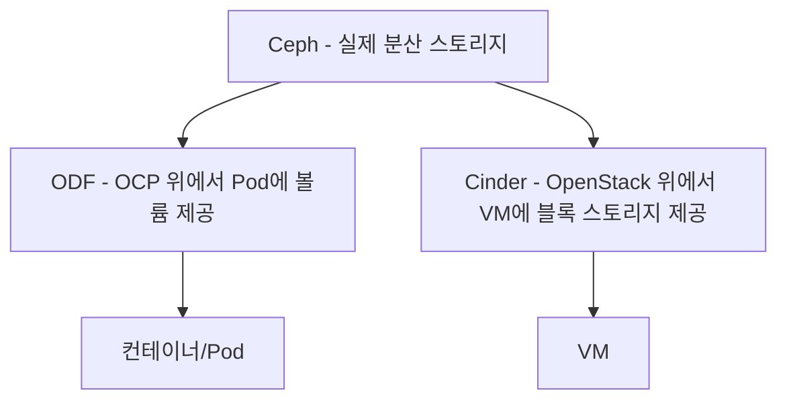

# OCP/OpenStack 스토리지 용어 개요 — Ceph, ODF, Cinder

이 용어들이 헷갈리는 이유는 앞서 정리한 OCP/OpenStack 축과 똑같다. Ceph는 실제로 데이터를 저장하는 스토리지 시스템 자체이고, ODF와 Cinder는 그 Ceph를 각자의 플랫폼(OCP 또는 OpenStack)에서 쓸 수 있게 연결해주는 계층이다. 참고: rhv-ocp-osp-overview.md

## 핵심 구도: 저장소는 하나, 연결 계층이 둘

- Ceph — 실제 데이터를 분산 저장하는 오픈소스 스토리지 시스템. 레드햇이 인수해서 RHCS(Red Hat Ceph Storage)로 판다
- ODF(OpenShift Data Foundation) — OCP(컨테이너) 클러스터 안에서 Ceph를 배포하고 Pod에 볼륨으로 제공하는 오퍼레이터
- Cinder — OpenStack(VM) 안에서 VM에 블록 스토리지(디스크)를 붙여주는 서비스. 백엔드로 Ceph를 쓰는 경우가 많다

즉 "Ceph를 쓴다"는 말은 어느 쪽에서든 나올 수 있는데, 컨테이너 환경(OCP)이면 ODF를 통해 연결된 것이고 VM 환경(OpenStack)이면 Cinder를 통해 연결된 것이다.

## 한 줄 구분법

"저장소가 뭐냐"고 물으면 답은 대체로 Ceph다. "그걸 어떻게 붙이냐"가 갈리는 지점이고, 컨테이너면 ODF, VM이면 Cinder다.

참고: ceph.md, odf.md, cinder.md, ocp.md, rhosp-osp.md
