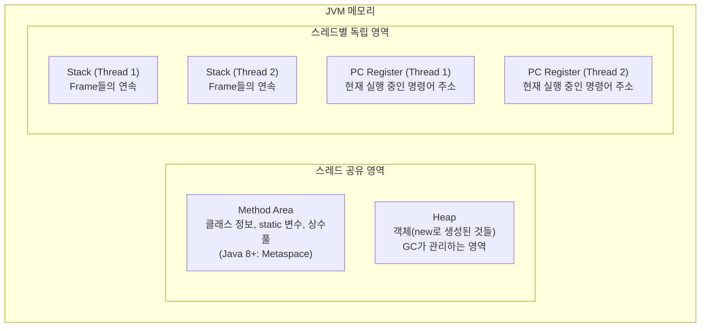
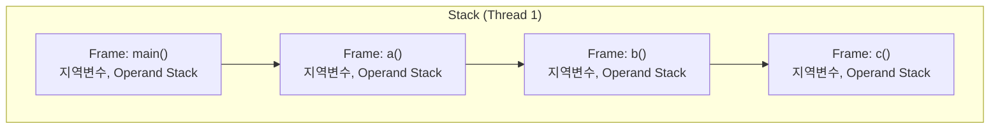
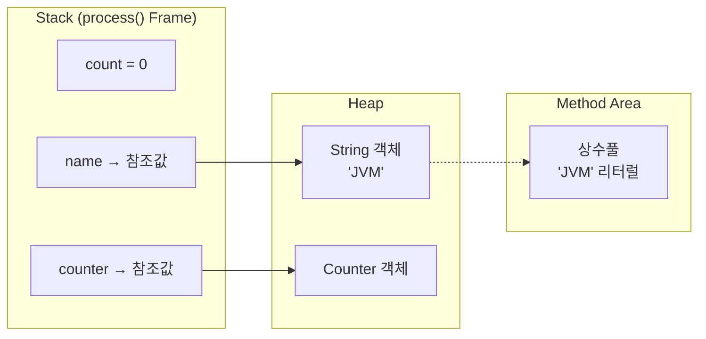

# JVM 메모리 영역 해부 — Heap, Stack, Method Area는 실제로 어떻게 동작하는가

> `StackOverflowError`와 `OutOfMemoryError`를 직접 만들어봤다. 에러 메시지는 달랐지만, 둘 다 JVM 메모리가 꽉 찼다는 신호였다. 그 메모리가 정확히 어디인지, 무엇이 저장되는지 해부해보자.

---

## JVM 메모리 전체 구조

JVM이 실행되면 OS로부터 메모리를 할당받아 여러 영역으로 나눠 관리한다.



핵심 구분:
- **스레드가 공유**하는 영역: Method Area, Heap
- **스레드마다 독립**적으로 존재하는 영역: Stack, PC Register

---

## Heap — 객체가 살아있는 곳

`new` 키워드로 생성되는 모든 객체는 Heap에 올라간다.

```java
String message = new String("JVM");  // "JVM" 객체 → Heap
List<Integer> list = new ArrayList<>(); // ArrayList 객체 → Heap
```

Heap은 모든 스레드가 공유한다. 덕분에 스레드 간 데이터 공유가 쉽지만, 동시에 **동기화 문제**가 생기는 이유도 여기에 있다.

### Heap 내부 구조 (G1GC 기준)

```
Heap
├── Young Generation (새로 생긴 객체)
│   ├── Eden      ← new 하면 여기 먼저
│   ├── Survivor 0
│   └── Survivor 1
└── Old Generation (오래 살아남은 객체)
```

- 객체는 Eden에서 태어나고, GC에서 살아남으면 Survivor로 이동
- 여러 번 살아남으면 Old Generation으로 승격
- GC는 이 구조를 기반으로 효율적으로 메모리를 회수한다 (Phase 3에서 상세히)

### Heap이 꽉 차면

```java
// HeapTest.java
List<byte[]> list = new ArrayList<>();
while (true) {
    list.add(new byte[1024 * 1024]); // 1MB씩 계속 할당
}
```

```bash
java -Xmx50m HeapTest.java
```

실제 출력:
```
Exception in thread "main" java.lang.OutOfMemoryError: Java heap space
    at ding.co.HeapTest.main(HeapTest.java:11)
```

`-Xmx50m` 으로 Heap 최대 크기를 50MB로 제한했더니, 1MB씩 객체를 계속 만들다가 50번 만에 터진 것이다.

### Heap 관련 JVM 플래그

| 플래그 | 의미 | 예시 |
|---|---|---|
| `-Xms` | Heap 초기 크기 | `-Xms256m` |
| `-Xmx` | Heap 최대 크기 | `-Xmx1g` |

실무에서 `-Xms`와 `-Xmx`를 같은 값으로 설정하는 경우가 많다. Heap 크기를 동적으로 늘리고 줄이는 과정 자체가 GC 부담이 되기 때문이다.

---

## Stack — 메서드 호출의 기록

스레드마다 Stack이 하나씩 있다. 메서드를 호출할 때마다 **Stack Frame** 하나가 쌓이고, 메서드가 끝나면 Frame이 사라진다.



### Stack Frame 안에 있는 것

- **지역변수 슬롯**: `int x = 5` 같은 지역변수 (Phase 1에서 본 `astore_1`)
- **Operand Stack**: 계산 중간값을 임시로 올려두는 공간
- **리턴 주소**: 이 메서드가 끝나면 어디로 돌아갈지

### Stack이 꽉 차면

```java
// StackTest.java
public static void infinite() {
    infinite(); // 재귀 무한 호출
}
```

실제 출력:
```
Exception in thread "main" java.lang.StackOverflowError
    at ding.co.StackTest.infinite(StackTest.java:7)
    at ding.co.StackTest.infinite(StackTest.java:7)
    ...
```

`infinite()`를 호출할 때마다 Frame이 하나씩 쌓인다. Stack 용량이 꽉 차는 순간 `StackOverflowError`가 터진다. 스택 트레이스에 같은 줄이 수백 번 반복되는 이유가 바로 이것이다.

### Stack 관련 JVM 플래그

| 플래그 | 의미 | 예시 |
|---|---|---|
| `-Xss` | 스레드당 Stack 크기 | `-Xss512k` |

Stack 크기를 너무 작게 잡으면 깊은 재귀에서 `StackOverflowError`, 너무 크게 잡으면 스레드 수가 많을 때 메모리 낭비가 생긴다.

---

## Method Area (Metaspace) — 클래스 정보가 사는 곳

클래스가 로딩될 때 클래스의 구조 정보가 저장되는 영역이다.

저장되는 것들:
- 클래스 이름, 부모 클래스, 인터페이스 목록
- 메서드 정보 (이름, 파라미터, 반환 타입)
- **static 변수**
- **상수풀 (Constant Pool)** — Phase 1에서 `ldc` 명령어가 꺼내던 곳

```java
public class Counter {
    static int count = 0; // → Method Area (Metaspace)에 저장
    int value;            // → Heap의 객체 안에 저장
}
```

### Java 7 vs Java 8 차이

Java 7까지는 이 영역을 **PermGen(Permanent Generation)** 이라고 불렀고 Heap 안에 있었다. 크기가 고정되어 있어서 클래스를 많이 로딩하면 `OutOfMemoryError: PermGen space` 가 터졌다.

Java 8부터는 **Metaspace** 로 바뀌었고, Heap 밖 Native Memory에 위치한다. 기본적으로 크기 제한이 없어서 PermGen 문제가 사라졌다.

| | PermGen (Java 7 이하) | Metaspace (Java 8+) |
|---|---|---|
| 위치 | Heap 안 | Native Memory (Heap 밖) |
| 크기 | 고정 (기본 64MB) | 동적 (OS 메모리까지) |
| OOM 발생 | 클래스 많으면 자주 발생 | 거의 없음 |

---

## PC Register — 지금 어디를 실행하고 있나

스레드마다 하나씩 있는 작은 공간이다. 현재 실행 중인 JVM 명령어의 주소를 저장한다.

OS 스케줄러가 스레드를 코어에서 내렸다가 다시 올릴 때, PC Register 덕분에 **어디서부터 다시 실행할지** 정확히 알 수 있다. 컨텍스트 스위칭의 핵심이다.

---

## 두 에러의 대칭 구조

직접 만들어본 두 에러를 메모리 영역으로 정리하면:

```
StackOverflowError               OutOfMemoryError: Java heap space
────────────────────────         ──────────────────────────────────
Stack이 꽉 참                    Heap이 꽉 참
메서드 호출(Frame)이 원인         객체 생성(new)이 원인
스레드마다 독립적                 모든 스레드 공유
JVM 플래그: -Xss                 JVM 플래그: -Xmx / -Xms
```

---

## 코드 한 줄이 메모리에 어떻게 올라가는가

```java
public void process() {
    int count = 0;                     // Stack (지역변수)
    String name = "JVM";               // Stack에 참조값, 실제 객체는 Heap
    Counter counter = new Counter();   // Stack에 참조값, Counter 객체는 Heap
}
```



**중요한 구분:**
- 지역변수(참조값)는 Stack에
- 실제 객체는 Heap에
- `int`, `long` 같은 primitive 타입은 Stack에 값 자체가 저장

---

## 정리

| 영역 | 공유 여부 | 저장되는 것 | 관련 에러 |
|---|---|---|---|
| **Heap** | 스레드 공유 | new로 만든 객체 | `OutOfMemoryError: Java heap space` |
| **Stack** | 스레드 독립 | 지역변수, Frame | `StackOverflowError` |
| **Method Area** | 스레드 공유 | 클래스 정보, static, 상수풀 | `OutOfMemoryError: Metaspace` |
| **PC Register** | 스레드 독립 | 현재 실행 명령어 주소 | — |

- **Heap**은 모든 스레드가 공유 — 동기화 문제의 근원
- **Stack**은 스레드마다 독립 — 지역변수가 Thread-safe한 이유
- **static 변수**는 Heap이 아니라 Method Area에 — 모든 인스턴스가 공유하는 이유
- 지역변수는 Stack, 객체는 Heap — 이 구분이 모든 것의 기초

---

**다음**: [JVM Garbage Collection — GC는 어떻게 메모리를 회수하는가](./jvm-garbage-collection.md)
