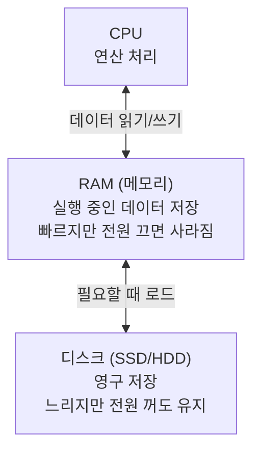
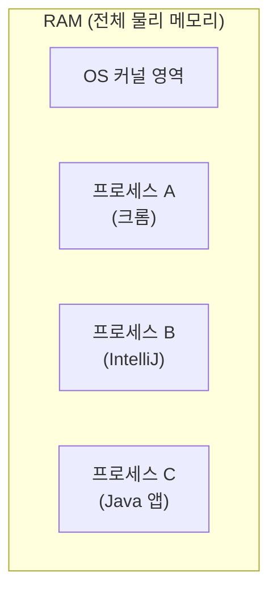
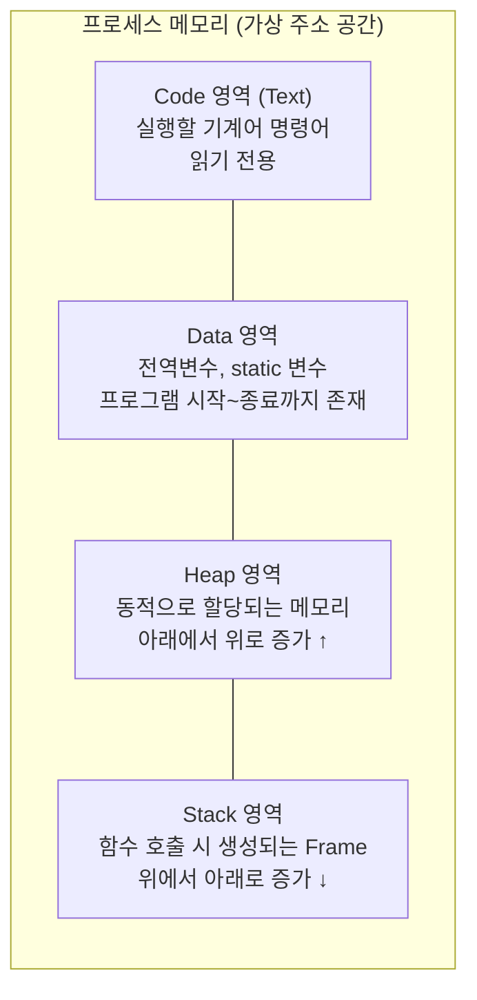
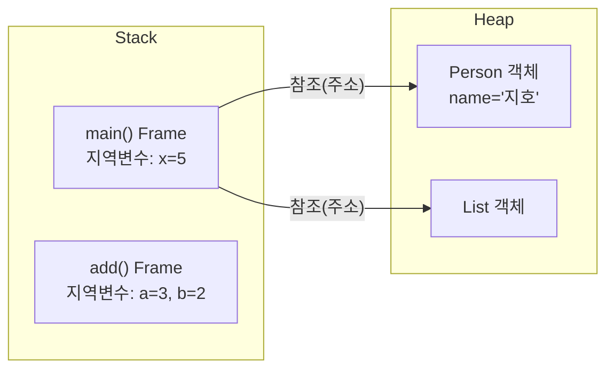
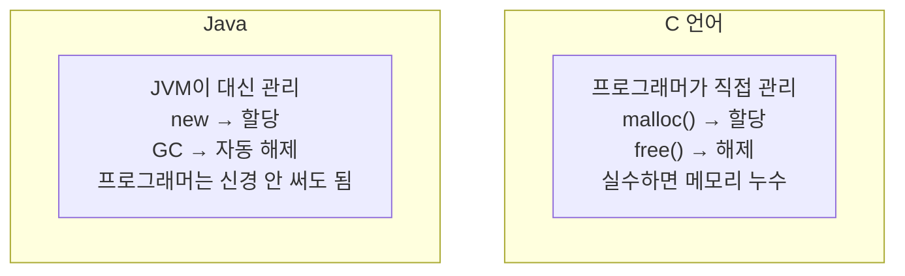
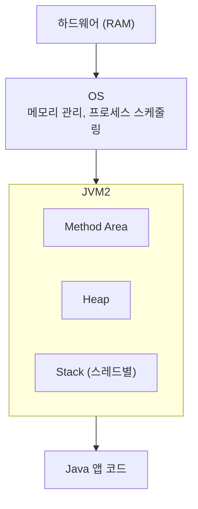

# JVM을 이해하기 전에 — 컴퓨터 메모리 구조부터

> JVM의 Heap, Stack을 설명하기 전에 먼저 물어봐야 할 것이 있다. "메모리가 뭔가?" Java 코드가 실행되는 환경을 이해하려면, 그 아래에 있는 OS와 하드웨어 메모리부터 알아야 한다.

---

## 메모리란 무엇인가



- **CPU**: 연산을 처리하는 곳. 직접 데이터를 저장하지 않는다
- **RAM**: CPU가 지금 당장 사용하는 데이터를 올려두는 곳. 빠르지만 휘발성
- **디스크**: `.class` 파일, `.jar` 파일이 저장된 곳. 실행하려면 RAM으로 올라와야 한다

Java 프로그램을 실행한다는 것 = `.class` 파일을 디스크에서 RAM으로 올리고 CPU가 처리하는 것이다.

---

## OS가 메모리를 관리하는 방식

여러 프로그램이 동시에 실행된다. 크롬, IntelliJ, 터미널이 모두 RAM을 쓴다. 이것을 OS가 중재한다.



OS는 각 프로세스에게 **가상 메모리(Virtual Memory)** 를 할당한다. 각 프로세스는 자신이 RAM 전체를 독점한다고 착각하지만, 실제로는 OS가 중재해서 물리 메모리를 나눠 쓴다.

덕분에:
- 프로세스끼리 메모리를 침범하지 못한다
- 실제 RAM보다 더 큰 메모리를 쓰는 것처럼 동작할 수 있다 (스왑)

---

## 프로세스 메모리 구조

Java 앱을 실행하면 OS가 프로세스에 메모리를 할당한다. 이 메모리는 용도에 따라 4개 영역으로 나뉜다.



| 영역 | 저장되는 것 | 생명주기 |
|---|---|---|
| **Code** | 실행할 명령어 (기계어) | 프로세스 시작~종료 |
| **Data** | 전역변수, static 변수 | 프로세스 시작~종료 |
| **Heap** | 동적 할당 메모리 (`malloc`, `new`) | 직접 할당~해제 |
| **Stack** | 함수 호출 Frame, 지역변수 | 함수 호출~리턴 |

---

## Heap vs Stack — 핵심 차이

이 두 영역의 차이를 이해하는 것이 메모리 이해의 핵심이다.



**Stack:**
- 함수가 호출될 때 자동으로 생성, 리턴되면 자동으로 사라짐
- 크기가 컴파일 타임에 결정됨
- 매우 빠름 (포인터만 이동)
- 스레드마다 독립적으로 존재

**Heap:**
- 프로그래머(또는 GC)가 명시적으로 할당/해제
- 크기가 런타임에 결정됨
- Stack보다 느림 (관리 비용 존재)
- 모든 스레드가 공유

---

## C vs Java — 메모리 관리 방식의 차이

여기서 Java가 왜 JVM을 필요로 하는지 이해할 수 있다.



C에서는 Heap 메모리를 직접 `malloc()`으로 할당하고 `free()`로 해제해야 한다. 실수하면 메모리 누수(Memory Leak)가 생긴다.

Java는 이 책임을 JVM의 GC(Garbage Collector)에게 넘겼다. 덕분에 편하지만, **GC가 언제 어떻게 동작하는지 모르면** 예상치 못한 성능 문제가 생긴다.

---

## JVM은 프로세스 위에 올라간다

JVM 자체도 하나의 프로세스다. OS로부터 메모리를 할당받아 그 안에서 Java 앱을 실행한다.



즉 계층 구조는:

```
하드웨어 (RAM)
    ↓
OS (메모리를 프로세스 단위로 관리)
    ↓
JVM 프로세스 (OS로부터 메모리를 받아 내부적으로 나눔)
    ↓
Java 앱 (JVM 위에서 실행)
```

JVM의 Heap, Stack, Method Area는 **OS로부터 받은 메모리를 JVM이 내부적으로 용도별로 나눈 것**이다. 프로세스 메모리의 Heap/Stack과 이름은 같지만, JVM이 자체적으로 관리하는 별도 개념이다.

---

## 정리

- **RAM**: CPU가 실행 중에 데이터를 올려두는 곳
- **OS**: 여러 프로세스에 메모리를 나눠주는 중재자
- **프로세스 메모리**: Code, Data, Heap, Stack 4영역으로 구성
- **Stack**: 함수 호출마다 자동 생성/소멸, 스레드 독립
- **Heap**: 동적 할당, 모든 스레드 공유, 수동 또는 GC로 해제
- **JVM**: OS로부터 메모리를 받아 내부적으로 Method Area / Heap / Stack 등으로 나눔
- **GC**: C의 `free()`를 자동으로 해주는 JVM의 장치

---

**다음**: [JVM이란 무엇인가 — Java 코드가 실행되기까지](./jvm-what-and-why.md)
