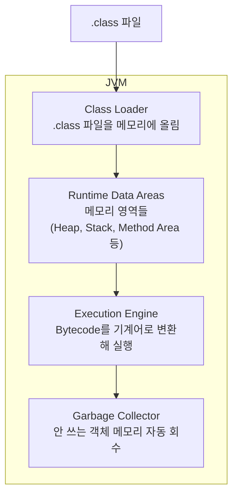
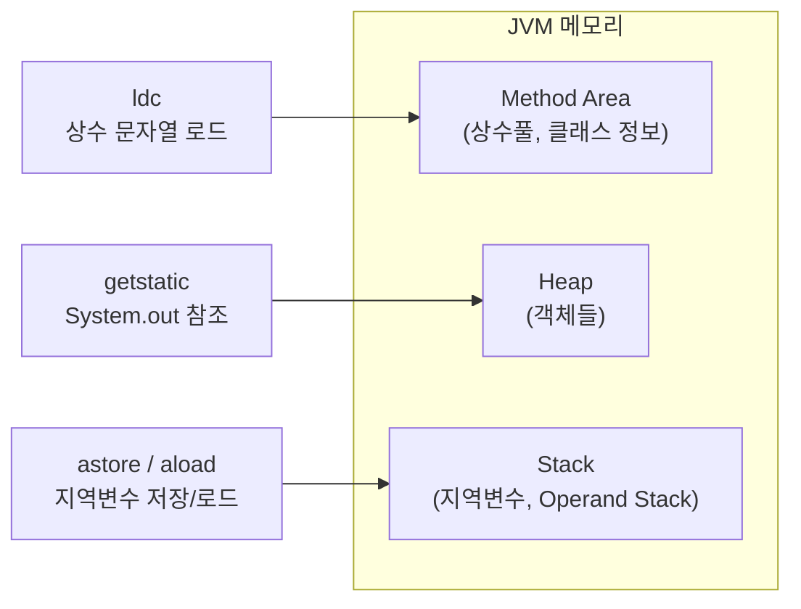

# JVM이란 무엇인가 — Java 코드가 실행되기까지

> `javap -c HelloJVM.class` 를 처음 실행했을 때, `aload_0`, `invokespecial`, `ldc` 같은 낯선 명령어들이 나왔다. 이게 뭔지 이해하려면 JVM이 뭘 하는 곳인지부터 알아야 했다.

---

## Java 코드는 어떻게 실행되나

C언어로 작성한 코드는 컴파일하면 특정 OS와 CPU에 맞는 기계어가 나온다. Mac에서 컴파일한 바이너리는 Windows에서 실행되지 않는다.

Java는 다르게 접근했다.

```
Java 코드(.java)
    ↓ javac 컴파일
Bytecode(.class)        ← OS/CPU에 독립적인 중간 언어
    ↓ JVM이 실행
기계어                   ← JVM이 현재 OS/CPU에 맞게 번역
```

**Bytecode는 특정 CPU의 언어가 아니다.** JVM이라는 가상 머신이 이해하는 중간 언어다. JVM은 각 운영체제마다 따로 구현되어 있고, bytecode를 받아서 그 OS에 맞는 기계어로 변환해 실행한다.

이것이 Java의 슬로건 **"Write Once, Run Anywhere"** 의 실체다.

---

## JVM / JRE / JDK 구분

헷갈리는 개념부터 정리하자.

```
JDK (Java Development Kit)
├── JRE (Java Runtime Environment)
│   └── JVM (Java Virtual Machine)
├── javac (컴파일러)
├── javap (bytecode 분석기)
└── jmap, jstack 등 (진단 도구)
```

| | 역할 | 필요한 상황 |
|---|---|---|
| **JVM** | Bytecode를 실행하는 가상 머신 | 실행의 핵심 |
| **JRE** | JVM + 표준 라이브러리(java.util 등) | Java 앱 실행만 할 때 |
| **JDK** | JRE + 컴파일러 + 개발 도구 전체 | Java 개발할 때 |

서버에 Java 앱을 배포만 한다면 JRE로 충분하다. 코드를 작성하고 컴파일하려면 JDK가 필요하다.

---

## JVM 내부 구조

JVM 안에는 크게 4가지 구성요소가 있다.



- **Class Loader**: `.class` 파일을 읽어서 메모리에 올린다
- **Runtime Data Areas**: 실행 중에 데이터가 저장되는 메모리 공간들
- **Execution Engine**: bytecode를 해석하고 실행한다
- **Garbage Collector**: 더 이상 참조되지 않는 객체를 찾아 메모리를 회수한다

---

## Bytecode를 직접 보자

실제로 확인해보자. 아래 코드를 컴파일하면 어떤 bytecode가 나오는지 보면, JVM이 뭘 하는지 눈으로 확인할 수 있다.

```java
// HelloJVM.java
public class HelloJVM {
    public static void main(String[] args) {
        String message = "JVM을 이해하자";
        System.out.println(message);
    }
}
```

```bash
javac HelloJVM.java
javap -c HelloJVM.class
```

실제 출력 결과:

```
public class HelloJVM {
  public HelloJVM();
    Code:
       0: aload_0
       1: invokespecial #1   // Method java/lang/Object."<init>":()V
       4: return

  public static void main(java.lang.String[]);
    Code:
       0: ldc           #7   // String JVM을 이해하자
       2: astore_1
       3: getstatic     #9   // Field java/lang/System.out:Ljava/io/PrintStream;
       6: aload_1
       7: invokevirtual #15  // Method java/io/PrintStream.println:(Ljava/lang/String;)V
      10: return
}
```

---

## Bytecode 해석

JVM은 **스택 기반 가상 머신**이다. 연산할 값을 스택에 올리고(push), 명령어가 스택에서 값을 꺼내(pop) 처리한다.

### 생성자 부분

```
0: aload_0          → this(자기 자신)를 Operand Stack에 올려
1: invokespecial #1 → Object의 생성자 호출
4: return
```

Java에서 클래스를 만들 때 명시적으로 `super()`를 호출하지 않아도, 컴파일러가 자동으로 `Object` 생성자 호출을 삽입한다. **모든 Java 클래스는 암묵적으로 Object를 상속한다** — 이게 bytecode로 보이는 순간이다.

### main 메서드 부분

```
0: ldc #7       → "JVM을 이해하자" 문자열을 상수풀(Constant Pool)에서 꺼내 Stack에 올려
2: astore_1     → Stack에서 꺼내 지역변수 슬롯 1번(message)에 저장
3: getstatic #9 → System.out 객체를 Heap에서 찾아 Stack에 올려
6: aload_1      → 지역변수 message를 Stack에 다시 올려
7: invokevirtual #15 → println() 호출 (Stack의 두 값 소비)
10: return
```

`String message = "JVM을 이해하자"` 한 줄이 실제로는 **3단계**로 동작한다:

1. 상수풀에서 문자열을 꺼내고 (`ldc`)
2. 임시로 Stack에 올리고
3. 지역변수 슬롯에 넣는다 (`astore_1`)

---

## 각 명령어가 어느 메모리 영역과 연결되는가



| Bytecode 명령어 | 연결되는 메모리 영역 |
|---|---|
| `ldc` | Method Area (상수풀) |
| `astore_1` / `aload_1` | Stack (지역변수 슬롯) |
| `getstatic` (System.out) | Heap (객체 참조) |
| `invokespecial` / `invokevirtual` | Execution Engine이 처리 |

---

## 왜 JVM을 이해해야 하는가

JVM을 몰라도 Java 코드는 쓸 수 있다. 하지만 다음 상황이 되면 달라진다.

```
- 서버가 갑자기 OOM(OutOfMemoryError)으로 죽었다
- GC가 너무 자주 발생해서 응답 지연이 생긴다
- 메모리 누수가 어디서 나는지 찾아야 한다
- 성능 병목이 코드 문제인지 JVM 설정 문제인지 판단해야 한다
```

이 상황들에서 **JVM 내부를 아는 개발자**와 모르는 개발자의 차이가 극명하게 갈린다. JVM을 이해한다는 건, Java 코드가 실행되는 환경 자체를 이해하는 것이다.

---

## 정리

- **JVM**은 Bytecode를 받아 현재 OS에서 실행시키는 가상 머신이다
- `.java` → `.class`(Bytecode) → JVM 실행 → 기계어 순서로 동작한다
- JVM 안에는 **Class Loader, Runtime Data Areas, Execution Engine, GC** 가 있다
- Bytecode는 **스택 기반**으로 동작한다 — 값을 스택에 올리고, 명령어가 소비한다
- `String message = "값"` 한 줄도 bytecode로 보면 상수풀 → Stack → 지역변수 슬롯 3단계다
- JVM을 이해하면 OOM, GC 이슈, 메모리 누수를 스스로 진단할 수 있다

---

**다음**: [JVM 메모리 영역 해부 — Heap, Stack, Method Area는 실제로 어떻게 동작하는가](./jvm-memory-areas.md)
