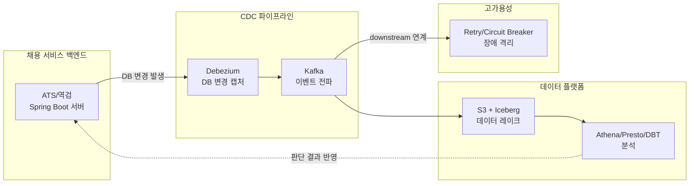

# 마이다스 백엔드(CDC 기술자) 지원 준비 오버뷰

참고: job-postings/midas-it-backend.md (공고 원문)

## 이 공고가 왜 이렇게 나왔는가

마이다스는 연간 200만 명 이상이 쓰는 채용 솔루션(ATS, 역검)을 이미 운영 중이다. 공고 서두에서 "기존 ATS를 넘어 AI Agent를 결합해 채용 과정을 자동화하고 의사결정을 지원"한다고 밝히는데, 이 방향 전환이 이 포지션의 존재 이유다.

AI Agent가 판단하고 행동하려면 "지금 데이터가 어떤 상태인지"를 실시간으로 알아야 한다. 예를 들어 지원자가 역량검사를 완료하는 순간, 그 이벤트가 즉시 AI Agent에 전달되어야 다음 판단(면접 일정 자동 제안 등)을 할 수 있다. 배치로 하루에 한 번 데이터를 옮기는 방식으로는 이 요구를 채울 수 없다. 그래서 DB 변경을 실시간으로 감지해 전파하는 CDC가 이 포지션의 핵심 축이 됐다.

동시에 이 파이프라인은 "200만 명 규모의 대규모 트래픽"을 전제로 한다. 실시간성과 대규모 트래픽이 만나면 필연적으로 지연·정합성·장애 전파 문제가 생기고, 공고가 요구하는 세 축(CDC 파이프라인, 고가용성 설계, 데이터 플랫폼 연계)은 이 문제를 각각 다른 층위에서 해결하기 위한 것이다.

## 주요 업무 네 가지가 어떻게 하나의 시스템으로 이어지는가

- **1. 채용 서비스 백엔드** — AI Agent가 판단할 원본 데이터(지원 정보, 역검 결과 등)가 발생하는 지점. 참고: job-postings/midas-it-backend.md
- **2. CDC 파이프라인** — 그 원본 데이터의 변경을 실시간으로 캡처해서 Kafka로 흘려보내는 층. 여기서 만든 이벤트가 AI Agent와 데이터 플랫폼 양쪽으로 갈라진다.
- **3. 고가용성** — 이벤트를 받는 downstream 시스템 중 하나가 느려지거나 죽어도, 전체 파이프라인이 함께 무너지지 않도록 막는 층. CDC는 실시간·대규모이기 때문에 이 층이 없으면 장애가 순식간에 전파된다.
- **4. 데이터 플랫폼** — 같은 이벤트를 분석 관점에서 쌓아두는 층. Iceberg로 안전하게 관리하고, Presto/Athena/DBT로 쿼리·집계해서 AI Agent가 참고할 통계나 모델 학습 데이터로 되돌린다.

즉 하나의 CDC 이벤트가 "실시간 반응"과 "누적 분석" 두 갈래로 동시에 쓰이는 구조이고, 이 포지션은 그 갈래길의 파이프라인 전체를 설계·운영하는 역할이다.

## 인재상이 강조하는 것과 기술 스택의 관계

인재상에서 "장애를 사후 대응이 아닌 구조 설계로 예방", "기술 선택의 이유를 명확하게 설명"을 명시한 이유도 이 구조에서 나온다. CDC + 실시간 이벤트 기반 시스템은 장애가 발생했을 때 원인 추적이 어렵고(비동기, 분산), 사후 대응만으로는 대규모 트래픽에서 감당이 안 되기 때문에 처음부터 장애를 견디는 구조(Circuit Breaker, Bulkhead 등)로 설계하는 역량을 요구한다.

## 학습 로드맵과 공고 항목 매핑

- **Iceberg** (`midas-prep/iceberg/`, 완료) — "S3 기반 데이터 레이크 및 Iceberg 테이블 기반 데이터 관리 구조 설계" (주요 업무), "데이터 레이크(S3) 및 Iceberg 등 데이터 플랫폼 구축 경험" (우대 조건)
- **Athena/Presto/DBT** (`midas-prep/data-analytics/`, 진행 중) — "Athena, DBT를 활용한 데이터 분석 환경 연계 개발" (주요 업무), "Athena, Presto, DBT 등 데이터 분석 및 모델링 경험" (우대 조건)
- **Resilience4j/Circuit Breaker** (`midas-prep/resilience/`, 로드맵만) — "Retry, Circuit Breaker, 비동기 처리 등을 활용한 안정성 및 확장성 개선" (주요 업무), "장애를 사후 대응이 아닌 구조 설계로 예방" (인재상)
- **CDC 운영 심화** (`midas-prep/cdc-ops/`, 보류) — "Debezium 기반 CDC 시스템 설계·운영" (주요 업무). CDC 개념 자체는 이미 학습 완료(blog/cdc/, glossary/topics/distributed-systems/published/cdc.md), 운영 관점만 보강 필요

## 상대적으로 가벼운 항목 (별도 로드맵 없음)

- Java/Spring Boot 백엔드 실무 3년 이상 — 자격 요건이지 학습 대상 아님, 이미 보유
- 대용량 트래픽/데이터 환경 경험 — 마찬가지로 실무 경험 항목
