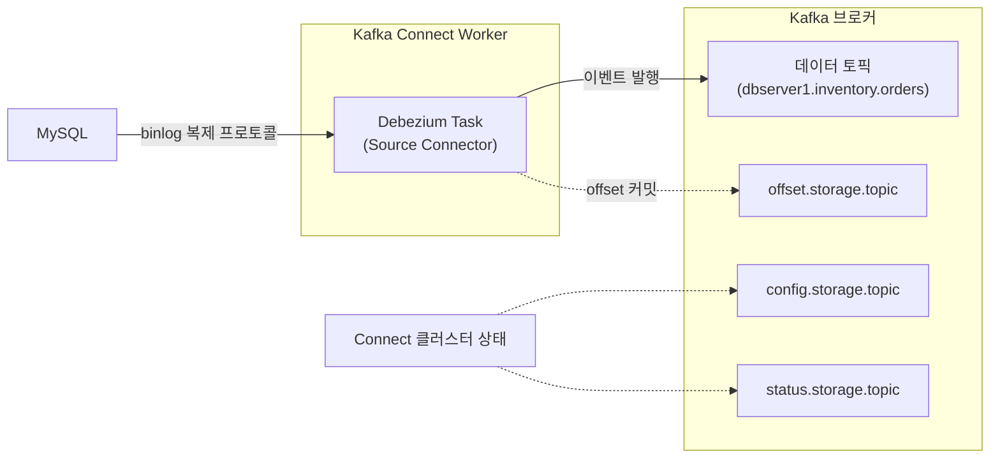

# kafka-connect-broker-relationship

**"Kafka Connect가 브로커와 물리적으로 어떻게 분리되어 있고, 무엇을 위해 브로커를 다시 사용하는가"**

kafka-connect.md에서 Worker-Connector-Task 구조를 정리했다. 여기서는 그 구조가 Kafka 브로커와 어떤 관계를 맺는지, 그리고 Debezium이 그 구조 어디에 끼워지는지를 다룬다.

---

## Connect는 브로커와 별도 프로세스다

Kafka Connect는 브로커 내부 기능이 아니라 별도로 뜨는 JVM 클러스터다. Connect Worker는 Kafka 입장에서 그냥 하나의 클라이언트(프로듀서 겸 컨슈머)로 접속한다.

```
Kafka Connect 클러스터 (별도 프로세스)
  └── Worker
        └── Connector (설정 단위)
              └── Task (실행 단위)
```

Debezium은 이 구조에서 별도 프로그램이 아니라 **Source Connector 구현체**로 끼워진다. Connect 입장에서는 Connector 플러그인 하나일 뿐이고, 그 안에서 Debezium이 MySQL에 Replica처럼 접속해 binlog를 읽는 로직을 수행한다.

```
Kafka Connect Worker
  └── Debezium MySQL Connector (Source Connector)
        └── Task 1 (binlog 구독 → 변경 이벤트 생성)
```

MySQL CDC는 보통 Task가 1개다. binlog가 순서 보장이 필요한 단일 스트림이라 병렬로 쪼갤 수 없기 때문이다. 반대로 JDBC Source Connector처럼 테이블 단위로 병렬화 가능한 Connector는 Task를 여러 개로 나눈다.

---

## 브로커는 두 가지 역할을 겸한다

Connect가 브로커를 쓰는 방식은 두 축으로 나뉜다.

**1. 데이터 목적지** — Debezium이 만든 변경 이벤트는 Source Connector를 거쳐 일반 데이터 토픽(예: `dbserver1.inventory.orders`)에 프로듀서처럼 쓰인다.

**2. Connect 자신의 상태 저장소** — Connect 클러스터는 별도 DB나 파일 시스템 없이, 자신이 연결된 브로커의 내부 토픽 3개에 상태를 저장한다.

- `config.storage.topic` — Connector 설정
- `offset.storage.topic` — offset (debezium-offset-recovery.md)
- `status.storage.topic` — Connector/Task 실행 상태



---

## 이 구조가 왜 중요한가

Connect Worker가 여러 대라도 모두 같은 브로커를 상태 저장소로 공유하기 때문에, 클러스터 차원의 조율이 가능하다. Worker가 죽거나 새로 join할 때 나머지 Worker들이 config/offset/status 토픽을 통해 같은 그림을 보고 재배정을 계산할 수 있다. 이것이 rebalancing(kafka-connect-rebalancing.md)이 여러 Worker에 걸쳐 일관되게 이루어지는 이유다.

즉 Kafka Connect는 브로커 위에 얹힌 계층이 아니라 브로커 옆에서 도는 별도 클러스터이고, 브로커를 데이터 목적지이자 상태 저장소로 재사용한다.

---

## 한 줄 요약

> Kafka Connect는 브로커와 분리된 프로세스이며, Debezium은 그 안의 Source Connector로 끼워지고, Connect 클러스터는 자체 상태(config/offset/status)를 브로커의 내부 토픽에 저장해 여러 Worker 간 조율의 기반으로 삼는다.

참고: kafka-connect.md
참고: debezium.md
참고: debezium-offset-recovery.md
참고: kafka-connect-rebalancing.md
