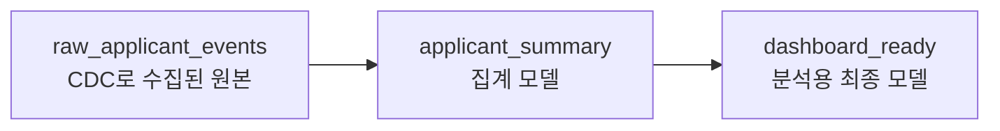

# dbt-model (디비티 모델)

**"SQL SELECT 문 하나를 테이블이나 뷰로 변환해서 관리하는 DBT의 기본 단위"**

DBT(Data Build Tool)는 데이터를 옮기거나 읽어오지 않는다. 이미 Presto/Athena로 쿼리 가능한 데이터 위에서, "이 원본 테이블을 이렇게 가공하면 저 테이블이 된다"는 변환 로직(SQL)을 파일로 관리하고 실행 순서를 조립해주는 도구다.

---

## 동작 방식 — .sql 파일 하나가 모델 하나

DBT 프로젝트에서 모델은 `SELECT` 문이 담긴 `.sql` 파일 하나다.

```sql
-- models/marts/applicant_summary.sql
SELECT
    applicant_id,
    COUNT(*) AS event_count,
    MAX(created_at) AS last_event_at
FROM {{ ref('raw_applicant_events') }}
GROUP BY applicant_id
```

DBT는 이 SELECT 문을 그대로 실행해서 결과를 새 테이블(또는 뷰)로 만든다. 개발자는 `CREATE TABLE AS SELECT` 같은 DDL을 직접 쓰지 않고 SELECT 로직만 작성하면 된다.

## ref() — 모델 간 의존성을 코드로 표현

위 예시의 `{{ ref('raw_applicant_events') }}`가 핵심이다. 이 함수는 다른 모델을 이름으로 참조하는데, 실행 시 DBT가 이를 실제 테이블 경로로 치환한다.



모델들이 `ref()`로 서로를 참조하면서 자연스럽게 의존성 그래프(DAG)가 만들어진다. 참고: dbt-dag.md

## Iceberg/Presto와의 관계

DBT 자체는 쿼리 엔진이 아니다. Presto/Athena 같은 엔진에 SQL을 보내 실행시키는 역할만 한다. 즉 DBT 모델의 SELECT 문은 Presto의 Iceberg 커넥터를 거쳐 실행되고, 그 결과가 다시 Iceberg 테이블로 쌓이는 구조다. 참고: presto-iceberg-connector.md

---

## 한 줄 요약

> DBT 모델 = SELECT 문 하나를 담은 SQL 파일. ref()로 다른 모델을 참조하면서 "원본 → 가공 → 분석용" 테이블 체인을 코드로 관리한다.

참고: dbt-dag.md
참고: presto-iceberg-connector.md
