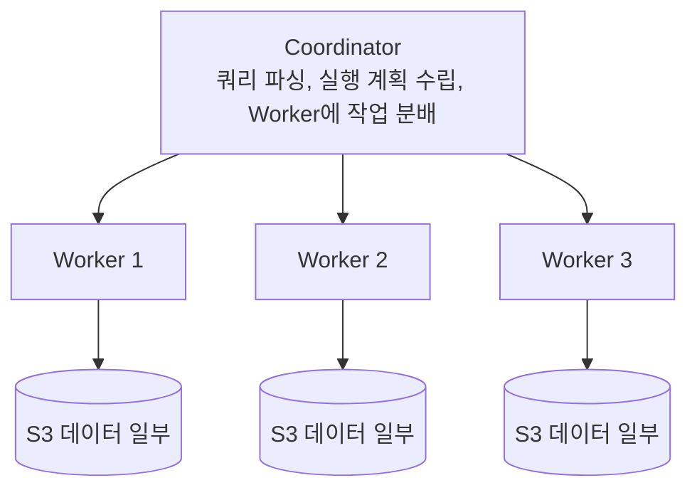

# presto-architecture (프레스토 아키텍처)

**"쿼리를 여러 워커에 나눠서 병렬로 실행하는 분산 SQL 쿼리 엔진의 구조"**

Presto(현재는 Trino로도 불림)는 데이터를 직접 저장하지 않는다. S3, Iceberg, MySQL 등 여러 데이터 소스에 커넥터로 붙어서, 그 위에 SQL 쿼리를 분산 실행만 해주는 엔진이다.

---

## 왜 필요한가 — 데이터를 옮기지 않고 쿼리한다

전통적인 방식은 데이터를 한 곳(데이터 웨어하우스)으로 모아야 쿼리할 수 있었다. Presto는 반대로, 데이터는 원래 있던 곳(S3의 Iceberg 테이블, MySQL 등)에 그대로 두고 쿼리 시점에 필요한 부분만 읽어 처리한다. CDC로 S3에 쌓인 데이터를 별도로 옮기지 않고 바로 분석할 수 있는 이유가 여기 있다.

## 동작 방식 — Coordinator와 Worker

- Coordinator — 클라이언트로부터 SQL을 받아 파싱하고, 실행 계획을 여러 단계(stage)로 쪼갠 뒤 Worker들에게 작업(task)을 분배한다. 스스로 데이터를 읽지 않는다.
- Worker — 실제로 데이터 소스에서 데이터를 읽고, 필터링/조인/집계 같은 연산을 수행한 뒤 결과를 다음 단계로 넘긴다.

쿼리 하나가 여러 Worker에 걸쳐 병렬로 처리되기 때문에, 대용량 데이터를 스캔하는 쿼리도 단일 노드보다 훨씬 빠르게 끝난다.

## 커넥터(Connector) — 데이터 소스 추상화

Presto가 여러 종류의 저장소를 동일한 SQL로 다룰 수 있는 이유는 커넥터 구조 때문이다. 각 데이터 소스(Iceberg, MySQL, Kafka 등)마다 전용 커넥터가 있고, 이 커넥터가 "이 소스에서 어떤 데이터를 어떻게 읽어올지"를 Presto 엔진에 알려준다. 참고: presto-iceberg-connector.md

이 구조 덕분에 하나의 쿼리에서 서로 다른 데이터 소스를 조인하는 것도 가능하다.

---

## 한 줄 요약

> Presto = 데이터를 저장하지 않고, Coordinator가 쿼리를 여러 Worker에 분산시켜 각자의 데이터 소스(커넥터를 통해)를 병렬로 읽고 처리하는 분산 SQL 엔진.

참고: presto-iceberg-connector.md
참고: athena-vs-presto.md
