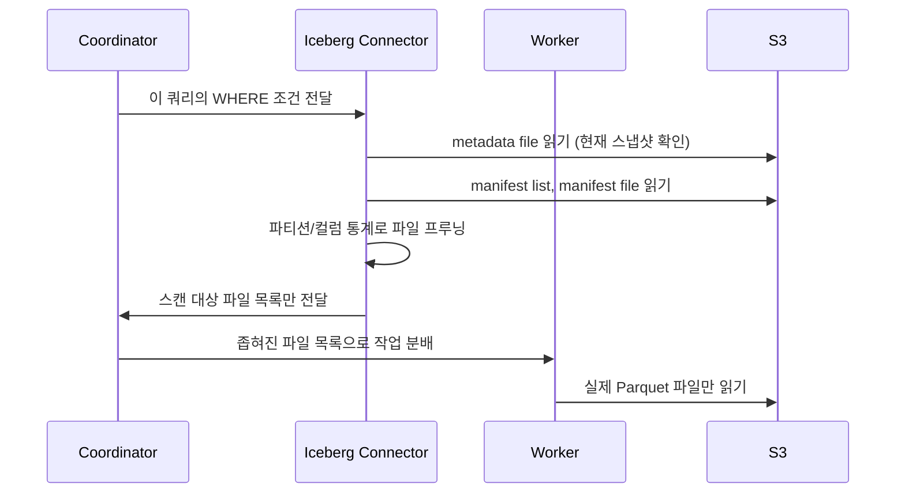

# presto-iceberg-connector (프레스토 아이스버그 커넥터)

**"Presto Worker가 S3 파일을 직접 뒤지지 않고 Iceberg 메타데이터를 먼저 읽어 스캔 범위를 좁히는 연결 방식"**

Presto의 Iceberg 커넥터는 Iceberg 테이블의 메타데이터 구조(metadata file → manifest list → manifest file)를 그대로 이해하고 활용한다. 참고: presto-architecture.md, iceberg-manifest.md

---

## 쿼리 실행 흐름

WHERE 절에 파티션 컬럼이나 min/max로 걸러지는 조건이 있으면, 커넥터가 manifest의 통계를 보고 조건에 맞지 않는 파일 전체를 스캔 대상에서 제외한다. 이 프루닝이 쿼리 성능의 핵심이다 — 실제 데이터를 열어보기 전에 메타데이터만으로 필터링이 끝난다.

## Time Travel 쿼리도 커넥터가 처리

`FOR VERSION AS OF`, `FOR TIMESTAMP AS OF` 같은 Iceberg의 Time Travel 문법은 Presto SQL 확장으로 그대로 지원된다. 커넥터가 요청된 스냅샷 ID/타임스탬프에 해당하는 metadata를 찾아 그 시점의 파일 목록으로 쿼리를 실행한다. 참고: iceberg-snapshot.md

## 스키마/파티션 변경과 커넥터

Iceberg 테이블의 스키마 에볼루션이나 파티션 에볼루션이 일어나도 Presto 커넥터는 별도 대응 없이 이를 인식한다. 컬럼 ID 기반 매핑, 파일별 파티션 스펙 기록이 모두 메타데이터에 있기 때문에, 커넥터는 그 메타데이터를 읽는 것만으로 자동으로 올바르게 처리한다. 참고: iceberg-schema-evolution.md, iceberg-partition-evolution.md

---

## 한 줄 요약

> Presto의 Iceberg 커넥터는 쿼리 실행 전에 Iceberg 메타데이터(manifest)를 먼저 읽어 스캔할 파일을 좁히고(pruning), Time Travel이나 스키마/파티션 변경도 메타데이터 해석만으로 자동 처리한다.

참고: presto-architecture.md
참고: iceberg-manifest.md
