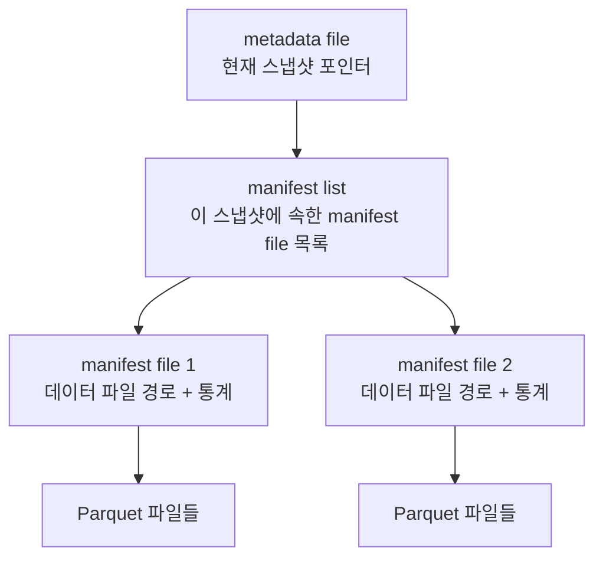

# iceberg-manifest (아이스버그 매니페스트)

**"스냅샷이 가리키는 파일 목록을 실제로 담고 있는 메타데이터 파일"**

스냅샷은 "이 시점의 테이블 상태"를 나타내는 포인터일 뿐이고, 그 포인터가 실제로 가리키는 파일 목록은 manifest에 적혀 있다. 참고: iceberg-snapshot.md

---

## 계층 구조 — metadata file → manifest list → manifest file

Iceberg 메타데이터는 3단계로 나뉜다.

- metadata file — 테이블 스키마, 파티션 스펙, 현재 스냅샷이 어떤 manifest list를 가리키는지 기록
- manifest list — 하나의 스냅샷에 속한 manifest file들의 목록. 각 manifest file의 파티션 범위 요약도 함께 가짐
- manifest file — 실제 데이터 파일(Parquet) 경로와 그 파일의 컬럼별 min/max, null count 같은 통계를 기록

## 왜 이렇게 나누는가

manifest file에 파일 단위 통계(min/max)가 있어서, 쿼리 엔진은 실제 Parquet 파일을 열어보지 않고도 manifest만 읽고 "이 파일에는 조건에 맞는 데이터가 없다"고 판단해 스캔 대상에서 제외할 수 있다. 이를 파일 프루닝(pruning)이라 한다.

manifest list에도 파티션 범위 요약이 있어서, 더 상위 단계에서 먼저 관련 없는 manifest file 자체를 건너뛸 수 있다. 즉 프루닝이 두 단계(manifest list 단계, manifest file 단계)로 일어난다.

## 쓰기 시 재사용

새 스냅샷을 만들 때 기존 데이터 파일이 그대로 유지된다면, 그 파일들을 가리키던 manifest file도 다시 쓰지 않고 재사용한다. 변경된 부분만 새 manifest file로 추가하고, manifest list가 새 manifest file과 기존 manifest file을 함께 가리키도록 갱신한다. 스냅샷마다 전체 파일 목록을 통째로 다시 쓰지 않아도 되는 이유다.

---

## 한 줄 요약

> manifest = 스냅샷이 가리키는 실제 데이터 파일 목록과 그 파일들의 통계를 담은 메타데이터. manifest list가 여러 manifest file을 묶고, 이 계층 구조 덕분에 쿼리 엔진이 파일을 열지 않고도 스캔 대상을 좁힐 수 있다(pruning).

참고: iceberg-snapshot.md
참고: iceberg-table-format.md
