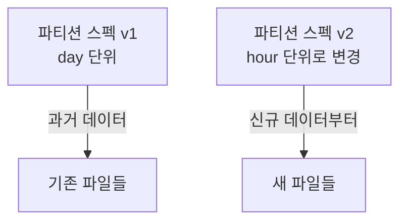

# iceberg-partition-evolution (아이스버그 파티션 에볼루션)

**"기존 데이터를 재작성하지 않고도 앞으로 들어올 데이터의 파티션 전략을 바꾸는 것"**

Hive 스타일 테이블은 파티션이 디렉토리 경로(`year=2026/month=07`)로 고정되어 있어서, 파티션 기준을 바꾸려면 테이블 전체를 새 디렉토리 구조로 재작성해야 한다. Iceberg는 파티션 정보를 디렉토리 경로가 아니라 메타데이터(파티션 스펙)로 관리해서 이 문제를 피한다. 참고: iceberg-schema-evolution.md

---

## 동작 방식 — 파티션 스펙의 버전 관리

Iceberg는 "어떤 컬럼을, 어떤 방식으로 파티셔닝하는가"를 파티션 스펙이라는 메타데이터로 관리하고, 이 스펙 자체도 버전을 가진다.

트래픽이 늘어 day 단위 파티션이 너무 커지면, hour 단위로 스펙을 바꾼다. 이때 기존 파일은 v1 스펙 그대로 남고, 새로 들어오는 데이터만 v2 스펙으로 쓰인다. 과거 파일을 재작성하지 않는다.

## 쿼리는 어떻게 두 스펙을 함께 다루는가

manifest file이 각 데이터 파일이 어떤 파티션 스펙으로 쓰였는지를 함께 기록하고 있어서, 쿼리 엔진은 파일마다 맞는 스펙으로 파티션 프루닝을 적용한다. 참고: iceberg-manifest.md 사용자는 쿼리에서 파티션 컬럼을 직접 명시할 필요가 없다 — Iceberg가 파티션 값을 데이터 컬럼으로부터 자동으로 유도하기 때문이다(hidden partitioning).

## Hive 방식과의 근본적 차이

Hive는 파티션이 경로이자 곧 스키마의 일부라서 바꾸면 과거/현재가 물리적으로 다른 구조가 되어 쿼리가 둘을 각각 다르게 다뤄야 한다. Iceberg는 파티셔닝을 메타데이터 층위의 설정으로 다루기 때문에, 쿼리 작성자 입장에서는 파티션 전략이 바뀐 사실 자체를 몰라도 된다.

---

## 한 줄 요약

> 파티션 에볼루션 = 파티션 기준을 메타데이터(파티션 스펙)로 관리해서, 기존 데이터를 재작성하지 않고도 앞으로의 파티션 전략을 바꾸고, 쿼리 엔진이 파일별로 맞는 스펙을 자동 적용하는 것.

참고: iceberg-schema-evolution.md
참고: iceberg-manifest.md
