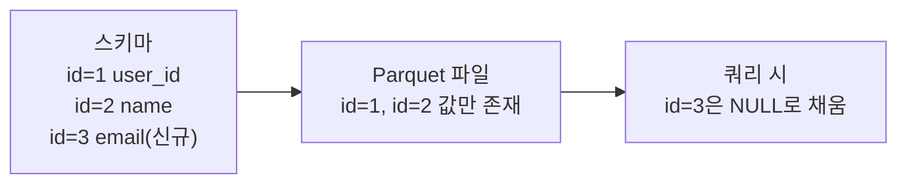

# iceberg-schema-evolution (아이스버그 스키마 에볼루션)

**"기존 데이터 파일을 다시 쓰지 않고도 테이블의 컬럼 구조를 안전하게 바꾸는 것"**

Hive 스타일 테이블은 컬럼을 컬럼 이름이나 위치로 매핑하는 경우가 많아서, 컬럼 순서를 바꾸거나 타입을 바꾸면 기존 데이터를 잘못 읽을 위험이 있다. Iceberg는 이 문제를 컬럼마다 고유 ID를 부여하는 방식으로 해결한다. 참고: iceberg-table-format.md

---

## 동작 방식 — 컬럼 이름이 아니라 ID로 매핑

Iceberg는 스키마의 각 컬럼에 이름과 별개로 불변의 정수 ID를 붙인다. 데이터 파일(Parquet) 안에도 이 ID가 함께 기록된다.

컬럼 이름이 바뀌어도 ID는 그대로이므로, 쿼리 엔진은 이름이 아니라 ID로 파일의 컬럼을 찾는다. 이름 변경이 기존 파일과 충돌하지 않는 이유다.

## 허용되는 변경과 이유

- 컬럼 추가 — 새 ID를 부여하고 끝. 기존 파일에는 그 ID가 없으니 읽을 때 NULL 처리
- 컬럼 이름 변경 — ID는 그대로이므로 기존 파일 재작성 불필요
- 컬럼 삭제 — 스키마에서 ID 매핑만 제거. 파일 자체는 그대로 두되 그 컬럼을 더는 읽지 않음
- 타입 확장(int → long, float → double처럼 정보 손실 없는 변경) — 허용
- 컬럼 순서 변경 — ID 기반 매핑이라 위치에 의존하지 않으므로 안전

반대로 타입을 좁히는 변경(long → int)이나 정보 손실이 있는 변경은 막는다. 기존에 저장된 값이 새 타입 범위를 벗어날 수 있어서다.

## 왜 파일을 다시 안 써도 되는가

변경 사항이 메타데이터(스키마 정의)에만 반영되고, 이미 쓰인 Parquet 파일은 그대로 둔 채 읽을 때 ID 매핑으로 해석하기 때문이다. 대규모 테이블에서 컬럼 하나 추가하자고 수 테라바이트를 재작성하지 않아도 되는 이유가 여기 있다.

---

## 한 줄 요약

> 스키마 에볼루션 = 컬럼을 이름이 아니라 불변 ID로 추적해서, 컬럼 추가/삭제/이름변경/순서변경을 기존 데이터 파일 재작성 없이 안전하게 처리하는 것.

참고: iceberg-table-format.md
참고: iceberg-partition-evolution.md
