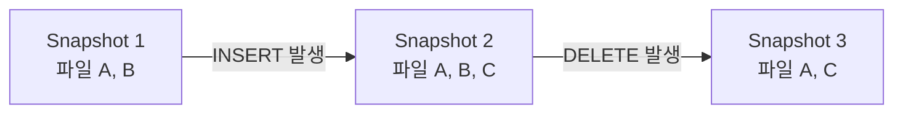

# iceberg-snapshot (아이스버그 스냅샷)

**"어느 한 시점에 테이블을 구성하던 파일 목록 전체를 가리키는 불변 버전"**

Iceberg 테이블에 쓰기(INSERT/UPDATE/DELETE, 파일 추가)가 일어날 때마다 새 스냅샷이 하나씩 생긴다. 스냅샷은 그 시점에 테이블이 어떤 데이터 파일들로 구성되어 있었는지를 통째로 가리키는 포인터다. 참고: iceberg-table-format.md

---

## 동작 방식 — 스냅샷 교체로 원자적 커밋

기존 파일을 수정하는 대신, 새 스냅샷을 만들고 테이블의 "현재 스냅샷" 포인터를 원자적으로 교체한다.



각 스냅샷은 그 이전 스냅샷의 파일들을 그대로 두고, 새 파일을 추가하거나 특정 파일을 제외하는 방식으로 다음 스냅샷을 구성한다. 기존 데이터 파일 자체를 수정하지 않는다(불변).

쿼리 엔진이 테이블을 읽을 때는 "현재 스냅샷"이 가리키는 파일 목록만 본다. 쓰기 작업이 진행 중이어도 읽기는 그 이전 스냅샷을 그대로 보므로, 리더가 반쯤 쓰인 상태를 보는 일이 없다.

## Time Travel

스냅샷마다 식별자(snapshot ID)와 타임스탬프가 남기 때문에, 과거 특정 스냅샷 시점의 테이블 상태를 그대로 조회할 수 있다.

```sql
SELECT * FROM table FOR VERSION AS OF 1234567890;
SELECT * FROM table FOR TIMESTAMP AS OF '2026-07-01 00:00:00';
```

이 기능을 Time Travel이라 부른다. 데이터가 실제로 삭제된 게 아니라 스냅샷이 그 파일을 더 이상 가리키지 않을 뿐이라서 가능하다.

## 스냅샷과 저장 공간

오래된 스냅샷을 계속 보존하면 실제로는 아무도 참조하지 않는 파일도 삭제되지 않고 S3에 남는다. 그래서 일정 기간이 지난 스냅샷은 만료(expire) 처리해서, 어떤 스냅샷에서도 참조되지 않는 파일을 실제로 삭제한다.

---

## 한 줄 요약

> 스냅샷 = 특정 시점의 테이블을 구성하는 파일 목록 전체를 가리키는 불변 포인터. 쓰기는 새 스냅샷 생성 + 포인터 교체로 원자적으로 처리되고, 이 덕분에 Time Travel이 가능하다.

참고: iceberg-table-format.md
참고: iceberg-manifest.md
