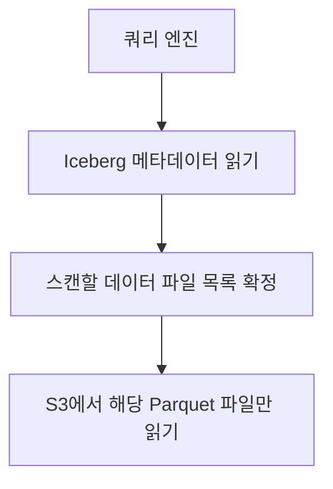

# iceberg-table-format (아이스버그 테이블 포맷)

**"테이블이 어떤 파일들로 이루어져 있는지를 파일시스템 리스팅이 아니라 메타데이터로 관리하는 방식"**

Iceberg는 파일 포맷(Parquet, ORC 같은)이 아니라 테이블 포맷이다. 데이터는 여전히 Parquet 같은 파일로 S3에 저장되고, Iceberg는 그 파일들의 목록과 스키마, 파티션 정보를 별도 메타데이터로 관리한다.

---

## 왜 필요한가 — Hive 테이블 방식의 한계

기존 Hive 스타일 테이블은 파티션을 디렉토리 경로로 표현한다.

```
s3://bucket/table/year=2026/month=07/day=17/part-0001.parquet
```

이 방식에서 "이 테이블에 어떤 파일이 속하는가"를 알아내려면 S3 디렉토리를 리스팅해야 한다. 문제는 세 가지다.

- 리스팅 자체가 느리다. 파티션이 많아질수록 S3 API 호출이 늘어난다.
- 파티션 컬럼을 나중에 바꾸려면 디렉토리 구조를 통째로 다시 써야 한다.
- 여러 프로세스가 동시에 파일을 추가/삭제하면, 리스팅 시점에 따라 같은 쿼리도 다른 결과를 볼 수 있다. 원자적 커밋이 없다.

## 해결 방식 — 메타데이터가 파일 목록을 가진다

Iceberg는 "지금 이 테이블은 정확히 이 파일들로 구성된다"는 목록을 메타데이터 파일에 명시적으로 기록한다. 쿼리 엔진은 S3를 리스팅하지 않고 메타데이터만 읽어서 어떤 파일을 스캔할지 결정한다.



이 메타데이터 계층 덕분에 파일 추가/삭제가 원자적 커밋(스냅샷 교체)으로 처리된다. 참고: iceberg-snapshot.md

## 테이블 포맷 vs 파일 포맷

- 파일 포맷(Parquet, ORC) — 개별 파일 안에서 데이터를 어떻게 인코딩하는가
- 테이블 포맷(Iceberg, Delta Lake, Hudi) — 여러 파일을 하나의 논리적 테이블로 묶고, 그 구성을 어떻게 추적하는가

Iceberg는 후자다. 내부적으로 Parquet 파일을 그대로 사용하되, 그 위에 메타데이터 레이어를 얹는다.

---

## 한 줄 요약

> Iceberg = 테이블을 이루는 파일 목록과 스키마를 메타데이터로 명시적으로 관리해서, S3 리스팅 없이 원자적 커밋과 빠른 스캔을 가능하게 하는 테이블 포맷.

참고: iceberg-snapshot.md
참고: iceberg-manifest.md
