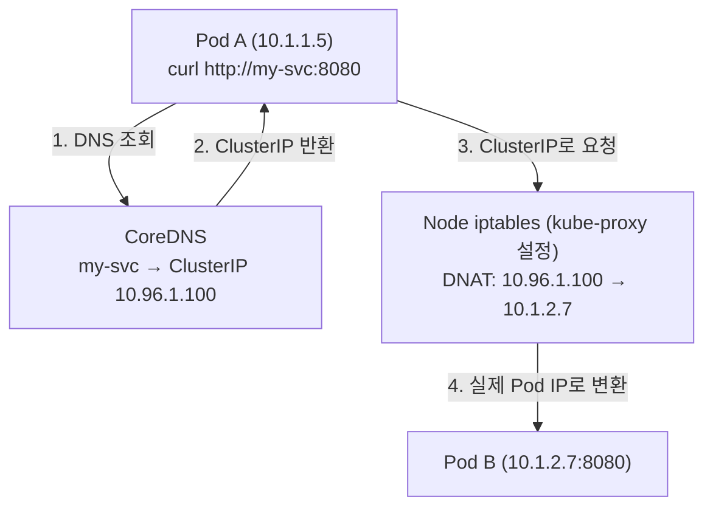

# Phase 0: K8s 네트워킹 기초 — Pod는 어떻게 통신하는가

> 참고: Networking and Kubernetes (Strong & Lancey, O'Reilly 2021) Chapter 3~4

---

## 0. 왜 K8s 네트워킹은 복잡한가

Docker가 컨테이너를 각 호스트 단위의 private bridge network에 붙이는 방식을 썼다. 문제는 다른 호스트의 컨테이너와 통신하려면 포트 매핑이 필요했고, 관리자가 포트 충돌을 직접 피해야 했다.

K8s는 이 문제를 **"모든 Pod에 고유한 IP를 준다"** 는 원칙으로 해결했다. 덕분에 포트 충돌 걱정이 없고, Pod는 마치 별도의 VM처럼 통신할 수 있다. 하지만 수천 개의 Pod에 IP를 부여하고 라우팅을 관리하는 것은 그 자체로 상당한 복잡성을 낳는다.

---

## 1. 컨테이너가 격리되는 원리 — Namespace와 cgroup

K8s를 이해하려면 컨테이너가 어떻게 네트워크를 격리하는지부터 알아야 한다.

컨테이너는 Linux 커널의 두 가지 기능으로 만들어진다.

**Namespace** — 프로세스가 볼 수 있는 리소스 범위를 격리한다.
- Network namespace: 독립적인 네트워크 스택(IP, 라우팅 테이블, iptables)을 가진다
- PID namespace: 프로세스 ID 격리
- Mount namespace: 파일시스템 격리
- IPC, UTS, UID namespace도 존재

**cgroup(Control Group)** — 프로세스가 사용할 수 있는 리소스 양을 제한한다.
- CPU, Memory, Disk I/O, Network 사용량을 컨테이너별로 제한

```
Node
┌─────────────────────────────────────┐
│  eth0 (10.100.1.5)                  │
│                                     │
│  ┌──────────────────────────────┐   │
│  │  Container network namespace │   │
│  │  eth0 (10.200.1.5)  ← veth  │   │
│  └──────────────────────────────┘   │
│                                     │
│  Kernel / cgroup                    │
└─────────────────────────────────────┘
```

컨테이너 안에서 `ifconfig`를 치면 호스트와 다른 IP가 보이는 이유가 바로 이 Network namespace 때문이다. 컨테이너는 자신만의 독립된 네트워크 스택을 가진다.

---

## 2. veth pair — 컨테이너를 호스트에 연결하는 방법

Network namespace로 격리된 컨테이너가 외부와 통신하려면 연결 통로가 필요하다. 이것이 **veth pair(Virtual Ethernet pair)** 다.

veth pair는 한쪽 끝에서 들어간 패킷이 반드시 다른 쪽 끝으로 나오는 가상 케이블이다.
- 한쪽 끝: 컨테이너 namespace 안의 `eth0`
- 다른쪽 끝: 호스트 namespace의 `vethXXXX`

그리고 호스트 쪽 여러 veth를 하나로 묶는 **Bridge interface**가 있다. Bridge는 L2 스위치처럼 동작하며, 같은 Bridge에 연결된 컨테이너들이 서로 통신할 수 있게 한다.

```
Root network namespace (Node)
┌─────────────────────────────────────────────┐
│  eth0 (10.100.1.5) ← 외부 네트워크          │
│       ↕                                     │
│  BRIDGE (br0)                               │
│  ├── veth0 ↔ [Container A: eth0 10.200.1.5] │
│  └── veth1 ↔ [Container B: eth0 10.200.1.6] │
└─────────────────────────────────────────────┘
```

**중요한 포인트**: 같은 노드의 컨테이너끼리는 Bridge를 통해 직접 통신한다. 다른 노드의 컨테이너와 통신하려면 오버레이 네트워크나 라우팅이 필요하다. 이를 해결하는 것이 CNI다.

---

## 3. K8s 네트워킹 모델의 3가지 원칙

K8s는 CNI(Container Network Interface)가 반드시 지켜야 할 네트워킹 규칙을 정의한다.

1. **모든 컨테이너는 NAT 없이 서로 통신할 수 있어야 한다**
2. **노드는 NAT 없이 컨테이너와 통신할 수 있어야 한다**
3. **컨테이너가 자신을 바라보는 IP와 외부에서 보이는 IP가 동일해야 한다**

이 원칙이 중요한 이유: Docker 방식에서는 컨테이너 내부 IP(172.17.x.x)와 외부에서 접근하는 포트가 달랐다. K8s는 이 불일치를 없앴다. 컨테이너가 자신의 IP를 10.1.0.5로 알고 있다면, 다른 Pod도 10.1.0.5로 직접 접근할 수 있다.

---

## 4. Pod — K8s 네트워킹의 기본 단위

Pod는 하나 이상의 컨테이너 묶음이다. 네트워크 관점에서 **Pod 안의 모든 컨테이너는 하나의 Network namespace를 공유한다**.

```
Pod (Network namespace 1개)
┌────────────────────────────────────┐
│  eth0 (10.1.0.5)                   │
│                                    │
│  ┌──────────────┐ ┌──────────────┐ │
│  │ Container A  │ │ Container B  │ │
│  │ (app:8080)   │ │ (sidecar)    │ │
│  └──────────────┘ └──────────────┘ │
│  → localhost로 서로 통신 가능       │
└────────────────────────────────────┘
```

Pod 내부 컨테이너들은 같은 IP를 공유하고 localhost로 통신한다. 그래서 같은 포트를 두 컨테이너가 동시에 열면 충돌한다.

**Pod IP는 임시다.** Pod가 재시작되거나 재스케줄링되면 IP가 바뀐다. 그래서 Pod IP를 직접 참조하면 안 된다. 이 문제를 해결하는 것이 Service다 (Phase 1에서 다룬다).

---

## 5. CNI — Pod IP를 누가 어떻게 부여하는가

CNI는 K8s가 컨테이너 네트워크를 구성하기 위해 호출하는 플러그인 인터페이스다. K8s 자체에는 기본 CNI가 없다. 클러스터를 구성할 때 CNI 플러그인을 선택해야 한다.

CNI 플러그인이 하는 일:
- Pod가 생성될 때 IP 주소를 할당한다 (ADD 명령)
- Pod가 삭제될 때 IP를 회수한다 (DEL 명령)
- Pod 간 라우팅 경로를 관리한다

K8s가 Pod를 스케줄링하는 흐름:

```
1. 사용자가 Pod 생성 요청 → API Server
2. Scheduler가 적절한 Node 선택 → Pod spec에 nodeName 기록
3. 해당 Node의 Kubelet이 Pod 생성 감지
4. Kubelet → CRI(container runtime)에게 컨테이너 생성 요청
5. Kubelet → CNI 플러그인에게 네트워크 구성 요청 (ADD)
6. CNI가 veth pair 생성, IP 할당, 라우팅 설정
7. Pod가 네트워크를 가지고 Running 상태가 됨
```

주요 CNI 플러그인:
- **Calico** — BGP 기반 라우팅, NetworkPolicy 강력 지원
- **Flannel** — 단순한 오버레이 네트워크, 설정이 쉬움
- **Cilium** — eBPF 기반, 고성능 + 강력한 보안 정책
- **WeaveNet** — 암호화 지원 오버레이

OpenShift(OKD)는 기본적으로 **OVN-Kubernetes** 또는 **OpenShift SDN**을 사용한다.

---

## 6. Node와 Pod의 네트워크 레이아웃 — IP 대역이 왜 중요한가

K8s 클러스터에는 세 종류의 IP 대역이 존재한다.

**Node IP** — 실제 물리/가상 머신의 IP. 클러스터 외부에서도 라우팅 가능.

**Pod CIDR** — Pod에게 할당되는 IP 대역. Node마다 서브넷이 할당된다.
- 예: 클러스터 전체 10.1.0.0/16, Node1의 Pod들은 10.1.1.0/24, Node2는 10.1.2.0/24

**Service CIDR** — Service(ClusterIP)에 할당되는 가상 IP 대역.
- 예: 10.96.0.0/12

이 세 대역이 겹치면 라우팅이 꼬인다. VM이나 온프레미스 환경에서 K8s를 쓸 때 가장 자주 발생하는 문제가 바로 IP 대역 충돌이다.

클러스터 네트워크 구조는 크게 세 가지:

**Isolated Network** — Pod IP가 클러스터 외부에서 라우팅 불가. 외부 접근은 LB/Proxy 경유. 보안에 유리.

**Flat Network** — Pod IP가 클러스터 외부에서도 직접 라우팅 가능. 성능에 유리하지만 큰 IP 대역 필요.

**Island Network** — 노드는 외부 라우팅 가능, Pod는 불가. Pod 트래픽이 노드를 나갈 때 SNAT으로 노드 IP로 변환. 대부분의 온프레미스 환경이 이 방식. VM ↔ K8s 통신이 어려운 이유 중 하나가 여기 있다.

```
Island Network에서의 패킷 흐름:

Pod(10.1.1.5) → 외부 요청
  ↓
Node에서 SNAT: src IP를 Node IP(192.168.1.10)로 변환
  ↓
외부에서 보기엔 Node IP로 요청이 온 것처럼 보임
  ↓
응답이 Node에 도착 → DNAT으로 다시 Pod IP로 변환
```

---

## 7. kube-proxy — Service IP를 실제 Pod IP로 연결하는 것

Pod IP는 바뀐다. 그래서 K8s는 Service라는 고정 IP(ClusterIP)를 제공한다. 그런데 이 ClusterIP는 실제로 존재하는 인터페이스가 아니다. 어떤 네트워크 장비에도 설정되어 있지 않은 **가상 IP**다.

이 가상 IP로 들어오는 트래픽을 실제 Pod IP로 변환하는 것이 **kube-proxy**다.

kube-proxy는 모든 노드에서 실행되며, API Server를 감시하다가 Service/Endpoint가 변경되면 그에 맞게 노드의 네트워크 규칙을 업데이트한다.

kube-proxy의 동작 모드:
- **iptables 모드** (가장 일반적) — iptables DNAT 규칙을 추가해 ClusterIP → Pod IP로 변환
- **IPVS 모드** — 커널의 IPVS(IP Virtual Server)를 사용, 대규모 클러스터에서 성능이 좋음
- **userspace 모드** — 구버전, 현재는 거의 안 씀

```
Service ClusterIP로 요청이 들어올 때:

Client Pod → ClusterIP:80
  ↓
Node의 iptables DNAT 규칙 매칭
  ↓
실제 Pod IP:targetPort 로 변환
  ↓
트래픽이 실제 Pod에 도달
```

---

## 8. CoreDNS — 이름으로 Service를 찾는 방법

Pod는 Service의 ClusterIP를 직접 알 필요가 없다. K8s 내부 DNS인 **CoreDNS**가 이름을 IP로 변환해준다.

`my-service.my-namespace.svc.cluster.local` 형식으로 조회하면 해당 Service의 ClusterIP를 반환한다.

같은 namespace 안에서는 Service 이름만으로도 조회 가능하다.
- `http://my-service` → CoreDNS가 `my-service.default.svc.cluster.local` 로 완성해서 조회

```
Pod에서 DNS 조회 흐름:

curl http://my-service:8080
  ↓
/etc/resolv.conf 확인 → nameserver: CoreDNS IP (보통 10.96.0.10)
  ↓
CoreDNS에게 my-service.default.svc.cluster.local 조회
  ↓
ClusterIP: 10.96.1.100 반환
  ↓
iptables DNAT → 실제 Pod IP로 변환
  ↓
트래픽 도달
```

---

## 전체 흐름 정리



---

## 체크리스트

- [ ] 컨테이너가 Network namespace로 격리된다는 것을 설명할 수 있다
- [ ] veth pair와 Bridge가 무엇인지, 왜 필요한지 말할 수 있다
- [ ] K8s 네트워킹 모델의 3가지 원칙을 말할 수 있다
- [ ] CNI가 어떤 역할을 하는지, 언제 호출되는지 설명할 수 있다
- [ ] Pod CIDR / Service CIDR / Node IP 세 가지 대역의 차이를 설명할 수 있다
- [ ] kube-proxy가 ClusterIP를 어떻게 처리하는지 설명할 수 있다
- [ ] CoreDNS가 어떤 역할을 하는지 설명할 수 있다

---

## 참고 문헌
- *Networking and Kubernetes* — James Strong & Vallery Lancey (O'Reilly, 2021) Chapter 3~4
