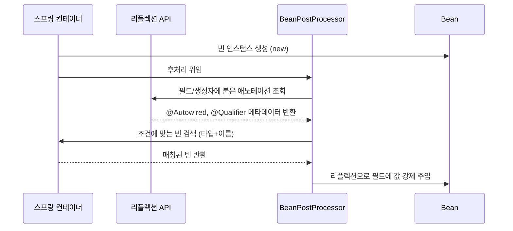

# 어노테이션이 실제로 동작하는 원리

`@Autowired`, `@Qualifier`, `@Primary`, `@Fallback` 같은 스프링 어노테이션이나 Hibernate의 `@NaturalIdCache` 모두 공통된 원리로 동작한다. 어노테이션 자체엔 실행 가능한 코드가 없고, 항상 그걸 읽어서 반응하는 별도의 처리기가 있다는 점이다.

## 어노테이션 자체는 메타데이터일 뿐이다

`@Qualifier("kakaoPayService")`를 필드에 붙이는 순간 자바 컴파일러가 하는 일은 하나뿐이다. 이 어노테이션 정보를 클래스 파일(.class)의 메타데이터 영역에 기록해두는 것이다. `@Retention(RUNTIME)`이 지정된 어노테이션이라면 이 정보는 런타임에도 리플렉션(`Class.getAnnotations()` 등)으로 조회할 수 있게 클래스 파일에 남는다.

여기까지가 자바 언어 차원에서 벌어지는 전부다. 어노테이션은 조건문도 함수 호출도 아니다. "이 필드/클래스에 이런 표식이 붙어 있다"는 데이터일 뿐이라서, 아무도 이 데이터를 읽지 않으면 프로그램 동작은 어노테이션이 없을 때와 완전히 같다.

## 실제 동작은 프레임워크가 리플렉션으로 만든다

스프링이 `@Autowired`와 `@Qualifier`를 보고 실제로 의존성을 주입하는 과정은 이렇다.

`@Autowired`가 붙은 필드/생성자를 찾아 실제로 값을 채워 넣는 주체는 `AutowiredAnnotationBeanPostProcessor`라는 스프링 내부 클래스다(autowired.md에서 이미 언급). 이 클래스가 하는 일은 다음과 같다.

1. 빈이 생성된 직후, 그 클래스의 모든 필드/생성자/메서드를 리플렉션으로 순회한다.
2. `Field.getAnnotation(Autowired.class)`처럼 리플렉션 API로 어노테이션이 붙어 있는지 검사한다.
3. 붙어 있으면, 같은 대상에 qualifier.md의 `@Qualifier`도 있는지 추가로 검사해서 이름을 읽는다.
4. 이 타입(+이름) 조건에 맞는 빈을 컨테이너의 빈 레지스트리에서 찾는다. primary.md의 `@Primary`, fallback-bean.md의 `@Fallback`도 이 검색 단계에서 후보를 좁히는 데 쓰인다.
5. `Field.setAccessible(true)` 후 `field.set(bean, foundBean)`처럼 리플렉션으로 private 필드에도 값을 강제로 밀어 넣는다.

즉 이 어노테이션들은 전부 "이 필드는 주입 대상이다", "이 이름을 써라", "내가 기본이다", "내가 후순위다"라는 표식일 뿐이고, 그 표식을 읽어서 실제로 빈을 찾고 필드에 꽂아 넣는 일은 스프링 컨테이너 초기화 과정에 등록된 `BeanPostProcessor`들이 리플렉션으로 수행한다.

## Hibernate의 어노테이션도 같은 원리다

natural-id-cache.md의 `@NaturalIdCache`도 메커니즘은 동일하다. Hibernate가 엔티티 클래스를 최초로 스캔할 때 리플렉션으로 `@NaturalId`, `@NaturalIdCache`가 붙은 필드/클래스를 찾아 메타모델(entity metadata)에 기록해두고, 이후 `session.byNaturalId(...)` 호출 시 이 메타모델을 참조해서 어느 캐시 영역을 조회할지 결정한다. 어노테이션이 직접 캐시를 만드는 게 아니라, Hibernate 내부 초기화 로직이 어노테이션을 리플렉션으로 읽어서 그에 맞는 동작(캐시 영역 생성, 조회 경로 분기)을 수행하도록 프로그래밍되어 있는 것이다.

## 핵심

어노테이션 자체엔 실행 가능한 코드가 없다. "이 클래스/필드/메서드에 이런 메타데이터가 붙어 있다"는 사실을 클래스 파일에 새겨두는 것까지만 자바 언어의 역할이고, 그 메타데이터를 리플렉션으로 읽어서 실제 로직(빈 찾기, 캐시 영역 만들기, AOP 프록시 씌우기 등)을 실행하는 건 항상 그 어노테이션을 해석하도록 만들어진 별도의 프레임워크 코드(`BeanPostProcessor`, `AutowiredAnnotationBeanPostProcessor`, Hibernate의 메타모델 빌더 등)다. 그래서 어노테이션이 마법처럼 동작하는 게 아니라, 어딘가에 반드시 그 어노테이션을 찾아 읽는 리플렉션 기반 처리기가 존재한다는 게 원리의 핵심이다.
