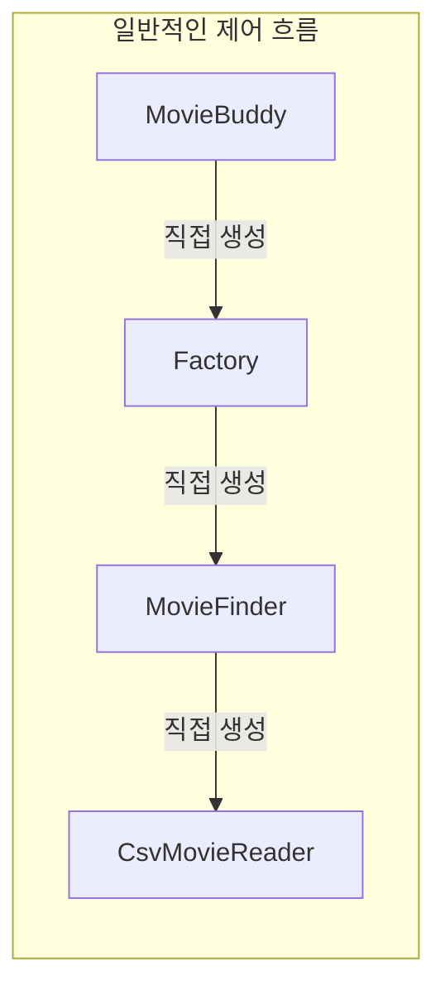
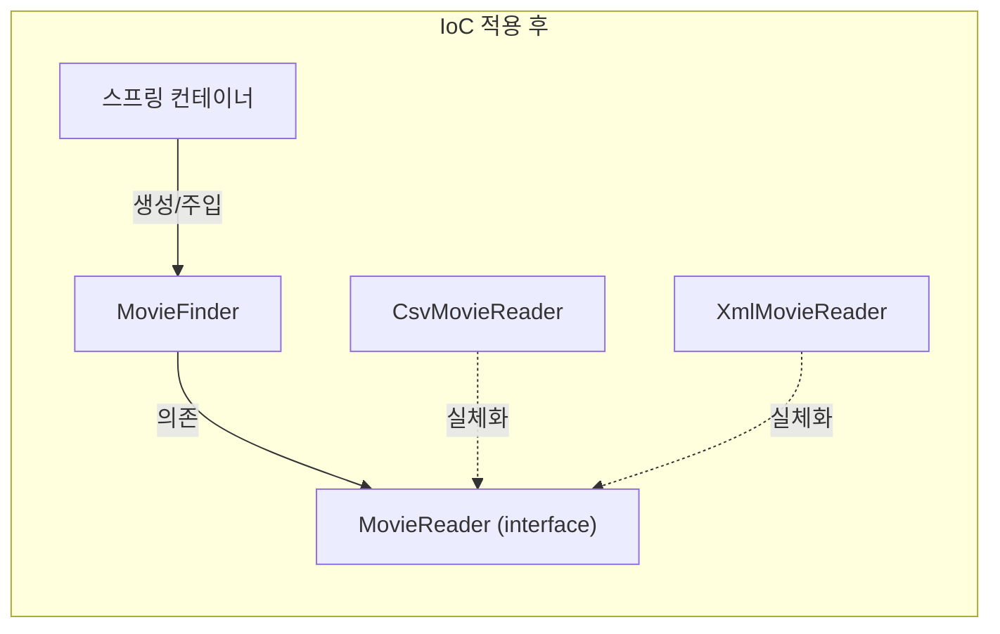

# 제어의 역전 (Inversion of Control, IoC)

프로그램의 제어 흐름을 코드 스스로 결정하지 않고, 외부(프레임워크나 컨테이너)에 맡기는 원리다.

일반적인 프로그램은 객체가 필요한 다른 객체를 직접 생성하고 호출 순서도 스스로 정한다.
IoC가 적용되면 이 흐름이 뒤바뀐다. 객체는 자신이 무엇을 필요로 하는지만 선언하고, 그 객체를 언제 생성해서 누구에게 줄지는 컨테이너가 결정한다.

MovieFinder는 더 이상 CsvMovieReader를 직접 생성하지 않는다.
MovieReader라는 인터페이스에만 의존하고, 실제로 어떤 구현체가 주입될지는 컨테이너가 결정한다.
그래서 구현체를 CsvMovieReader에서 XmlMovieReader로 바꿔도 MovieFinder 코드는 건드릴 필요가 없다.

## 왜 필요한가

객체가 협력 대상을 직접 생성하면, 그 대상의 구체 클래스에 결합된다.
구현체를 바꾸려면 그 객체를 생성하는 코드 전체를 찾아 고쳐야 한다.
IoC는 이 결합을 인터페이스 경계로 옮긴다.
그 결과 설계가 유연해지고 확장에 열려 있으면서 변경에는 닫혀 있는 구조(개방 폐쇄 원칙)를 실현할 수 있다.

## 스프링과의 관계

스프링은 IoC를 프레임워크 전체의 기반 기술로 삼는다.
빈(Bean)을 생성하고 조립하는 스프링 IoC 컨테이너, 의존관계 주입(DI), 관점지향 프로그래밍(AOP)까지 모두 IoC 원리 위에서 동작한다.
IoC는 특정 기술이나 환경에 종속되지 않는 보편적인 프로그래밍 모델이라, 스프링뿐 아니라 서블릿 컨테이너 등 다른 프레임워크에서도 널리 쓰인다.

## 관련 개념

- 참고: di.md
- 참고: solid.md
