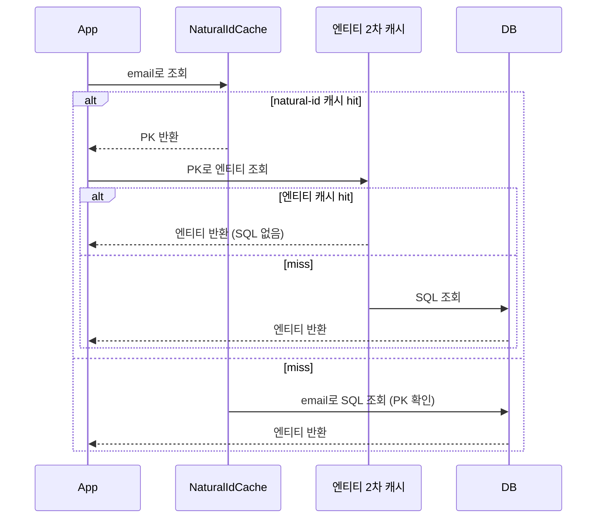

# NaturalIdCache

`@NaturalIdCache`는 Spring이 아니라 Hibernate(JPA 구현체)의 어노테이션이다. Spring Data JPA와 함께 자주 등장하지만 Hibernate 네이티브 기능이라는 점을 먼저 짚어야 한다.

## 왜 필요한가

JPA 엔티티는 기본적으로 PK(`@Id`) 기준으로 2차 캐시에 저장된다. 하지만 실무 조회는 PK가 아니라 이메일, 상품 코드처럼 비즈니스적으로 유일한 컬럼(자연키, natural id) 기준으로 이뤄지는 경우가 많다. 문제는 `email = ?` 같은 조건으로 조회하면 2차 캐시가 켜져 있어도 매번 SQL이 나간다는 점이다. 2차 캐시는 PK 기준으로만 엔티티를 찾기 때문이다.

`@NaturalId`와 `@NaturalIdCache`는 이 간극을 메운다. "이 컬럼은 자연키이니, PK를 몰라도 이 값으로 캐시에서 바로 찾을 수 있게 별도 캐시 영역을 만들어라"고 Hibernate에 지시하는 것이다.

## 구성

```java
@Entity
@Cacheable
@org.hibernate.annotations.Cache(usage = CacheConcurrencyStrategy.READ_WRITE)
@NaturalIdCache
public class Member {

    @Id
    @GeneratedValue
    private Long id;

    @NaturalId
    private String email;
}
```

- `@NaturalId` — 자연키 필드를 표시. 여러 필드 조합도 가능하다.
- `@NaturalIdCache` — "자연키 값 → PK" 매핑을 저장하는 별도의 2차 캐시 영역을 활성화한다.
- `@Cache` — 엔티티 자체의 2차 캐시(PK 기준). `@NaturalIdCache`는 이게 이미 켜져 있다는 전제 위에서 동작한다.

## 조회 흐름



`@NaturalIdCache`가 담는 건 엔티티 데이터가 아니라 "email → PK" 매핑뿐이다. SQL을 완전히 없애려면 natural-id 캐시와 엔티티 캐시 둘 다 hit 해야 한다. 하나만 켜면 절반의 이점만 본다.

## 흔히 걸리는 지점

`@NaturalIdCache`만 켜고 `@Cache`(엔티티 캐시)를 빼먹으면, PK를 알아내는 것까진 캐시로 되지만 실제 엔티티 로딩은 매번 SQL이 나간다.

Spring Data JPA의 `findByEmail(...)` 같은 쿼리 메서드는 이 캐시를 타지 않는다. JPQL/Criteria로 생성되는 일반 쿼리라서 자연키 캐시 경로를 거치지 않는다. 이 캐시를 실제로 쓰려면 Hibernate 네이티브 API인 `session.byNaturalId(...)`를 직접 호출해야 한다. Spring Data JPA 프로젝트에서는 이 기능이 존재하는지도 모른 채 지나가는 경우가 많은 이유가 이것이다.

2차 캐시 자체가 켜져 있어야 한다는 전제(`hibernate.cache.use_second_level_cache=true`, region factory 설정 등)도 있다. 이게 안 되어 있으면 두 어노테이션 다 무의미하다.
