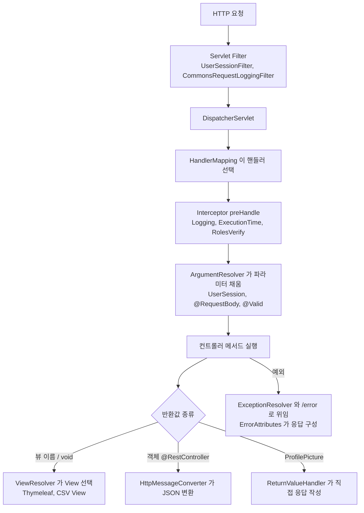
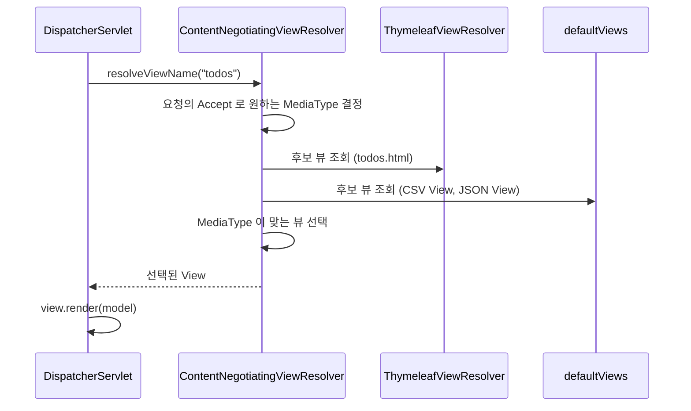
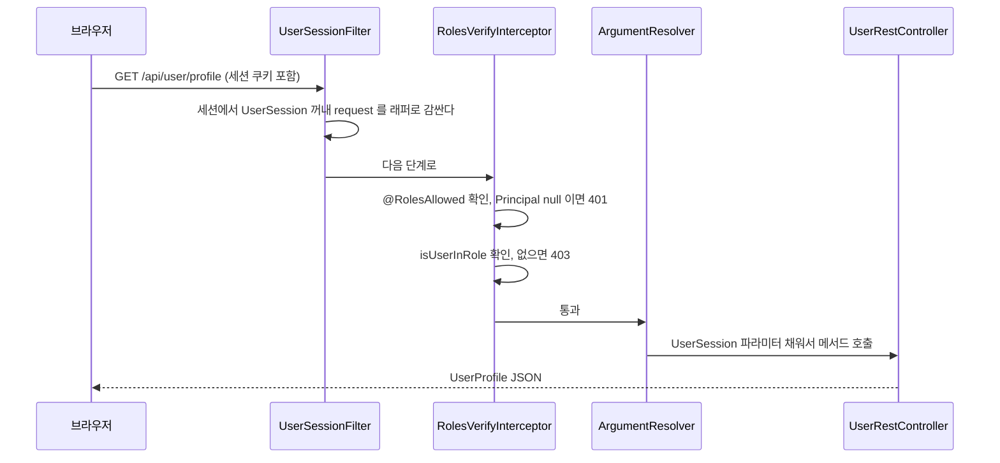

# todoapp 실습 복기, 스프링 MVC 커밋별 학습 정리

원본: next-step/todoapp (SpringRunner 스프링 MVC 실습, Spring Boot 3.5.6 / Java 21 / Thymeleaf / Jakarta Validation)

커밋 기록(2025-10)과 최종 코드를 바탕으로, 당시 구현한 것이 스프링 MVC의 어떤 원리를 건드리는지 다시 풀어 쓴 복기 문서다.
이해 못 하고 넘어간 부분을 다시 잡는 용도라서 "무엇을 했나"보다 "왜 그게 동작하나"에 무게를 뒀다.
메시지 국제화는 message-source.md, 프로파일과 프로퍼티는 environment.md, 컴포넌트 등록은 bean.md에 따로 정리돼 있다.

---

## 전체 그림, 요청 하나가 지나가는 길

이 프로젝트에서 구현한 것들은 대부분 요청 처리 파이프라인의 서로 다른 지점에 끼워 넣는 확장이다.
어느 커밋이든 "파이프라인의 어디에 끼웠는가"로 보면 정리가 된다.



커밋 순서와 이 그림의 대응은 아래와 같다.
- 설정 값, 프로파일, 데이터 초기화: 파이프라인 바깥, 컨테이너 기동 단계
- 할일 API, CSV 다운로드: 컨트롤러와 반환값 처리 단계
- 에러 메시지, 국제화: 예외 처리 단계
- 로그인, 인증/인가: Filter, Interceptor, ArgumentResolver 단계
- 프로필 이미지: ReturnValueHandler 단계

---

## 1. 설정 파일로 데이터 전달 (b2cd487, 5a754f6, ed28639)

### @ConfigurationProperties

`SiteProperties`는 `@ConfigurationProperties("todoapp.site")`가 붙은 클래스다.
application.yml의 `todoapp.site.author`, `todoapp.site.description` 값이 같은 이름의 필드에 바인딩된다.
접두사(`todoapp.site`) + 필드명이 곧 키라는 것이 전부다.

- 클래스형(SiteProperties)은 setter로 값을 채운다. 필드 초기값(`"unknown"`)은 설정이 없을 때의 기본값 역할을 한다.
- record형(FeatureTogglesProperties)은 생성자로 값을 채운다. 불변이고 setter가 필요 없어서 설정 값에는 이쪽이 더 낫다.
- yml에서는 `online-users-counter`처럼 kebab-case로 쓰고, 자바에서는 `onlineUsersCounter`로 받는다. 스프링 부트의 relaxed binding이 둘을 이어준다.

이 클래스들이 빈으로 등록되는 이유는 `TodoApplication`의 `@ConfigurationPropertiesScan`이다.
이 애노테이션이 없으면 `@ConfigurationProperties` 클래스는 그냥 클래스일 뿐이고 아무도 빈으로 만들어주지 않는다.
(`@Component`를 붙이거나 `@EnableConfigurationProperties`로 명시하는 방법도 있다.)

### 컨트롤러에서 꺼내 쓰는 두 가지 방법

- `FeatureTogglesRestController`는 FeatureTogglesProperties를 생성자로 주입받아 그대로 반환한다. `@RestController`라서 JSON으로 변환된다. 응답이 `{"auth": true, "onlineUsersCounter": false}` 모양이 되는 이유다.
- 템플릿에서 `site.author`를 쓰려면 모델에 `site`라는 이름으로 들어 있어야 한다. 처음에는 컨트롤러마다 `model.addAttribute("site", ...)`를 했다가, ed28639에서 `GlobalControllerAdvice`의 `@ModelAttribute("site")`로 옮겼다.

### @ControllerAdvice + @ModelAttribute

`@ControllerAdvice` 클래스의 `@ModelAttribute` 메서드는 모든 컨트롤러의 요청 처리 직전에 실행되어 반환값을 모델에 넣는다.
LoginController와 TodoController가 각자 하던 중복 코드(12줄, 10줄)가 사라지고 한 곳으로 모인 것이 이 커밋의 핵심이다.
"여러 컨트롤러에 공통으로 필요한 모델 데이터"는 ControllerAdvice로 올린다고 기억하면 된다.

### 정적 파일에서 템플릿으로 (b2cd487의 rename)

`static/pages/todos.html`이 `templates/todos.html`로 옮겨졌다.
static 아래 파일은 요청 경로 그대로 파일을 내려주는 정적 리소스이고, templates 아래 파일은 뷰 이름으로 찾아 Thymeleaf가 모델과 합쳐 렌더링하는 템플릿이다.
서버가 값을 채워 넣어야 하는 페이지(사이트 정보 등)는 반드시 templates 쪽에 있어야 한다.
참고로 컨트롤러 메서드가 `void`이고 `@RequestMapping("/todos")`면 뷰 이름은 요청 경로에서 유추된 `todos`가 되어 `templates/todos.html`이 선택된다. `LoginController.loginForm()`도 같은 원리다.

---

## 2. 프로파일과 데이터 초기화 (05ba147)

### @ConditionalOnProperty

`TodoDataInitializer`에는 `@ConditionalOnProperty(name = "todoapp.data.initialize", havingValue = "true")`가 붙어 있다.
이 프로퍼티 값이 "true"일 때만 빈으로 등록된다는 뜻이다. 주석 처리된 `@Profile("prod")`는 같은 목적을 프로파일로 달성하는 대안이다.

- `application.yml`에서 `initialize: true`, `application-prod.yml`에서 `false`다.
- prod 프로파일을 활성화하면(`spring.profiles.active=prod`) application-prod.yml이 application.yml 위에 덮어써진다. 그래서 운영에서는 초기 데이터가 들어가지 않는다.

즉 "환경별로 달라지는 동작"을 코드의 if문이 아니라 설정 값으로 갈라놓은 구조다.

### 초기화 콜백 3종의 실행 순서

TodoDataInitializer는 일부러 세 인터페이스를 모두 구현해서 실행 시점을 비교하게 만든 코드다.

1. `InitializingBean.afterPropertiesSet()` — 빈이 생성되고 의존성 주입이 끝난 직후. 아직 애플리케이션 전체가 뜨기 전이다. ("Task one")
2. `ApplicationRunner.run(ApplicationArguments)` — 컨텍스트 기동이 모두 끝난 뒤. 인자를 파싱된 객체로 받는다. ("Task two")
3. `CommandLineRunner.run(String...)` — 같은 시점이지만 인자를 문자열 배열 그대로 받는다. ("Task three")

세 번째 둘은 SpringApplication이 `run()` 마지막에 호출하는 훅이다. 같은 시점에 호출되고, 같은 빈이 두 인터페이스를 모두 구현하면 ApplicationRunner가 먼저 호출된다.
정리하면 "빈 생명주기 콜백(빈 단위)"과 "애플리케이션 기동 완료 콜백(앱 단위)"의 차이다. 초기 데이터를 넣는 용도로는 보통 Runner 계열을 쓴다. 모든 빈이 준비된 뒤라서 안전하기 때문이다.

---

## 3. 할일 REST API (0ce0332, a38d279)

`TodoRestController`는 `/api/todos` 아래에 CRUD를 만든다.

- `@GetMapping` → 전체 조회. `Iterable<Todo>`를 반환하면 Jackson이 JSON 배열로 변환한다. Todo가 어떻게 직렬화되는지는 `web/config/json/TodoModule`이 정한다.
- `@PostMapping` + `@ResponseStatus(HttpStatus.CREATED)` → 본문이 없는 응답을 201로 내려준다. 반환 타입이 void여서 상태 코드를 명시하지 않으면 200이 나간다.
- `@PutMapping("/{id}")` → `@PathVariable`로 URL의 id를, `@RequestBody`로 JSON 본문을 받는다.
- `@DeleteMapping("/{id}")` → 삭제.

### @RequestBody + @Valid

`WriteTodoCommand`는 record이고 필드에 `@NotBlank @Size(min = 4, max = 140)`가 붙어 있다.
`@RequestBody`가 JSON을 객체로 바꾸고, `@Valid`가 그 객체를 검증한다. 실패하면 컨트롤러 메서드가 실행되기도 전에 `MethodArgumentNotValidException`이 발생한다.
이 예외가 4번 항목의 에러 메시지 가공으로 이어진다.

LoginController의 `@Valid LoginCommand command, BindingResult bindingResult`는 비슷하지만 다르다.
`BindingResult`를 파라미터로 받으면 검증 실패가 예외로 던져지지 않고 BindingResult에 담겨 컨트롤러로 들어온다. 그래서 컨트롤러가 직접 `hasErrors()`를 보고 로그인 페이지로 돌려보낼 수 있다.
- REST API 쪽: BindingResult 없음 → 예외 발생 → 에러 응답
- 폼 페이지 쪽: BindingResult 있음 → 컨트롤러가 직접 화면 분기

---

## 4. CSV 다운로드와 ContentNegotiatingViewResolver (acd91ee)

가장 많이 헷갈릴 만한 부분이다. 코드는 짧다.

```java
@RequestMapping(path = "/todos")
public void todos() {}

@RequestMapping(path = "/todos", produces = "text/csv")
public void downloadTodos(Model model) {
    model.addAttribute(SpreadsheetConverter.convert(findTodos.all()));
}
```

같은 `/todos` 경로에 메서드가 둘이다. 어느 쪽이 호출되는지는 요청의 `Accept` 헤더가 정한다. `produces = "text/csv"`가 붙은 쪽은 클라이언트가 `Accept: text/csv`를 보낼 때만 선택된다. 브라우저의 일반 요청(`text/html`)은 첫 번째 메서드로 간다.

### 뷰가 정해지는 과정

두 메서드 모두 void이므로 뷰 이름은 `todos`다. 여기서 ViewResolver 체인이 일한다.



`ContentNegotiatingViewResolver`는 직접 뷰를 만들지 않는다. 다른 ViewResolver들이 내놓은 후보와 `defaultViews`를 모아서, 요청이 원하는 미디어 타입과 맞는 것을 고른다.
- Accept가 text/html → Thymeleaf의 `todos.html`
- Accept가 text/csv → `CommaSeparatedValuesView` (contentType이 text/csv)
- Accept가 application/json → `MappingJackson2JsonView`

그러면 CommaSeparatedValuesView가 모델에서 `Spreadsheet`를 꺼내(`Spreadsheet.obtainSpreadsheet(model)`) CSV로 써서 응답한다. `model.addAttribute(객체)`에서 이름을 생략하면 클래스명 기반 이름이 자동으로 붙고, 이 뷰는 타입으로 찾기 때문에 이름은 상관없다.

### 설정 조작의 핵심

```java
@Configuration
public static class ContentNegotiationCustomizer {
    @Autowired
    public void configurer(ContentNegotiatingViewResolver viewResolver) {
        var defaultViews = new ArrayList<>(viewResolver.getDefaultViews());
        defaultViews.add(new CommaSeparatedValuesView());
        defaultViews.add(new MappingJackson2JsonView());
        viewResolver.setDefaultViews(defaultViews);
    }
}
```

이 커밋 제목이 "설정 정보 조작"인 이유가 이것이다. ContentNegotiatingViewResolver는 **스프링 부트가 이미 만들어 둔 빈**이다. 그걸 직접 새로 만들지 않고, 이미 만들어진 빈을 주입받아서 `defaultViews`만 고쳐 쓴다.

`configureViewResolvers`의 주석이 이 이유를 말해 준다. `registry.enableContentNegotiation()`처럼 WebMvcConfigurer로 직접 설정하면 부트가 구성한 ContentNegotiatingViewResolver 전략이 무시된다. 부트의 자동 구성을 살리면서 일부만 바꾸고 싶을 때는 "만들어진 빈을 받아서 후처리"하는 패턴을 쓴다.

기존 목록을 `new ArrayList<>(...)`로 복사해서 추가하는 것도 의도가 있다. 기존 defaultViews를 날리지 않고 보존하기 위해서다.

---

## 5. 인코딩 문제 (a40357f)

```yaml
server:
  servlet:
    encoding:
      charset: utf-8
      force: true
```

한글 응답이 깨지는 문제를 `server.servlet.encoding.force: true`로 해결했다.
스프링 부트는 기본적으로 UTF-8을 쓰지만, `force`가 꺼져 있으면 요청이 이미 인코딩을 지정한 경우(브라우저가 보낸 헤더 등)에는 그 값을 따른다. `force: true`는 요청과 응답 모두에 위 charset을 강제로 적용한다. 내부적으로는 `CharacterEncodingFilter`가 처리한다.

---

## 6. 에러 처리와 국제화 (28118c8 ~ 2430a45)

이 여섯 커밋은 하나의 흐름이다. 순서대로 따라가면 이해가 쉽다.

### 에러가 화면에 나오는 경로

스프링 부트에서 컨트롤러가 예외를 던지면 응답은 `/error` 경로로 포워딩되어 `BasicErrorController`가 처리한다. 이때 응답 내용을 만드는 것이 `ErrorAttributes`다. 결과는 `timestamp`, `status`, `error`, `message`, `path` 같은 Map이다.
- JSON 요청이면 이 Map이 JSON으로 나간다.
- HTML 요청이면 `templates/error.html` (404는 `templates/error/404.html`)이 이 Map을 모델로 받아 렌더링한다. 상태 코드별 파일명(`error/404.html`)이 `error.html`보다 우선한다.

application.yml의 `include-message`, `include-binding-errors`, `include-stacktrace: always`는 기본으로 숨겨진 정보를 Map에 포함시키는 스위치다. 개발 중 확인용이고 운영에서는 끄는 것이 맞다.

### ReadableErrorAttributes, 에러 메시지를 읽기 좋게

기본 구현체 `DefaultErrorAttributes`의 message는 예외 객체의 메시지 그대로라서 사용자가 읽기 좋지 않다. `ReadableErrorAttributes`는 기본 구현체를 delegate로 감싸고 `message`만 덮어쓴다. (데코레이터에 가까운 구조다.)
`WebMvcConfiguration`에서 `ErrorAttributes` 타입 빈으로 등록하면, 부트가 기본 구현체 대신 이것을 쓴다. 기본 빈은 `@ConditionalOnMissingBean`이라서 같은 타입의 빈이 이미 있으면 물러난다. 참고: conditional-on-missing-bean.md

메시지 결정 로직은 이렇다.

1. 예외가 `MessageSourceResolvable`이면 → 예외가 스스로 코드(`getCodes()`)와 인자(`getArguments()`)를 내놓는다. 그걸로 `messageSource.getMessage(resolvable, locale)`을 호출한다.
2. 아니면 → `Exception.예외클래스단순명`이라는 코드를 만들어 messages.properties에서 찾고, 없으면 원래 예외 메시지를 기본값으로 쓴다.

### SystemException이 MessageSourceResolvable인 이유

core 모듈의 `SystemException`이 `MessageSourceResolvable`을 구현한다. `getCodes()`는 `"Exception." + 클래스 단순명`을 반환한다.
그래서 `TodoNotFoundException`이 던져지면 코드가 `Exception.TodoNotFoundException`이 되어 messages.properties의 같은 키와 연결된다. 예외 클래스를 새로 만들 때 메시지 파일에 키 하나만 추가하면 사용자용 문구가 생기는 구조다.

### getArguments 오버라이드 (0529f73)

```properties
Exception.TodoNotFoundException=할일을 찾을 수 없어요 (일련번호: {0})
```

`{0}`에 id를 넣으려면 예외가 인자를 내놔야 한다. `TodoNotFoundException`이 `getArguments()`를 오버라이드해서 `new Object[]{id}`를 반환한다. SystemException의 기본 `getArguments()`가 빈 배열이어서 오버라이드가 필요했다.
이 커밋 메시지의 "SystemException을 상속하여 사용"은 이 기본값 위에 필요한 예외만 덮어쓴다는 뜻이다.

### 검증 실패 정보 포함 (c187746)

`@Valid` 실패 시 `MethodArgumentNotValidException`이 발생한다. 이 예외는 `BindingResult`를 구현하고 있어서 `extractBindingResult`가 `instanceof BindingResult`로 걸러낼 수 있다.
각 필드 에러를 `messageSource.getMessage(fieldError, locale)`로 변환해 `errors` 리스트로 응답에 붙인다. 필드 에러는 그 자체로 MessageSourceResolvable이라서 코드 목록(`Size.writeTodoCommand.text` 등)으로 메시지를 찾는다.

```properties
Size.writeTodoCommand.text=할일은 {2}-{1}자 사이로 작성해주세요
```

`{2}-{1}`이 min-max로 뒤집혀 있는 것이 이상해 보일 수 있다. 검증 애노테이션이 `@Size(min = 4, max = 140)`일 때 메시지 인자는 [필드명, max, min] 순서로 들어온다. `{0}`은 필드 정보, `{1}`은 max(140), `{2}`는 min(4)이므로 `{2}-{1}`이 "4-140"이 된다. 애노테이션 속성이 알파벳 순으로 정렬되어 전달되기 때문이다.
메시지 키 `Size.writeTodoCommand.text`는 `애노테이션명.객체명.필드명` 규칙이고, 객체명은 클래스명의 첫 글자를 소문자로 바꾼 것이다.

### 국제화 (2430a45)

messages_ko.properties와 messages_en.properties를 추가했다. 요청의 `Accept-Language` 헤더(`webRequest.getLocale()`)로 어떤 파일을 쓸지 정해진다. messages.properties는 해당 로케일 파일이 없을 때의 기본값이다.
참고로 messages.properties의 한글이 `할...`로 보이는 것은 유니코드 이스케이프다. 에디터가 자동 변환한 것이고 내용은 같다.

---

## 7. 로그인과 인증/인가 (53557e1 ~ 6f8589e)

가장 길고 가장 중요한 부분이다. 구성 요소가 여럿이라 역할을 먼저 나열하고 흐름으로 묶는다.

- `UserSession` — 로그인한 사용자 정보 + 역할(`ROLE_USER`). `java.security.Principal`을 구현한다.
- `UserSessionHolder` / `HttpUserSessionHolder` — UserSession을 저장하고 꺼내는 인터페이스와, HttpSession에 저장하는 구현체.
- `UserSessionFilter` — 요청마다 세션의 UserSession을 꺼내 요청 객체에 연결하는 서블릿 필터.
- `RolesVerifyHandlerInterceptor` — 핸들러에 붙은 `@RolesAllowed`를 보고 접근을 허용하거나 막는 인터셉터.
- `UserSessionHandlerMethodArgumentResolver` — 컨트롤러 파라미터로 UserSession을 주입하는 리졸버.
- `AccessDeniedException(403)`, `UnauthorizedAccessException(401)` — 실패 시 던지는 예외.

### 로그인 처리 (LoginController)

POST /login에서 일어나는 일이다.

1. `@Valid LoginCommand` 검증. 실패하면 모델에 메시지와 bindingResult를 담고 `login` 뷰로 돌아간다.
2. `verifyUserPassword.verify(username, password)` 호출.
3. `UserNotFoundException`이면 → 처음 온 사용자이므로 `registerUser`로 가입시킨다. (로그인 겸 회원가입 구조)
4. `UserPasswordNotMatchedException`이면 → 메시지를 모델에 담고 로그인 페이지로.
5. 성공하면 `userSessionHolder.set(new UserSession(user))`로 세션에 저장하고 `redirect:/todos`.

예외를 흐름 제어에 쓰고 있다는 점이 눈에 띄는데, 3번처럼 "없으면 가입"이라는 정상 시나리오를 예외로 분기하는 건 다소 거칠다. 실습 코드라서 그렇게 돼 있고, 실무에서는 `findByUsername`이 Optional을 반환하게 하는 쪽이 더 낫다.

`redirect:/todos`는 브라우저에게 새 요청을 보내라고 응답하는 것이다(PRG 패턴). 로그인 POST 직후 새로고침해서 로그인이 재전송되는 것을 막는다.

### 세션 저장, HttpUserSessionHolder

`RequestContextHolder.getRequestAttributes()`로 **현재 스레드의 요청**에 접근해서 `SCOPE_SESSION` 범위에 속성을 넣는다.
싱글톤 빈인 holder가 요청별로 다른 세션을 다룰 수 있는 것은 `RequestContextHolder`가 ThreadLocal로 현재 요청을 들고 있기 때문이다. HttpSession 객체를 필드로 쥐고 있는 것이 아니다. 그래서 빈은 하나인데 사용자별로 다른 세션에 접근한다.

### 인증, UserSessionFilter

서블릿 표준에는 `request.getUserPrincipal()`과 `request.isUserInRole(role)`이라는 인증 정보 조회 API가 있다. 일반적인 서블릿 컨테이너에서는 컨테이너가 인증을 처리해 이 값들을 채워 준다.
이 프로젝트는 컨테이너 인증을 쓰지 않고 자체 세션을 쓴다. 그래서 필터가 `HttpServletRequestWrapper`로 요청을 감싸서 두 메서드를 재정의한다.
- `getUserPrincipal()` → 세션의 UserSession 반환 (로그인 안 했으면 null)
- `isUserInRole(role)` → `userSession.getRoles().contains(role)`

이렇게 하면 이후 단계(인터셉터, 컨트롤러)는 세션 구현을 모른 채 서블릿 표준 API만으로 인증 정보를 볼 수 있다. 표준 스펙에 맞춰 끼워 넣는 어댑터 구조이고, 6f8589e 커밋 제목의 "서블릿 인증 및 인가 스펙 구현"이 이것이다.
`OncePerRequestFilter`를 상속한 이유는 포워딩(에러 페이지 등)으로 같은 요청이 필터를 여러 번 지나가도 한 번만 실행되게 하기 위해서다.

### 인가, RolesVerifyHandlerInterceptor

필터는 "누구인지"를 요청에 심고, 인터셉터는 "해도 되는지"를 판정한다.

1. 핸들러가 `HandlerMethod`인지 확인한다 (정적 리소스 핸들러는 건너뜀).
2. 메서드에 붙은 `@RolesAllowed`를 찾고, 없으면 클래스에 붙은 것을 찾는다. (`AnnotatedElementUtils.findMergedAnnotation`은 메타 애노테이션까지 탐색한다.)
3. 애노테이션이 있으면:
   - `request.getUserPrincipal() == null` → 로그인 안 함 → `UnauthorizedAccessException` (401)
   - `request.isUserInRole(...)`로 허용 역할과 일치하는지 확인, 하나도 없으면 → `AccessDeniedException` (403)

401과 403의 구분이 핵심이다. 401은 "누구인지 모르겠다(인증 안 됨)", 403은 "누구인지는 아는데 권한이 없다(인가 실패)"이다.
이 예외들은 `@ResponseStatus`가 붙어 있어서 던지면 해당 상태 코드로 응답이 나가고, 6번의 에러 처리 체계(ReadableErrorAttributes, messages)도 그대로 탄다.

TodoRestController와 UserRestController 클래스 위에 `@RolesAllowed("ROLE_USER")`를 붙여서 이 API들은 로그인한 사용자만 접근할 수 있다.

### 인터셉터 vs 필터

둘 다 요청 앞단에 끼는 장치라서 헷갈린다. 이 프로젝트에서 나뉜 기준이 좋은 예시다.
- 필터(UserSessionFilter): 서블릿 레벨. DispatcherServlet 앞에서 동작하므로 어떤 핸들러가 호출될지 모른다. 요청 객체를 감싸는 일처럼 스프링 MVC 이전의 일에 적합하다.
- 인터셉터(RolesVerifyHandlerInterceptor): 스프링 MVC 레벨. 핸들러가 정해진 뒤에 동작하므로 `HandlerMethod`의 애노테이션을 읽을 수 있다. "이 컨트롤러에 @RolesAllowed가 붙었나"는 핸들러를 알아야 판단되니까 인터셉터에 있어야 한다.

등록 순서는 `addInterceptors`에서 Logging → ExecutionTime → RolesVerify다. 인터셉터는 등록한 순서대로 `preHandle`이 실행된다.

### ArgumentResolver, 컨트롤러가 UserSession을 받는 법

`UserRestController.getUserProfile(UserSession userSession)`처럼 파라미터 타입만 써도 로그인 세션이 들어온다.
스프링 MVC는 파라미터마다 `supportsParameter()`가 true인 리졸버를 찾아 `resolveArgument()`로 값을 채운다. 이 리졸버는 타입이 UserSession이면 지원하겠다고 답하고 `userSessionHolder.get()`을 돌려준다.
`addArgumentResolvers`에 등록해야 목록에 들어간다. 05469f7 커밋에서 resolver의 `NotImplementedException`을 구현하고 WebMvcConfiguration에 등록한 것이 이 작업이다.
`@PathVariable`이나 `@RequestBody`도 내부적으로는 똑같이 이 인터페이스의 구현체다. 직접 만들어 보면서 그 구조를 체감한 것이다.

### 로그인부터 API 호출까지 전체 시퀀스



---

## 8. 사용자 정의 ReturnValueHandler, 프로필 이미지 (f0436e1)

### 하려는 것

사용자가 올린 프로필 이미지를 `GET /user/profile-picture`로 내려받게 한다. 컨트롤러는 이렇게만 쓴다.

```java
@RequestMapping("/user/profile-picture")
public ProfilePicture profilePicture(UserSession userSession) {
    return userSession.getUser().getProfilePicture();
}
```

`ProfilePicture`는 이미지 바이트가 아니라 이미지 위치(URI)를 담은 도메인 객체다. 이걸 반환했을 때 실제 이미지 바이트가 응답으로 나가게 만드는 것이 `ProfilePictureReturnValueHandler`다.

### ReturnValueHandler의 구조

ArgumentResolver가 "파라미터 쪽 확장점"이라면 `HandlerMethodReturnValueHandler`는 "반환값 쪽 확장점"이다. 같은 모양의 두 메서드가 있다.
- `supportsReturnType()` — 이 반환 타입을 내가 처리할 수 있나? (여기서는 `ProfilePicture`인지)
- `handleReturnValue()` — 실제 처리. 저장소에서 이미지를 불러와 `response.getOutputStream()`에 `transferTo`로 복사한다.

마지막 줄 `mavContainer.setRequestHandled(true)`가 중요하다. "응답을 내가 직접 다 썼으니 뷰 렌더링을 하지 말라"는 신호다. 이걸 빼먹으면 DispatcherServlet이 뷰 이름을 찾아 렌더링을 시도해서 오류가 난다.

### 업로드

`changeUserProfilePicture`는 `MultipartFile`을 받아 저장소에 저장하고(`profilePictureStorage.save`), 사용자 정보를 갱신하고, 세션을 새 User로 교체한다(`userSessionHolder.set(new UserSession(updatedUser))`).
세션에 User 객체를 통째로 담아 두기 때문에, DB의 사용자 정보가 바뀌면 세션도 같이 갈아 끼워야 일관성이 맞다.

---

## 9. 지금 코드에서 다시 확인해 볼 지점

복기하면서 코드에서 눈에 띈 부분이다. 학습 과정이라 의도된 미완성일 수 있으니 "고쳐야 한다"가 아니라 "확인해 볼 만하다"로 적는다.

- ProfilePictureReturnValueHandler가 WebMvcConfiguration에 등록되어 있지 않다. `addReturnValueHandlers`로 등록하지 않으면 이 핸들러는 호출되지 않는다. 지금 상태에서는 `@RestController`의 기본 처리(Jackson JSON 변환)로 흘러간다. 등록한다면 `addReturnValueHandlers(handlers)`에 `new ProfilePictureReturnValueHandler(profilePictureStorage)`를 추가하는 모양이 된다.
- `changeUserProfilePicture`가 마지막에 `new UserProfile(userSession.getUser())`를 반환하는데, 방금 갱신한 `updatedUser`가 아니라 파라미터로 받은 이전 세션의 User다. 응답의 profilePictureUrl이 변경 전 값으로 나갈 수 있다.
- `OnlineUsersCounterController`는 요청 스레드에서 `Thread.sleep`을 반복하며 응답을 쓴다. SSE를 이해하기 위한 최소 구현이고, 접속 수만큼 톰캣 스레드를 점유한다. `SseEmitter`로 바꾸는 것이 스프링 MVC의 정석이다. (같은 패키지의 `ConnectedClientCountBroadcaster`가 그걸 위한 준비물로 보인다.)
- `application.yml`의 `include-stacktrace: always`와 `org.springframework: debug` 로그는 개발용 설정이다.

---

## 한눈에 보는 요약

- 설정 값은 `@ConfigurationProperties` + `@ConfigurationPropertiesScan`으로 객체에 바인딩한다.
- 모든 컨트롤러가 공유하는 모델은 `@ControllerAdvice` + `@ModelAttribute`로 올린다.
- 환경별 동작 차이는 프로파일과 `@ConditionalOnProperty`로 갈라낸다.
- 하나의 URL이 Accept에 따라 HTML, CSV, JSON으로 나뉘는 것은 `ContentNegotiatingViewResolver`와 `defaultViews` 덕분이다. 부트가 만든 빈은 새로 만들지 않고 주입받아 고친다.
- 에러 메시지는 `ErrorAttributes`를 갈아 끼우고, 예외를 `MessageSourceResolvable`로 만들어 메시지 파일과 연결한다.
- 인증은 필터가 서블릿 표준 API(Principal, isUserInRole)에 자체 세션을 연결하고, 인가는 인터셉터가 `@RolesAllowed`를 읽어 401/403을 가른다.
- ArgumentResolver는 파라미터를, ReturnValueHandler는 반환값을 확장하는 지점이다. 스프링 MVC의 기본 애노테이션들도 같은 구조 위에 있다.

## Recap

이 프로젝트에서 한 일은 전부 "스프링 MVC 파이프라인의 어느 지점에 내 코드를 끼우는가"였다.
기동 시점에는 설정 바인딩과 조건부 빈 등록으로, 요청 앞단에는 필터(요청 감싸기)와 인터셉터(인가 판정)로, 파라미터와 반환값에는 ArgumentResolver와 ReturnValueHandler로, 응답 단계에는 ViewResolver와 View(CSV)로, 예외 단계에는 ErrorAttributes와 MessageSource로 끼웠다.
스프링 부트가 이미 만들어 둔 것은 새로 만들지 않고 받아서 고치거나 같은 타입의 빈으로 대체하며, 이 방식이 "자동 구성은 살리고 일부만 바꾸는" 부트 확장의 기본 패턴이다.
