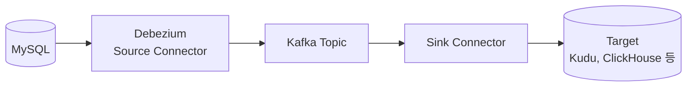

# 대규모 CDC Pipeline 운영을 위한 Debezium 개선 여정

출처: 토스 테크 "대규모 CDC Pipeline 운영을 위한 Debezium 개선 여정" (토스증권 김용우, 2024-07-18)

## 한 줄 요약
CDC를 배치에서 스트리밍으로 바꾸고 나니 "잘 돌고 있는지"를 알 수 없었다. 그래서 "잘 운영한다"의 기준을 지표로 정하고, End-to-End 지연 측정, 테이블별 처리량 지표 추가, 초기 snapshot 병목 제거(11~12시간에서 1시간 이내) 세 가지를 개선했다.

## CDC란
데이터베이스의 변경을 감지해 이벤트로 바꾸고 이벤트 스트림으로 흘려보내는 기술이다. 핵심 장점은 DB 변경을 실시간으로 받을 수 있다는 점이다. 토스증권은 분석용(Data Analyst), 학습용(ML Engineer), 서비스용 데이터에 쓴다.

## 문제 제기
- 배치는 처리 데이터의 시작과 끝, 소요 시간이 명확하다
- 스트리밍은 "특정 시각에 얼마나 처리했고 얼마나 걸렸는지"를 알기 어렵다
- 질문: CDC가 잘 운영되고 있다는 걸 어떻게 믿을 수 있는가

## "잘 운영한다"의 기준 네 가지
1. Source-to-Target Latency: 원천에서 타겟까지 지연
2. Events Per Second: 초당 처리량
3. CDC Pipeline Scalability: 파이프라인을 만드는 데 걸리는 시간
4. Data Consistency: 정합성 (글에서는 별도 주제로 미룸)

## 파이프라인 구조



## 개선 1: Source-to-Target Latency

지연 허용치에 따라 용도를 계층으로 나눴다.
- Tier 1, 300ms: 서비스용 데이터 (예: 계좌 정보)
- Tier 2, 10초: 서비스용 알람
- Tier 3, 10분: 지표 관련 서비스
- Tier 4, 1시간: 분석용 데이터

단계별 지표는 이미 있었다.
- Source Connector: `MilliSecondsBehindSource`
- Kafka: consumer lag
- Sink Connector: process time

문제는 각 단계 지표만으로는 전체 지연을 알 수 없다는 점이다. 그래서 End-to-End로 잰다.

```
End-to-End Latency = Sink Process Time - source.ts_ms
```

`source.ts_ms`는 Debezium 이벤트에 들어 있는 "원천 DB에서 이벤트가 발생한 시각"이다. 이 값을 Sink 처리 시각과 빼면 전체 지연이 나오고, 시간대별 추이와 SLI 설정에 쓸 수 있다.

## 개선 2: Events Per Second

기존 Debezium 지표는 `TotalNumberOfEventSeen`, `...CreateEventSeen`, `...UpdateEventSeen`, `...DeleteEventSeen` 네 개뿐이다. 이들은 원천 로그에서 읽은 이벤트 양이어서, 변환되어 실제로 Produce된 CDC 이벤트 수는 알 수 없었다.

그래서 테이블별, 작업 유형별 지표(`...ByTable`)를 직접 추가했다. 테이블별 카운터를 `Map<String, AtomicLong>`으로 들고 있는 `TableEventMeter` 클래스를 만든 방식이다.

얻은 것
- 테이블 특성 파악 (Append Only인지, 배치 업데이트가 있는지)
- Create/Delete 수를 비교해 정합성 검증의 기초 자료로 사용

## 개선 3: Pipeline Scalability

병목은 Debezium의 `snapshot` 단계다. 대상 테이블의 모든 행을 CDC 이벤트로 바꾸는데 단일 스레드라 경우에 따라 11~12시간이 걸렸다. 장애 복구로 파이프라인을 새로 만들 때도 같은 시간이 필요하다는 뜻이다.

해법 1: 배치와 스트리밍 하이브리드
1. Apache Sqoop으로 현재 데이터를 Target에 먼저 적재
2. Debezium은 `snapshot.mode: no_data`로 원천 로그의 최초 시점부터 스트리밍만 시작
3. 결과: 신규 파이프라인 생성이 11~12시간에서 1시간 이내

해법 2: 기존 파이프라인에 테이블 추가
- 문제: 기존에는 스키마가 고정이라 테이블을 추가할 때마다 새 파이프라인이 필요했고, Source Connector가 늘수록 DB 연결 부하도 늘었다
- 해결: 커스텀 `Snapshotter`(`add_table`)를 구현. 데이터 snapshot은 하지 않고(`shouldSnapshotData`는 false) 스키마 snapshot만 한다(`shouldSnapshotSchema`는 true)
- 결과: 기존 파이프라인에 테이블 추가가 5분 이내

## 배울 점
- 스트리밍은 "돌고 있다"가 곧 "잘 돌고 있다"가 아니다. 지표로 정의해야 믿을 수 있다
- 단계별 지표를 모아도 전체 체감 지연은 알 수 없다. 원천 시각과 최종 처리 시각을 직접 빼는 End-to-End가 필요하다
- 느린 초기 적재(snapshot)는 배치 도구로 대신하고, 스트리밍은 그 이후만 맡기는 분업이 효과적이다
- 오픈소스도 확장 지점(Snapshotter 인터페이스)을 구현해 요구에 맞출 수 있다

## 직접 확인해볼 것
- 글의 `shouldStream()` 구현은 생략되어 있다. 스키마만 snapshot하는 모드에서 어떤 값을 돌려주는지는 Debezium 소스로 확인해야 한다
- Sqoop 적재 시점과 `no_data` 모드에서 스트리밍이 시작되는 로그 위치가 어긋날 때 중복이나 유실이 없는지 글은 설명하지 않는다. 직접 생각해볼 문제다

참고: 이 글에서 따로 다루지 않은 Data Consistency가 네 번째 지표다.

## Recap
토스증권은 CDC가 배치에서 스트리밍으로 바뀌며 운영 상태를 알기 어려워지자, 지연, 처리량, 구축 시간, 정합성을 "잘 운영한다"의 기준으로 정했다. 단계별 지표만으로는 전체 지연을 알 수 없어 Debezium 이벤트의 `source.ts_ms`와 Sink 처리 시각의 차이로 End-to-End 지연을 재고, 원천 로그 기준이던 처리량 지표는 테이블과 작업 유형별 지표로 확장했다. 단일 스레드 snapshot 때문에 11~12시간 걸리던 파이프라인 생성은 Sqoop 초기 적재와 `snapshot.mode: no_data` 스트리밍으로 1시간 이내로, 테이블 추가는 커스텀 `add_table` Snapshotter로 5분 이내로 줄였다.
