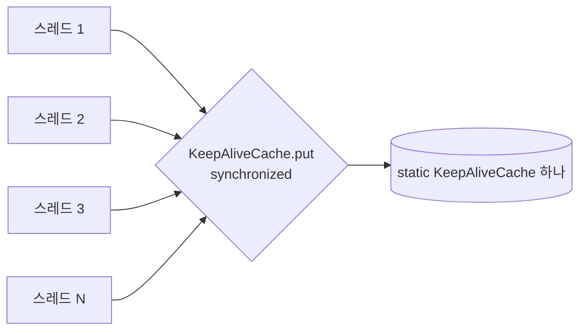

# Feign 기본 클라이언트와 KeepAliveCache 락 경합

출처: 토스 엔지니어링 노트 3 "Feign 코드 분석과 서버 성능 개선" (토스페이먼츠 김성두, 2023-11-22)
환경: Spring Boot 2.7.9, JDK 11

## 한 줄 요약
Feign에 Apache HttpClient 5 의존성을 넣어놨는데도 실제로는 JDK 기본 `HttpURLConnection`이 쓰이고 있었고, 그 내부의 static `KeepAliveCache`가 `synchronized`라서 멀티스레드 호출이 전부 한 줄로 서 있었다. 구현체를 바꾸자 처리량이 8배 이상 올랐다.

## 상황
- 요구사항: 약 15,000건을 10분 안에 처리
- 멀티스레드로 외부 API를 대량 호출했는데 기대만큼 빨라지지 않음
- 모니터링의 스택 트레이스에서 BlockedThread가 `KeepAliveCache.put`에서 `locked` 상태로 대기하는 것을 발견

```
[BlockedThread][blocker:http-nio-8080-exec-67][blocked:http-nio-8080-exec-101]
at sun.net.www.http.ClientVector.put(KeepAliveCache.java:309)
- locked sun.net.www.http.ClientVector@51f75cb3
at sun.net.www.http.KeepAliveCache.put(KeepAliveCache.java:172)
- locked sun.net.www.http.KeepAliveCache@71a6e252
```

여기서 읽어야 할 포인트는 두 가지다.
- blocker 스레드가 락을 쥐고 있고, blocked 스레드가 그 락을 기다린다
- 락의 대상이 우리 코드가 아니라 JDK 내부 클래스(`sun.net.www.http.*`)다

## 원인: 세 겹의 사실이 겹쳤다

1. Feign의 기본 클라이언트(`Client.Default`)는 `HttpURLConnection`을 쓴다
2. `HttpURLConnection`은 내부에서 `sun.net.www.http.HttpClient`를 쓴다
3. 그 `HttpClient`는 `static KeepAliveCache kac`를 갖고 있고, `KeepAliveCache.put()`은 `synchronized`다

```java
public class HttpClient extends NetworkClient {
    protected static KeepAliveCache kac = new KeepAliveCache();   // 모든 인스턴스가 공유
}

public synchronized void put(final URL url, Object obj, HttpClient http) { ... }
```

static이므로 JVM 안의 모든 HTTP 연결이 캐시 하나를 공유하고, `synchronized`이므로 한 번에 한 스레드만 `put`을 할 수 있다. 연결을 반환(keep-alive 캐시에 넣기)할 때마다 모든 스레드가 이 지점에서 줄을 선다.



스레드를 아무리 늘려도 이 지점은 직렬화되어 있어서 처리량이 늘지 않는다. 스레드가 많을수록 오히려 대기만 늘어난다.

## 함정: 의존성을 넣었는데 왜 안 쓰였나
- Apache HttpClient 5를 의존성에 추가한 것만으로는 Feign이 그걸 쓰지 않는다
- Spring Boot 2.x(이 글의 2.7.9)에서는 명시적으로 켜야 한다
- Spring Boot 3.x에서는 의존성만 있어도 자동 설정된다 (글의 설명)

자동 설정이 "있을 것 같아서" 믿고 넘어갔지만, 실제로는 조용히 기본 구현체로 폴백되어 있었다. 에러도 경고도 없다는 점이 이 문제를 오래 숨겼다.

## 해결

방법 1: Feign 구현체를 Apache HttpClient 5로 교체

```gradle
implementation("org.springframework.cloud:spring-cloud-starter-openfeign")
implementation("io.github.openfeign:feign-hc5")
```

```yaml
feign.httpclient.hc5.enabled: true
```

방법 2: JDK를 17 이상으로 올린다. 글에 따르면 JDK 17에서는 이 경합을 만들던 `synchronized` 구현이 개선되어 문제가 발생하지 않는다.

둘 중 무엇을 택해도 결과는 같았다.
- API 처리량 최소 8배 향상
- 작업 소요 시간 평균 10분 → 1분대

## 이해를 위한 포인트

왜 Apache HttpClient는 괜찮은가
- 이 글은 구체적 내부 구조까지는 설명하지 않지만, 흐름상 Apache HttpClient는 JVM 전역 static 캐시가 아니라 자체 커넥션 풀(`PoolingHttpClientConnectionManager` 계열)을 쓰기 때문에 전역 락 하나에 모이지 않는다. 이 부분은 글에 근거가 있는 설명이 아니라 내 추론이므로, 확인이 필요하면 hc5 소스를 직접 볼 것

이 문제의 진단 흐름
- 증상: 스레드를 늘렸는데 처리량이 안 늘어남
- 단서: 스레드 덤프/모니터링에서 `locked` 대기
- 추적: 락 대상 클래스(`KeepAliveCache`)에서 소스 역추적
- 발견: 설정한 줄 알았던 구현체가 실제로는 쓰이지 않음

배울 점
- "락이 어디서 걸렸는가"는 스택 트레이스의 `locked`/`waiting to lock` 줄에서 시작한다
- 라이브러리 설정은 "넣었다"가 아니라 "실제로 그 구현체가 호출되고 있다"까지 확인해야 한다
- 멀티스레드 성능은 우리 코드가 아니라 공유 static 자원에서 막힐 수 있다

## 직접 확인해볼 것 (아직 안 해봄)
- 우리 프로젝트의 Feign이 어떤 Client 구현체를 쓰는지 (`feign.Client` 빈 타입 확인, 또는 스레드 덤프에서 `sun.net.www.http` 프레임 유무)
- 이 경합을 재현하는 간단한 부하 테스트: HttpURLConnection 기반 vs hc5 기반으로 스레드 수를 늘리며 처리량 비교

## Recap
Feign은 설정하지 않으면 JDK의 `HttpURLConnection`을 쓰고, 그 아래 `sun.net.www.http.HttpClient`가 들고 있는 static `KeepAliveCache`의 `put`이 `synchronized`라서 JVM 안의 모든 스레드가 한 락에서 직렬화된다. Apache HttpClient 5 의존성만 추가하면 안 되고(Boot 2.x 기준) `feign.httpclient.hc5.enabled: true`로 켜야 실제로 교체되며, 이렇게 하거나 JDK 17 이상으로 올리면 처리량이 8배 이상 늘어난다. 핵심 교훈은 "설정한 줄 알았던 구현체가 실제로 쓰이는지 확인하라"와 "멀티스레드 병목은 스택 트레이스의 locked 줄에서 시작해 JDK 내부까지 따라가라"이다.
