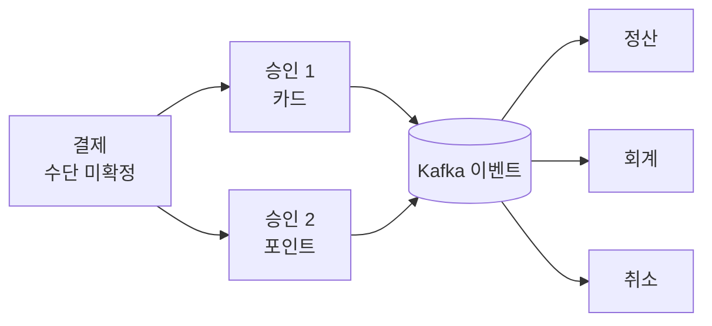
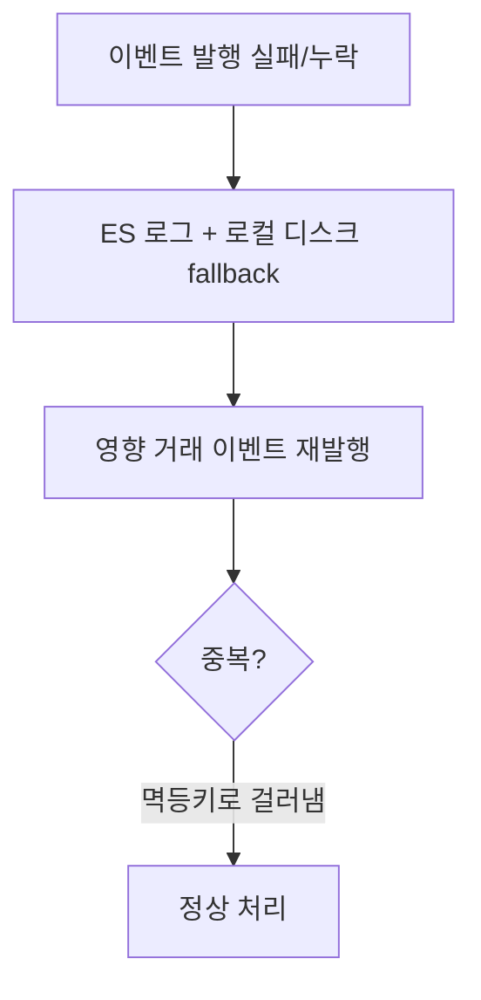

# 레거시 결제 원장을 확장 가능한 시스템으로

출처: 토스 테크 "레거시 결제 원장을 확장 가능한 시스템으로" (토스페이먼츠 박순현/양권성, 2025-12-01)

## 한 줄 요약
20년 넘은 Oracle 기반 결제 원장 옆에 MySQL 기반 신규 원장을 새로 만들고, 서비스를 멈추지 않고 비동기 이중 적재로 옮기면서, 그 과정에서 터진 장애 네 가지(원장 불일치, 망취소, 타임아웃 불일치, 이벤트 누락/중복)를 하나씩 자가 복구 구조로 막은 이야기.

## 원장이란
고객의 결제, 취소, 환불 내역을 기록하는 핵심 테이블이다. 돈의 기록이라 한 번 어긋나면 정산, 회계, 가맹점 응답까지 전부 어긋난다.

## 레거시 원장의 세 가지 문제
- 데이터 구조가 제각각: 결제수단마다 테이블 구조가 달랐다. 카드는 전체취소/부분취소가 다른 테이블, 계좌이체는 한 테이블
- 도메인끼리 강하게 결합: 결제, 정산, 취소, 회계가 같은 원장 테이블을 공유하고, 같은 컬럼이 도메인마다 다른 의미로 쓰였다
- 확장 불가: 결제와 결제수단이 1:1이라 하나의 주문을 여러 수단으로 나눠 내거나 더치페이 모델을 지원할 수 없었다

## 왜 Oracle에 테이블 추가가 아니라 MySQL 신규 구축인가
- 독립 인프라: Oracle에는 여러 팀 데이터가 섞여 있어 남의 작업이 내 장애가 될 수 있다
- 스택 일원화: MySQL + JPA가 Oracle + MyBatis보다 직관적
- 실험 자유: 오픈소스라 빠르게 환경을 만들고 실험할 수 있다

## 신규 원장 설계 전략 세 가지

데이터 구조 일관성
- 모든 승인 내역을 `approve` 공통 테이블에 저장하고, 결제수단별 추가 정보는 개별 테이블로 분리
- UPDATE 대신 INSERT-only. 이유는 불변성, 데드락 방지, 히스토리 추적

도메인 결합도 낮추기
- 각 도메인이 원장 DB를 직접 조회하지 않는다
- 결제 발생 시 Kafka 이벤트를 발행하고, 각 도메인은 구독해서 자기 로직만 수행. 팀별 병렬 개발이 가능해진다

결제와 승인의 분리
- 결제: 수단이 확정되지 않은 상태
- 승인: 실제 수단이 결정된 상태
- 그래서 하나의 결제에 여러 승인(여러 수단)이 연결될 수 있다

## 안전한 마이그레이션

비동기 점진 적재
- 기존 원장에 먼저 저장하고, 신규 원장에는 비동기로 적재
- 신규 쪽 실패가 서비스 장애로 번지지 않게 예외를 삼킨다

리소스 관리
- 비동기 작업은 실서비스 서버에서 돈다. ThreadPool을 작게 시작해 트래픽을 점진적으로 올리며 값을 찾았다
- ThreadPool이 포화되면 그 작업은 버린다. 누락은 별도 검증 배치가 메운다

정합성 검증
- Read-Only DB 기반 검증 배치를 매시간 5분 간격으로 실행. 복제 지연을 감안해 누락분을 재적재

대량 이관(수억 건 INSERT)
- 라이브 서버와 분리한 전용 서버를 AWS 같은 AZ에 배치
- 단건 저장을 Bulk Insert로 재설계
- 반복 조회 데이터는 로컬 캐시로 네트워크 I/O 절감
- IDC와 AWS 사이 대역폭을 모니터링하며 점진 조정

## 장애: DB 부하 급증
- 증상: MySQL wait 세션 급증
- 원인: 전날 배포된 기능의 단순 SELECT. 데이터가 쌓이면서 옵티마이저가 의도하지 않은 실행 계획(풀스캔)을 선택
- 대응: 최근 5개 배포 이미지를 보관 중이라 즉시 롤백. 이후 힌트로 의도한 인덱스를 쓰도록 보완

여기서 얻는 감각은 쿼리가 "어제는 빨랐다"는 것이 "내일도 빠르다"를 보장하지 않는다는 점이다. 통계가 바뀌면 같은 쿼리의 실행 계획이 바뀐다.

## 장애가 드러낸 네 가지 문제와 해법

1. 두 원장 불일치
   - DB 부하 때 신규 원장 적재가 일부 실패
   - 해법: 5분마다 기존 원장을 기준으로 자동 보정하는 배치

2. 원천사(카드사)와 불일치: 망취소
   - 카드사에는 승인이 됐는데 네트워크 타임아웃으로 우리 쪽은 실패로 남는 경우
   - 해법: 타임아웃 거래건을 따로 저장하고 원천사에 취소 요청을 보내 상태를 맞춘다

3. 가맹점 응답 불일치
   - MSA 각 서버의 타임아웃이 제각각. 승인 서버가 성공했는데 앞단 서버가 이미 타임아웃 실패를 응답
   - 해법: 승인 서버의 최대 처리 시간을 계산하고 모든 상위 서버 타임아웃을 거기에 맞춰 재설정

4. 결제 이벤트 누락과 중복
   - Outbox 패턴으로 구현했지만, 가맹점 결제 가용성을 우선해 외부 원천사 연동 쪽 롤백은 지원하지 않은 부분이 있었다
   - 누락 복구: 누락 이벤트를 Elasticsearch에 로깅하고, 로깅 시스템 장애에 대비해 fallback appender로 로컬 디스크에도 저장. 복구 시 영향 거래의 이벤트를 재발행
   - 재발행하니 중복 발생: 이벤트 헤더에 멱등키를 실어 소비 측에서 중복 처리를 막는다

## 배울 점
- 신규 시스템은 "옛 것과 같은지 계속 비교하는 배치"가 있어야 안전하게 옮겨진다
- 실패를 막는 것보다 실패해도 스스로 맞춰지는 구조(보정 배치, 재발행, 멱등키)가 더 현실적이다
- 분산 환경에서 타임아웃은 한 서버의 설정이 아니라 호출 체인 전체의 제약이다 (상위 > 하위 순으로 커야 한다)
- 재처리를 허용하는 순간 멱등성은 선택이 아니라 필수다

## Recap
토스페이먼츠는 결제수단별로 흩어지고 도메인끼리 얽힌 Oracle 원장을 두고, MySQL 기반 신규 원장을 INSERT-only와 결제/승인 분리, Kafka 이벤트 기반으로 설계했다. 이관은 기존 원장 우선 저장 후 비동기 적재와 검증 배치로 무중단으로 진행했고, 그 와중의 옵티마이저 풀스캔 장애는 롤백과 힌트로 해결했다. 이후 원장 불일치는 보정 배치, 카드사 불일치는 망취소, 타임아웃 불일치는 체인 전체 재설정, 이벤트 누락과 중복은 로그 기반 재발행과 멱등키로 막았다. 핵심은 초기 설계만큼이나 장애 후 스스로 회복하고 틀린 데이터를 바로잡는 운영 구조가 중요하다는 것이다.
