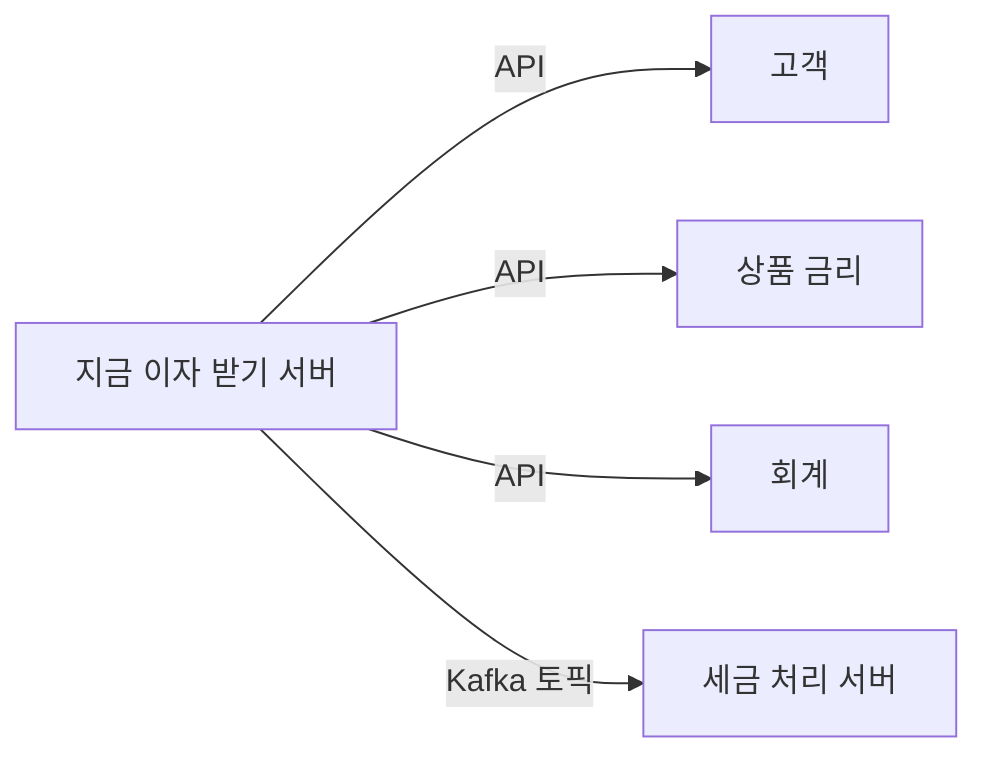

# 은행 최초 코어뱅킹 MSA 전환기 (지금 이자 받기)

출처: 토스 테크 SLASH23 "은행 최초 코어뱅킹 MSA 전환기 (feat. 지금 이자 받기)" (토스뱅크 장세경, 조서희, 2023-08-31)

## 한 줄 요약
모놀리식 코어뱅킹에서 트래픽이 가장 많은 "지금 이자 받기"를 MSA로 먼저 떼어내면서, 동시성은 Redis 락과 JPA Row Lock으로, 속도는 Kafka 비동기 분리와 Redis 캐시로, 안전성은 이중 호출 비교 검증과 순차 오픈으로 해결해 성능을 170배 개선했다.

## 은행 시스템의 기본 구조
- 채널계: 고객 요청을 코어뱅킹으로 전달
- 코어뱅킹(계정계): 돈과 관련된 핵심 비즈니스 로직 처리

대부분의 은행은 코어뱅킹이 하나의 거대한 모놀리식이다. 2000년대 디지털 붐 때 형성된 구조가 모바일 시대까지 커져 온 것이다.

토스뱅크는 구조가 비대칭이었다.
- 채널계: 토스 DNA 그대로 전부 MSA
- 코어뱅킹: Redis, Kafka 같은 모던 기술을 쓰지만 MCI(채널계 통신), FEP(대외 연계), EAI(대내 연계)가 강결합된 거대한 모놀리식

## 모놀리식 코어뱅킹의 장단점
장점
- 로컬 DB 트랜잭션으로 여러 하위 도메인을 ACID하게 변경 가능
- 단일 코드베이스라 개발이 단순
- 대부분의 은행이 이렇게 해서 인력 수급이 쉽다

단점
- 선택적 스케일아웃 불가: 카드만 늘리고 싶어도 전체를 늘려야 한다
- 장애 전파: 카드 30% 환급 이벤트로 카드 트래픽이 임계점을 넘으면 계좌 개설, 대출 약정까지 같이 마비. 이벤트를 미리 알아도 카드만 키울 수 없어 전체 가용성을 확보해야 하는 비효율

## 전환 대상과 도메인 분리
- 대상: 가장 트래픽이 많은 대표 서비스 "지금 이자 받기"
- 기술 스택: Kubernetes, Spring Boot, Kotlin, JPA, Kafka, Redis

기존에는 고객 조회, 금리 조회, 이자 회계 처리를 한 서버가 한 트랜잭션으로 처리했다. 이를 도메인 단위(고객, 상품, 회계)로 나누고 API 호출로 느슨하게 연결했다. 트랜잭션으로 묶일 필요 없는 것은 별도 마이크로 서버로 뺀다.

## 핵심 구현 1: 동시성 제어

문제
- 거의 동시에 Tx1(이자 수령)과 Tx2(입금 300원)가 들어온다
- 둘 다 잔액 100원을 읽고 시작하면 Tx1이 200으로 갱신한 뒤 Tx2가 오래된 100 기준으로 400을 덮어쓴다
- 맞는 값은 500원이다 (lost update)

해법
- 1차: Redis Global Lock
- 2차: DB 레이어에서 JPA `@Lock`으로 Row Locking. Tx2는 Tx1 커밋까지 대기하고, 커밋된 잔액을 읽어 500으로 갱신

주의
- 락이 필요한 데이터를 정확히 식별하고, 갱신하는 데이터에만 건다 (데드락과 성능 저하 방지)
- 계좌 단위 현재 잔액에만 Row Lock
- 재시도와 적절한 타임아웃으로 고객이 락을 느끼지 못하게 한다

## 핵심 구현 2: 비동기 분리로 성능 개선
- 문제: 이자 1회 지급에 20개 테이블, 80번의 UPDATE/INSERT. 평균 300ms로 코어뱅킹 중 느린 편
- 분리 기준: "잔액과 통장 데이터 관점에서 이 쓰기가 지연되면 실시간으로 문제가 되는가?"
- 즉시성이 필요 없는 세금 처리 같은 DML은 트랜잭션에서 뺀다
  - 트랜잭션 종료 시점에 세금 Kafka 토픽으로 Produce
  - 별도 서버가 Consume해서 세금 DB에 저장
  - Dead Letter Queue로 안정성을 보장하고, 재처리 중복을 막도록 API를 멱등하게 설계
- 결과: DML 80회에서 50회로 감소

## 핵심 구현 3: Redis 캐싱
- 문제: 이자 계산을 위해 매번 RDB의 일자별 거래내역을 조회
- 아이디어: 이자는 하루 1번만 받을 수 있으므로 하루 단위 캐싱이 잘 맞는다
- 구현: 하루 중 첫 계좌 상세 접근 때만 DB로 계산, 결과를 Redis에 캐싱, 같은 날 재접근은 Redis에서 반환, 만료는 하루라서 다음날 자정 이후 첫 접근 때 새로 계산

참고: lazy-expiration.md (이 캐시가 "첫 접근 때 계산" 방식이라는 점이 연결된다)

## 안정적 전환 검증 세 가지
1. 실시간 건별 검증: 채널계가 기존 코어뱅킹과 신규 마이크로 서버를 동시에 호출해 응답을 비교, 불일치 시 모니터링 채널로 알림 후 로직 수정
2. 배치 대량 검증: Staging에서 채널계 배치로 대량 대상을 추출해 같은 방식으로 비교
3. E2E 통합 테스트: 데이터가 실제로 정확히 쌓이는지 검증. 잔액 구간별 차등 지급, 고객 상태별(명의도용, 해킹 피해, 사망), 계좌 상태별(출금/입금 정지) 시나리오

## 순차 배포
- 토스뱅크 수신개발팀 → 내부 팀원 → 일부 고객(모수 확대) → 전체
- 코어뱅킹 서버 호출량과 신규 마이크로 서버 호출량을 조절하며 트래픽을 점진적으로 이동
- 기존 시스템을 멈추지 않는 빅뱅 탈피 전환

## 성과
- 지금 이자 받기 성능 170배 개선
- 계정계 서버로부터 독립된 서버로 안정성 증가
- 피크타임에 이자 지급 서버만 선택적 스케일아웃
- 도메인 단위 분리와 무중단 전환
- 오픈소스 기반 개발 환경으로의 변화

## 배울 점
- 한 번에 갈아엎지 않고 "가장 트래픽 많은 대표 기능 하나"로 시작해 효과와 위험을 함께 검증했다
- 트랜잭션을 쪼갤 때의 기준은 기술이 아니라 "이 쓰기가 늦어져도 고객 눈에 문제가 되는가"라는 비즈니스 질문이다
- 락은 넓게 걸수록 안전하지만 느려진다. 갱신 대상만 좁게 거는 것이 핵심
- 새 시스템 검증은 기존 시스템을 정답지로 삼아 실시간으로 같은 요청을 양쪽에 보내 비교하는 방식이 강력하다

## 직접 따져볼 것
- Redis Global Lock과 JPA Row Lock을 둘 다 쓰는 이유. 글은 "1차 / 2차"라고만 설명한다. Redis 락이 DB Row Lock 대기 자체를 줄이는 역할인지는 글에 명시되어 있지 않아서 직접 생각해볼 문제다

## Recap
토스뱅크는 채널계만 MSA이고 코어뱅킹은 거대한 모놀리식이던 구조에서, 가장 트래픽이 많은 "지금 이자 받기"를 도메인 단위 마이크로 서버로 분리했다. 잔액 갱신 유실은 Redis 락과 JPA Row Lock으로 막고, 세금처럼 즉시성이 필요 없는 쓰기는 Kafka로 트랜잭션에서 떼어 DML을 80회에서 50회로 줄였으며, 하루 1회 계산 결과는 Redis에 캐싱했다. 전환은 기존 서버와 신규 서버를 동시에 호출해 비교하는 검증, 배치 대량 검증, E2E 테스트, 그리고 대상을 넓혀가는 순차 오픈으로 안전하게 진행해 성능을 170배 개선하고 선택적 스케일아웃을 얻었다.
