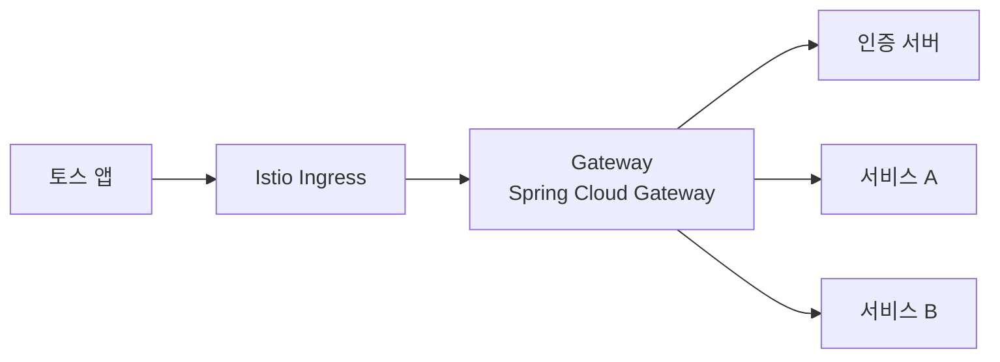

# 토스는 Gateway 이렇게 씁니다

출처: 토스 테크 SLASH23 "토스는 Gateway 이렇게 씁니다" (토스 최준우, 2023-10-12)

## 한 줄 요약
토스의 Gateway는 단순 라우팅이 아니라, 모든 서비스가 공통으로 필요한 것(요청 정제, 유저 Passport, 종단간 암호화, 동적 보안, mTLS 인증, 서킷 브레이커, 로깅/메트릭)을 한 곳에서 처리하는 플랫폼이다.

## Gateway가 필요한 이유
서비스가 늘어날수록 모든 서버에 공통 로직을 따로 넣는 것은 비효율적이다. Gateway는 라우팅과 프로토콜 변환을 맡는 중개자로서 다음을 제공한다.
- 클라이언트와 서비스를 독립적으로 확장
- 보안과 모니터링의 단일 제어 지점
- 공통 로직의 중앙 집중 처리

Route는 두 부분으로 구성된다.
- Predicate: Path, Method, Host 등으로 요청을 매칭
- Filter: 매칭된 요청의 전처리/후처리

참고: api-gateway.md

## 기술 스택
- Spring Cloud Gateway (Spring Webflux, Reactor-Netty 기반 비동기)
- 필터 개발에 Kotlin Coroutine
- Istio Ingress/Egress Gateway, Envoy 필터와 연동

## 공통 로직 처리

Sanitize (요청 정제)
- 잘못된 요청은 Gateway에서 지우거나 올바른 값으로 바꿔 서비스에 전달하고, 악의적 입력도 사전에 차단

유저 Passport
- 문제: 하나의 트랜잭션 안에서 여러 서비스가 각자 유저 API를 반복 호출해서 중복 요청과 리소스 낭비가 생긴다
- 해법(Netflix Passport 구조를 참고):
  1. Gateway가 유저 식별키를 받는다
  2. 인증 서버에 Passport를 요청한다
  3. Passport에는 디바이스 정보와 유저 정보가 들어 있다
  4. Gateway가 이를 serialize해서 트랜잭션 안으로 전파한다
  5. 각 서비스는 별도 API 호출 없이 Passport로 유저 정보를 쓴다

## 보안

종단간 암호화
- 앱이 요청 바디를 암호화 → Gateway가 복호화하고 인증/인가 → 복호화된 데이터와 유저 정보를 서비스로 전달
- 서비스는 암호화를 신경 쓰지 않아도 된다

Dynamic Security
- 유저 인증/인가를 넘어 "이 요청이 진짜 토스 앱에서 만들어졌는가"를 검증
- 앱이 매 요청을 짧은 유효기간의 키와 변조 불가능한 정보로 서명하고, Gateway가 서명으로 앱 생성 여부, 중복 사용 여부, 키 유효기간을 확인
- 의심 요청이 발견되면 FDS와 연계해 계정을 비활성화

mTLS 기반 인증/인가
- 외부 회사나 내부 개발자의 서비스 호출에 클라이언트 인증서를 사용
- 흐름: Edge에서 인증서 CA 유효성 확인 → 인증서 정보를 헤더에 실어 Gateway로 전달 → X.509 extension의 Subject Alternative Name에서 사용자 정보 추출 → 사용자, 도착지 호스트, 요청 경로로 인증/인가와 Auditing
- Istio만으로 하지 않고 Gateway에서 하는 이유: 코드로 자유롭게 짤 수 있고, Auditing 같은 추가 로직을 넣을 수 있고, 카나리 배포의 이점을 쓸 수 있다

## 안정성: Circuit Breaker
- 문제: 한 서비스의 지연이 의존 서비스로 번져 전체 시스템 다운
- 해법: 지연 서비스로 가는 요청을 끊고 빠르게 실패시켜, 그 서비스가 회복할 틈을 주고 확산을 막는다
- 구현 위치 선택
  - 인프라 레이어(Istio): 호스트 단위, 빠르고 쉽다
  - 애플리케이션 레이어(Resilience4J, Hystrix): 호스트, Route, 기능 단위로 정교하게 설정 가능
- 토스는 정교한 제어가 필요해서 애플리케이션 레이어를 선택

## 모니터링
- 로깅: 모든 요청/응답의 Route ID, Method, URI, 상태 코드를 Elasticsearch에 기록해서 라우팅 경로와 업스트림 호출을 즉시 확인
- 시스템 메트릭(Node Exporter): CPU, 메모리, 네트워크 RX/TX
- 애플리케이션 메트릭(Spring Actuator): JVM 스레드 블로킹, 세대별 메모리, Full GC
- Route별 메트릭: 기본 메트릭에 Path 정보를 추가해 API 경로별 성능 추적
- 수집은 Prometheus, 시각화는 Grafana, 알림은 Slack

## 배울 점
- 공통 관심사를 Gateway로 올리면 각 서비스는 비즈니스 로직에만 집중할 수 있다
- 같은 기능도 인프라(Istio)와 애플리케이션(Gateway 코드) 중 어디에 두느냐는 "얼마나 정교한 제어와 확장이 필요한가"로 갈린다 (서킷 브레이커, mTLS 두 곳에서 같은 논리로 앱 레이어를 선택)
- Passport처럼 "유저 정보를 한 번 조회해서 트랜잭션 안에 실어 나르는" 패턴은 서비스 간 중복 호출을 구조적으로 없앤다
- Gateway는 모든 요청이 지나는 지점이므로, 단일 제어 지점이면서 동시에 단일 장애 지점이 될 수 있다. 글은 이 점을 다루지 않았으므로 별도로 생각해볼 문제다

## Recap
토스는 Spring Cloud Gateway를 Istio 위에 올려, 요청 정제, 유저 Passport 전파, 종단간 암호화 복호화, 앱 서명 기반 Dynamic Security, 인증서 기반 mTLS 인증/인가를 한 곳에서 처리한다. 한 서비스의 지연이 전체로 번지지 않도록 서킷 브레이커는 호스트, Route, 기능 단위로 정교하게 제어할 수 있는 애플리케이션 레이어에 두었고, 요청 로그와 시스템/애플리케이션/Route별 메트릭을 Elasticsearch, Prometheus, Grafana, Slack으로 연결해 관측한다. 결과적으로 Gateway는 라우터가 아니라 보안, 최적화, 모니터링을 통합한 플랫폼이다.
