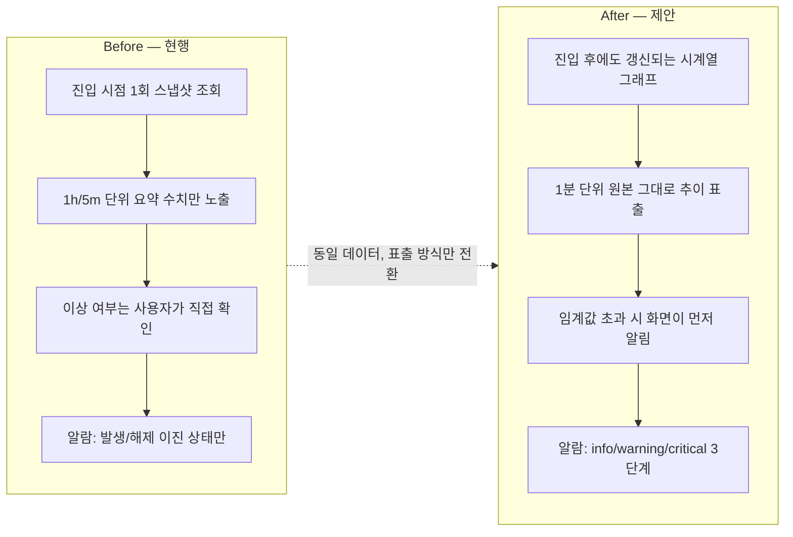
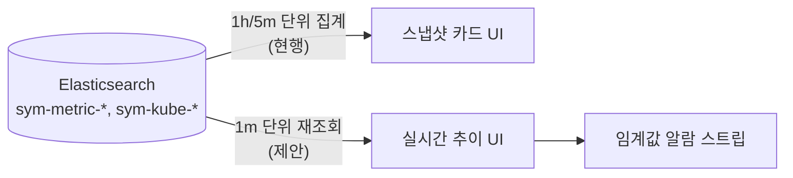
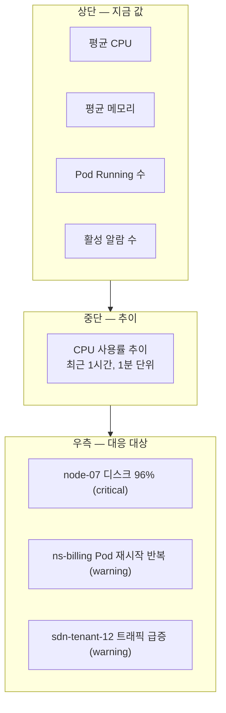

# 실시간 인프라 모니터링 대시보드 기획안

대상 레포: klid_monitor (DashboardApi / DashboardApp)
작성일: 2026-09-09

## 배경 — 데이터는 있는데 안 보인다

klid_monitor의 플랫폼·조직·클러스터 대시보드는 화면을 열 때 한 번 조회하는 스냅샷 구조다. CPU가 지금 몇 %인지는 보이지만, 5분 전보다 오르는 중인지 내리는 중인지는 화면 어디에도 없다. 장애나 이상 징후는 대부분 값 자체보다 변화 추이에서 먼저 드러나는데, 지금 구조로는 그 추이를 사람이 새로고침을 반복하며 눈으로 추적해야 한다.

반면 백엔드가 실제로 저장하고 있는 데이터는 이미 시계열이다. Elasticsearch에는 `@timestamp` 기준으로 CPU·메모리·디스크·네트워크·Pod 상태가 쌓이고 있고, 프론트엔드 설정값(`VUE_APP_PLATFORM_GRAPH_DATA_TERM=1m`)만 봐도 1분 단위 집계가 이미 가능한 상태다. 즉 새로 만들어야 하는 것은 수집 파이프라인이 아니라 표출 방식이다.

## Before / After

기존 대시보드와 새 대시보드는 같은 데이터를 다루지만 목적이 다르다. 기존은 지금 상태를 조회하는 화면이고, 새 대시보드는 이상 징후를 먼저 알아채는 화면이다.

**Before — klid_monitor 현행**
- 진입 시점 스냅샷 1회 조회. MainDashboard / PlatformDashboard가 카드·리스트 형태로 값만 보여준다.
- 1h / 5m 단위로 뭉친 요약 수치만 노출한다. 원본은 1분 단위인데 카드에는 구간 평균만 표시된다.
- 이상 여부는 사용자가 화면을 열어봐야 안다.
- 알람은 발생/해제 이진 상태만 있다 (SCE_ALM_HIST — 심각도 구분 없음).

**After — 신규 실시간 대시보드**
- 진입 후에도 갱신되는 시계열 그래프로 보여준다. 동일한 ES 인덱스를 조회 단위만 세분화해서 쓴다.
- 1분 단위 원본 그대로 추이 라인으로 표출한다. 이미 존재하는 date histogram 버킷을 그대로 활용한다.
- 임계값 초과 시 화면이 먼저 알린다. 패널 상단 알람 스트립 + 색상 강조로 처리한다.
- 알람 심각도를 info/warning/critical 3단계로 재구성한다 (아래 "알람 체계 고도화" 참고).

**근거 — 이미 존재하는 시계열 자산**
- `sym-metric-cpu` / `sym-metric-memory` / `sym-metric-filesystem` — `system.cpu.total.norm.pct` 등, 호스트·VM 리소스 사용률을 1분 버킷으로 집계 가능
- `sym-kube-pod` / `sym-kube-state-pod` — `kubernetes.pod.cpu.usage.node.pct`, Pod 단위 상태·리소스
- `sym-metric-network` — `system.network.in/out.bytes`, 인터페이스별 트래픽

## 표출 항목 (핵심)

카테고리별로 지금 있는 데이터를 어떻게 재표출할지와, 새로 정의가 필요한 항목을 구분했다.

### 컴퓨트 (호스트 · VM) — 출처: `sym-metric-*`
- CPU 사용률 추이 (기존 데이터) — `cpu.total.norm.pct`
- 메모리 사용률 추이 (기존 데이터) — `memory.used.pct`
- 디스크 사용률 추이 (기존 데이터) — `filesystem.used.pct`
- 리소스 할당 대비 실사용률 (신규 정의) — `SCE_MTR_VM` 결합 필요

### Kubernetes / Pod — 출처: `sym-kube-*`
- Pod 상태 분포(실시간) (기존 데이터) — `pod_running`/`pod_pending`/`pod_failed` 등
- Pod별 CPU·메모리 추이 (기존 데이터) — `pod.cpu/memory.usage.node.pct`
- CrashLoopBackOff 발생 추이 (신규 시각화) — `pod_crashloopbackoff` 값을 시계열로 그래프화
- HPA 스케일 이벤트 타임라인 (신규 시각화) — `SCE_HPA` 레플리카 변화 기록

### 네트워크 (SDN) — 출처: `sym-metric-network`
- 인터페이스별 In/Out 트래픽 (기존 데이터) — `network.in/out.bytes`
- 테넌트별 트래픽 상위 랭킹 (신규 정의) — network 필드와 SDN 테넌트 정보 결합

### 스토리지 · BareMetal — 출처: `filesystem`, `sym-status-bm`
- 스토리지 풀 사용률 추이 (기존 데이터) — `filesystem.used.pct`
- BareMetal 하드웨어 상태 (기존 데이터) — `sym-status-bm`
- 용량 임계 도달 예측(추세선) (신규 정의) — 시계열 기반 선형 추정 필요

## 알람 체계 고도화

현재 알람은 평균값 ≥ 임계값 단일 조건만 지원하고, 심각도 레벨이 없다. 발생/해제 두 상태만 있어서 "약간 넘었다"와 "완전히 터졌다"가 화면에서 구분되지 않는다. 실시간 대시보드로 전환하는 김에 이 부분도 같이 정리하는 것을 제안한다.

- 현행 `SCE_ALM_THLD_DEF`: metric / source / threshold 단일 값, 연산자는 ≥ 고정. 상태는 발생/해제뿐.
- 제안 — 3단계 심각도: 동일 metric에 구간별 임계값을 매핑해서 색상으로 즉시 구분한다.
  - Info: 70% 이상
  - Warning: 85% 이상
  - Critical: 95% 이상

## 화면 구성(안)

상단 KPI는 지금 값을, 중단 그래프는 추이를, 우측 패널은 지금 대응해야 할 것을 보여주는 3단 구성을 제안한다.

## 추진 단계

1. **기존 ES 인덱스 재활용 검증** — 신규 수집 없이 `sym-metric-*`, `sym-kube-*` 인덱스를 1분 단위 date histogram으로 재조회할 수 있는지 API 스펙을 확정한다.
2. **표출 항목 확정 · 화면 1개 프로토타입** — 컴퓨트 카테고리(CPU/메모리/디스크) 한 세트만 실시간 그래프로 먼저 붙여서 갱신 주기·성능을 확인한다.
3. **알람 심각도 체계 도입** — `SCE_ALM_THLD_DEF` 구조를 구간형으로 확장하고, 프론트 알람 패널에 색상을 반영한다.
4. **K8s / 네트워크 / 스토리지 확장** — 검증된 패턴을 나머지 카테고리로 확대 적용한다.

---

참고: klid_monitor 코드베이스 분석 기반. DashboardApi, DashboardApp, _dbScheme 참조.
